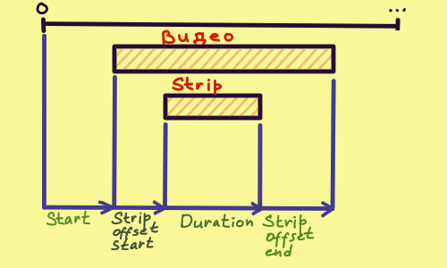
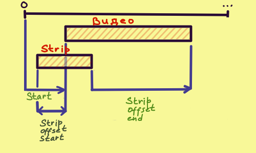

# VideoEditing

# Настраиваем рабочее пространство

## Открываем workspace

В header:

````bash 
> File | > New         |   ...
       |   Open...     |   Sculpting  
       |   Open recent |   VFX 
       |   ...         | > Video Editing
````

Через поиск:

````bash 
Video Editing
````

## Настройка Output - Format

````bash
Areas -> Properties |   Tool   | > Format
                    |   Render |   Frame Range
                    | > Output |   Stereoscopy
                    |   ...    |   ...
````

Настройка разрешения
- ResolutionX, ResolutionY
- % - уменьшит область рендера с сохранением пропорций. Обычного используется для тестового рендера

Настройка ФПС:
- Frame Rate - указываем FPS

## Настройка Output - Frame Range

````bash
Areas -> Properties |   Tool   |   Format
                    |   Render | > Frame Range
                    | > Output |   Stereoscopy
                    |   ...    |   ...
````

Настройка временной области рендера:
- Frame Start, Frame End - начальный и конечный фрейм для рендера. Можно записать в стиле 10\*24\*60, Blender сам посчитает сколько это кадров

## Настройка Output - Output

````bash
Areas -> Properties |   Tool   |   ...
                    |   Render |   Stereoscopy
                    | > Output | > Output
                    |   ...    |   ...
````

Настройка для output:
- Accept - путь к папке куда рендерим
- File Format - выбирай (FFmpegVideo), не обосрешся
- Color - выбор из (BW) черно-белое, и (RGB) цветное. Есть еще (RGBA), для активации нужно выбрать подходящий Video Codec

````bash
Areas -> Properties |   Tool   |   ...         |   Color Management
                    |   Render |   Stereoscopy | > Encoding
                    | > Output | > Output      |   ----------------
                    |   ...    |   ...         |
````

Настройка codec:
- Continer - выбирай (MPEG-4), это база, не обосрешся
- Video Codec - (H.264) это база. (PNG), (QT rle/QT Animtion) поддерживает прозрачность
- Audio Codec - (AAC) это база


# Стандартное редактирование видео

## Добавить видео/картинку/аудио #1

Через проводник виндовс:
- открываем проводник 
- тащим оттуда файлы 

## Добавить видео/картинку/аудио #2

Через пункт Add, в самом видео редакторе:

````bash
Areas -> Sequencer > Sequencer | /*Top Panel*/ |   ...       |   ...  
                                               | > Add       | > Movie   
                                               |   Strip     | > Sound
                                               |   ...       | > Image/Sequence
                                                             |   --------------
````

## Добавить видео/картинку/аудио #3

Через FileBrowser:

````bash
Areas -> FileBrowser
````

Удобно, что можно видеть сразу на глубину до 3 уровней:

````bash
Areas -> FileBrowser | /*Top Panel*/ |   ...              |   Columns    
                                      | > Display Settings | > Recursions 
                                      |   Filter Settigns  |   SortBy     
                                      |   ...              |   ---------- 
````

Удобно, что можно видеть недавние(Recent) и делать закладки(Bookmarks):

````bash
Areas -> FileBrowser | /*Left Panel*/ 
````

## Приблизить/отдалить

В этом варианте надо тянуть мышку:

````bash 
CTRL + MMouseButton + drag
````

## Передвигать Strip 

Выбери Strip и нажми:

````bash 
g
````

Чтобы двигать в переделах канала(по X):

````bash 
gx
````

Чтобы перемещать между каналами(по Y):

````bash 
gy
````

## Передвинуть начало strip на курсор

Устнавливаем курсор, выбираем strip, жмем:

````bash 
Shift + s
````

## Настройка перекрытия strip

Если переместить strip поверх другого стрипа, то он станет красным. Это и есть перекрытие

Оно есть в трех режимах:
- Shuffle - скользит влево/вправо пока не найдет достаточно места под себя
- Expand - сдвинет вправо мешающием strip'ы, освободит нужное пространство
- Overwrite - удалит то что под перемещаемым strip и вставит его туда

Настройка:

````bash 
Areas -> Video Sequencer > Sequencer | /*Top Panel*/ | > /* Выпадающее меню в центре */
````

## Удалить

Удалить strip:

````bash 
x 
````

## Дублировать strip 

Дублировать:

````bash 
alt + d 
````

## Разрезать 

Разрезать:

````bash
k 
````

Жестко разрезать. Отличается от обычного разреза, что теряется связь с оригинальным видео... Короче муттирует данные:

````bash 
shift + k 
````

## Настроить offset

По сути, ты когда загружаешь видео/звук/картинку, blender сохраняет ее в оперативке. И strip'ы всего лишь ссылки на эти данные. В итоге получается: 
- data - видео
- strip - "окно" через которое мы видим видео

В зависимости от параметров Time, видны разные части видео. Найти их можно, выбрав нужный strip и зайдя в:

````bash
Areas -> Video Sequencer > Sequencer | /*Right Panel*/ | > Strip     |   ...
                                                       |   Tool      | > Time
                                                       |   Modifiers |   Source
                                                       |   Proxy     |   ...
````



## Сдвинуть offset. Сдвигает видео внутри strip 

Можно сдвигать видимую часть видео внутри strip. Просто выбери strip и жмякни 

````bash 
s 
````

Принцип работы основан на изменении сразу несколько параметров Time, что выглядит примерно так:



## Сбросить offset 

Можно сбросить почти все параметры offset, то есть снова видеть весь видос. Просто выбери strip и жмякни 

````bash 
alt + o 
````

##
# Уменьшаем тормознутость Preview

Дело в том, что пока ты редактируешь видео, оно обычно пипец как тормозит. Можно уменьшить число тормозов

## Подготавливаем Proxy

Заходим:

````bash
Areas -> Video Sequencer > Sequencer
````

Выбираем видеодорожку. В том же Areas, в настройках дорожки(панель справа) заходим в Proxy и ставим галку в Strip Proxy & Timecode

````bash
Areas -> Video Sequencer > Sequencer | /*Right Panel*/ |   Strip     |  > Strip Proxy & Timecode
                                                       |   Tool      |
                                                       |   Modifiers |
                                                       | > Proxy     |
````

В меню Strip Proxy & Timecode, настраиваем качество видео для preview:
- owerwrite - обновлять proxy или нет
- resolution - процент разрешения
- quality - качество видео

После нужно отрендерить Proxy. Для этого жмем:

````bash
Areas -> Video Sequencer > Sequencer | /*Right Panel*/ |   Strip     |  > Rebuild Proxy & Timecode Indices
                                                       |   Tool      |
                                                       |   Modifiers |
                                                       | > Proxy     |
````

## Выбираем отобржение Proxy в Preview

Заходим:

````bash
Areas -> Video Sequencer > Preview | /*Right Panel*/ |   Tool     | > View Settings
                                                     | > View     |   2D Cursor
                                                     |   Metadata |   ...
````

Настраиваем отображение Proxy:
- Proxy Render Size - выбираем размер отрендеренного Proxy
- Use Proxy - ставим галочку, должна сработать какая-то оптимизация

# Удобные штучки

## Быстрая установка начала и конца Farme Range

Почти во всех Workspace'ах внизу есть Areas -> Timeline. Используй его чтобы установить начало и конец рендера по текущему Frame:

````bash
Areas -> Timeline | /*Top Panel*/ | > Payback | > Set Start Frame
                                              | > Set End Frame
````

## Отображение аудио-дорожек

Чтобы отобразить форму звуковой дорожки в Sequebcer надо зайти:

````bash
Areas -> Video Sequencer > Sequencer | /*Right Panel*/ | > Strip     | > Sound
                                                       |   Tool      |   Time
                                                       |   Modifiers |   Source
                                                       |   Proxy     |   ...
````

Настраиваем отображение аудио-дорожки:
- Display Waveforn - ставим галочку

## Marker(пометки)

Добавить Marker

````bash
Areas -> Video Sequencer > Sequencer | /*Top Panel*/ |   View   | > Add Marker
                                                     |   Select |   Duplcate marker
                                                     | > Marker |   Duplicate Marker to Scene
                                                     |   ...    |   ...
````

В той же менюшке можно:
- Rename Marker - переименовать маркер
- Jump to next/previous Marker - перейти к след/пред маркеру
- Lock Marker - залочить маркер чтобы не двигался
- Sync Marker - перемещает маркер вмесет с перемещением ЛЮБОЙ дорожки

## Запись экрана в Windows

win + alt + r


## Создание маски для видео
[CreateMask]: #создание-маски-для-видео

Открываем Areas для создания маски

````bash
Areas -> Movie Clip Editor | /*Top Panel*/ |   Tracking   |
                                           | > Mask       |
````

Открываем видео поверх которого рисуем маску

````bash
Areas -> Movie Clip Editor | /*Top Panel*/ | > Open   |
````

Создаем новую маску

````bash
Areas -> Movie Clip Editor | /*Top Panel*/ | > New   |
````

Рисуем маску:
- через аналог кривых Безье, для этого жмем CTRL + lmouse
- через SHIFT + A рисуем кругами и квадратами

Анимируем маску. По класике расставляем точки, выбираем фрейм, жмем I

## Устанавливаем маску для видео
[SetMask]: #устанавливаем-маску-для-видео

Сначало нужно [создать маску][CreateMask]

Открываем Areas для создания работы с видео

````bash
Areas -> Video Sequencer -> Sequencer
````

Добавляем(SHIFT + A) видео strip

````bash
Areas -> Video Sequencer > Sequencer | /*Top Panel*/ |   ...    |   ...    |
                                                     |   Marker |   Mask   |
                                                     | > Add    | > Movie  |
                                                     |   Strip  |   Sound  |
                                                     |   ...    |   ...    |
````

Над видео(на слой выше) добавляем(SHIFT + A) Adjustment Layer

````bash
Areas -> Video Sequencer > Sequencer | /*Top Panel*/ |   ...    |   ...              |
                                                     |   Marker |   Text             |
                                                     | > Add    | > Adjustment Layer |
                                                     |   Strip  |   Effect Strip     |
                                                     |   ...    |   ...              |
````

Выбираем модификатор маски

````bash
Areas -> Video Sequencer > Sequencer | /*Right Panel*/ |   Strip     | > Modifiers | > Add Strip Modifier -> Mask |
                                                       |   Tool      |
                                                       | > Modifiers |
                                                       |   Proxy     |
````

Выбираем маску

````bash
Areas -> Video Sequencer > Sequencer | /*Right Panel*/ | > Mask | > Mask Input Type |   Strip |
````

В открывшемся меню выбираем конкретную маску

````bash
Areas -> Video Sequencer > Sequencer | /*Right Panel*/ |   Strip     | > Mask |   Mask Mask Input Type |
                                                       |   Tool      |        | > Mask                 |
                                                       | > Modifiers |        |   Mask Time            |
                                                       |   Proxy     |
````

## Создаем эффект заблюренного лица

Сначало нужно [создать маску][CreateMask]

Потом [устанавливаем маску][SetMask]

Выбираем подходящий метод наложения. Это нужно чтобы не дублировать видео

````bash
Areas -> Video Sequencer > Sequencer | /*Right Panel*/ | > Strip     | > Compositing | > Blend -> Alpha Over |
                                                       |   Tool      |   ...         |   Opacity             |
                                                       |   Modifiers |
                                                       |   ...       |
````                                                   

Над Adjustment Layer(на слой выше) добавляем(SHIFT + A) Gaussian Blur

````bash
Areas -> Video Sequencer > Sequencer | /*Top Panel*/ |   ...    |   ...              |   ...           |
                                                     |   Marker |   Text             |   Glow          |
                                                     | > Add    |   Adjustment Layer | > Gaussian Blur |
                                                     |   Strip  | > Effect Strip     |   ------------- |
                                                     |   ...    |   ...              |
````

Настраиваем радиусы размытия для Gaussian Blur 

````bash
Areas -> Video Sequencer > Sequencer | /*Right Panel*/ | > Strip     | > Effect Strip | 
                                                       |   Tool      |   Compositing  | 
                                                       |   Modifiers |   ...          | 
                                                       |   ...       |     
                                                          ...              
````

