# Множества чисел 

- Натуральные($N$)  -     1, 2, 3...
- Целые($Z$)        - ...-1, 0, 1...
- Рациональные($Q$) - результат деления целого числа на натуральное $\frac{Z}{N}$ ...
- Вещественные($R$) - рациональные и иррациональные. Иррациональные($I$) - бесконечная непериодическая дробь
- Комплексные($C$)  - в составе которых есть $i = \sqrt{-1}$

# Ряды

## Исчисляемый ряд

Исчисляемый ряд - это означает что вы можете отсчитать от любого числа до любого другого за конечное число времени, даже если ряд бесконечен

Например натуральные числа: 1, 2, 3... - исчисляемы
Например целые числа: ...-1, 0, 1... - исчисляемы, ибо если их расположить в порядке типа: 0, 1, -1, 2, -2, 3, -3, 4, -4..., то все ок
Например рациональные числа: 1/2, 2/1, 1/3... - исчисляемы, ибо построив таблчку, где номер строки - числитель, номер столбца - знаменатель и обойдя ее змейкой, получим: 1/1, 2/1, 1/2, 1/3, 2/2, 3/1, 4/1, 3/2, 2/3, 1/4... Такое множество исчилимо. Для отрицательных чисел все тоже самое. А объединение двух исчеслимых множеств => множество исчислимое, а значит рациональные числа исчисляемы 

## Неисчесляемый ряд

Неисчесляемый ряд - ряд количесвто элементов в котором равно числу вещественных чисел. То есть это буквально невозможно посчитать

Например от 0 до 1 - неисчисляемы

# Теория меры 

Я ничего в ней не понимаю, потому что там все в терминах топологии и вообще я туой. Если бы не интеграл Лебега вообще в это чудо бы не полез 

## Мера 

Мера(Measure) - обобщение над понятиями длины, площади, объема и т.д. В вики вообще написано: __Мера__ - числовая характеристика, "масса" множества, при некотором распределении массы по пространству

Примеры меры для разных множеств:

1. Мера точи = 0
1. Мера отрезка $[b, a]$ это $b - a$
1. Мера счетного множества равна 0. Ибо счетное множество соответствует натуральным числам, а они как бы состоят из "точек". А мера множества равна сумме мер элементов этого множества. А сумма бесконечного числа нулей это ноль 
1. Мера множество рациональных чисел это 0. Так как множество рациональных чисел счетно
1. Мера множество иррационального отрезка $[0, 1]$ это 1

__Для умных:__

Более строго, если есть пространство $X$(физическое пространство), в котором выделено некоторое множество $U$(объекты, например сфера) называемое измеримым, то мы можем задать функцию $\varphi$(та самая мера, которая в реальном мире - объем), которая: 
1. $\varphi \rightarrow [0, +\inf]$ - функция возвращает положительные значения 
1. Все пространство является измеримым (это видимо что его в любом месте можно покрыт объектами... Короче я хз)
1. Объединение, разность и пересечение любых мнжеста из $U$, тоже принадлежит $U$ (а разве может быть по другому?)
1. $\varphi(\empty)=0$
1. $\varphi(A \bigcup B) = \varphi(A) + \varphi(B)$, для $A$ и $B$ не пересекающихся. Короче говоря, есть куб и шар, они не пересекаются, значит объем от объединных объектов равен сумме объемов каждого 
1. Ну и тоже что в предыдущем пункте но для более чем 1-ого объекта

В итоге оказвается, что для любого n-мерного пространства реальных чисел, существует только одна такая функция меры, чтобы мера стандартного "куба" со сторонами 1 в n-мерном пространстве была 1. И функция меры совпадает с функцией n-мерного Евклидового объема. Хуй знате как они это доказали и знать не хочу

Есть еще какая-то мера Хаусдорфа, критерий Каратеодори, Липшицивы функции, внешние меры и т.д. и т.п.

# Интегралы

## Интеграл Римана

Мы разбиваем функцию по оси абсцис. Делим на отрезки длиной $\Delta$. По каждому такому отрезку строим нижний(inf) и верхний(sup) прямоугольник. Строим суммы Дарбу, то есть:
- $s(\Delta)$ - сумма нижних(красных) прямоугольников
- $S(\Delta)$ - сумма верхних(синих) прямоугольников

Очевидно, что $s(\Delta) \leqslant S(\Delta)$

Увеличивая число отрезков, то бишь уменьшая длину $\Delta$ очевидно $s(\Delta)$ будет расти, а $S(\Delta)$ уменьшаться. И если существует такой предел для $\Delta$, что верхний интеграл равен нижнему, то функция интегриуема по Риману

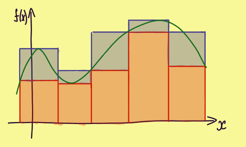</img>
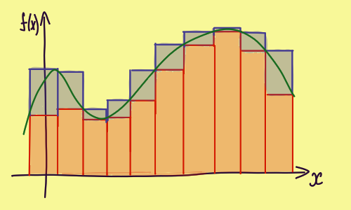</img>
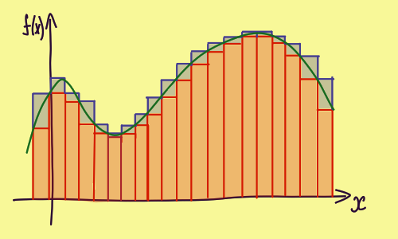</img>

У интегрирования по Риману существуют проблемы:
- высокая размерность - то есть, если у нас для функции от 2-ух переменных число разбиений увеличивается квадратично, для 3-ех кубически и т.д.
- непрерывность - если есть разрыв то неясно, по нижнему или по верхнему прямоугольнику мы должны считать, и вообще они никак не сойдутся. Обычно начинают рассказывать про функцию которая равна 0 для рациональнх и 1 для иррацилнальных чисел. И если искать интеграл от нее, то как не дроби все отрезки должны будут принимать либо 1 либо 0, $S(\Delta)$ не сходится с $s(\Delta)$, а значит нет интеграла

## Интеграл Лебега

Интеграл Римана разбивает по обсцисе, то есть по переменной, а интеграл Лебега по ординате, то есть по значению

В интернете все приводят такой пример. Представьте что у вас есть мешок мелочи. А найти интеграл, это очевидно означает посчитать сколько у вас денег. И интеграл по Риману это прибавлять каждую монетку. А по лебегу, это разбить монети на кучки по номиналу, посчитать сколько в каждой кучке монеток, и перемножить с номиналом

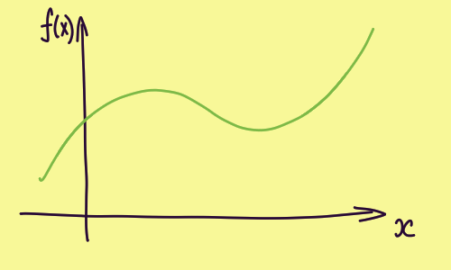</img>
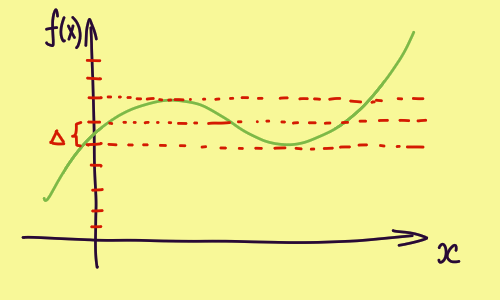</img>
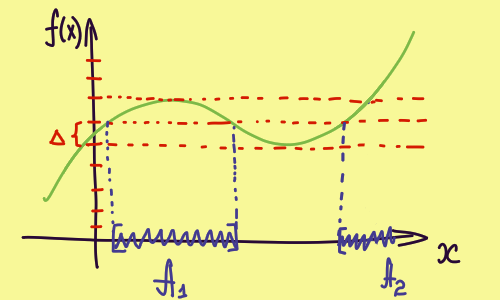</img>

В интеграле Лебега есть важное понятие, [мера](#мера), обозначется $\varphi$
В данноим случае, если посмотришь на 3 рисунок, то длины отрезков $A_1$, $A_2$ ... $A_n$ и будут мерой. 
Для 3d графиков это площадь, для 4d графиков это объем и т.д.

Математически мера записывается так: $\varphi(A)$. То бишь эта штука, вернет длину от множества A

В итоге мы интегрируем значения функции перемноженные на меру. Записывается так: $\int_{A}f(x)d\varphi$

# Теория вероятности 

## Элементарные события

__Обозначение:__ $\Omega$

__Определение:__ Итак, у нас есть шестигранный кубик. Если его бросить то выпадет: 1, 2, 3, 4, 5 или 6. Множество этих значений называется __элементарные события__ и обозначается __$\Omega$__

## Случайная величина 

__Обозначение:__ $X$

__Определение:__ событие, связанное с появлением того или иного числа в ходе проведения эксперимента. Например, автомат с газировкой может работать(1) или не работать(0)

## Дискретная и непрерывная величины

Дискретная - например числа на кубике 

Непрерывная - растояния от центра до точки попдания при стрельбе по мешени

## Плотность распределения вероятности 

И так, если построить зависимости вероятности исхода от значения, например для кубика, то получится график слева. Чтобы посчитать вероятность, нужно просто рассчитать площадь. Например, вероятность того что выпадет 1 или 6 это: $(1-0) \cdot 1/6 + (6-5) \cdot 1/6 = 2/6$

Если например взять кубик 6 гранями и раздробить его до 12 гранного кубика, то получим пример на рисунке по центру. Правда грани пронумерованы промежуточными значениями, это для того чтобы перейти к примеру с непрерывно величиной

Если мы продолжить дробить грани до бесконечности, то получим 3 рисунок. Вот этот график и есть __плотность распредления вероятностей__. Обозначается $\omega(x)$, и если мы хоти найти вероятность попадания попадания случайной величины в диапозон от $a$ до $b$, то просто надо нати площадь. Ну а как найти площадь? Правильно, взять интеграл от функции

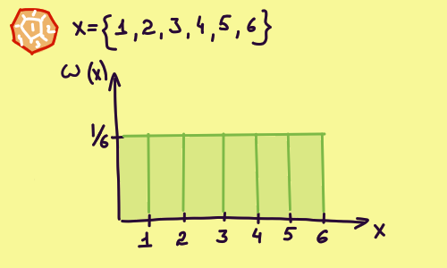</img>
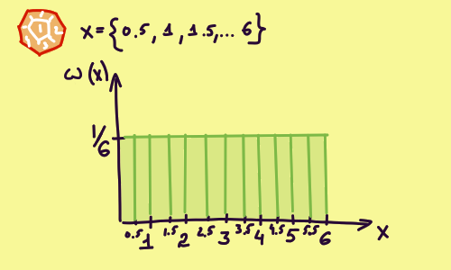</img>
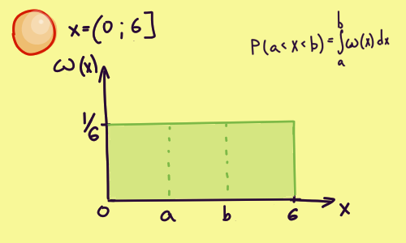</img>

__Особенности "плотности распределения веротности":__

1. Площадь под всем графиком равна 1
1. График во всех точках должен быть больше или равен 1

## Функция распредления случайной величины

Показывает вероятность того, что случайное события будет меньше значения $x$

В общем, в чем прикол. "Функция распределния случайной величины" это интеграл для ["Плотности распределения вероятности"](#плотность-распределения-вероятности). И чтобы найти вероятность в диапозоне от $a$ до $b$, необходимо $P = F(b) - F(a)$

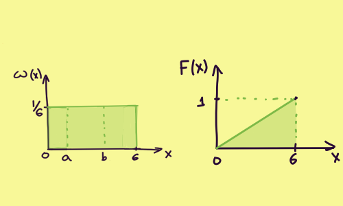</img>

__Особенности "функции распредления случайной величины":__

1. $F(-\infty) = 0$
1. $F(\infty) = 1$
1. График во всех точках должен быть больше или равен 1

## Условная вероятность 

__Обозначение:__ $P(A|H_i)$

Если сто пдуняк произошло событие $H_i$, то вероятность того, что в этом случае произойдет событие A - условная вероятность

Итак, у нас для примера есть [плотность распределения вероятности](#плотность-распределения-вероятности) для несовместных $H_1, H_2, H_3, H_4$. И есть событие $A$, которое может произойтм совместно с каждым из них
На втором рисунке как раз показано то, как эти вероятности совмещаются. Справа на рисунке формула, для условной вероятности

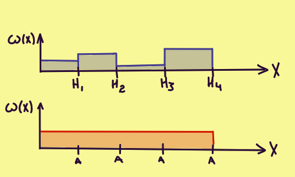</img>
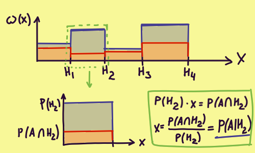</img>

__Где используется:__ 
1. В формуле Байеса. Больше не знаю где

## Формула Байеса

$P(H_i|A)=\frac{P(H_i)\cdot P(A|H_i)}{\sum_{i=1}^{n} P(H_i)\cdot P(A|H_i)} = \frac{P(H_i)\cdot P(A|H_i)}{P(A)}$

__Итак, как это формула получается?__

1. По формуле [условной вероятости](#условная-вероятность): $P(H_i|A) = \frac{P(H_i \bigcap A)}{P(A)}$
1. Вспоминаем что пересечение двух множеств не зависит от порядка в котоором они пересекаются: $P(H_i|A) = \frac{P(A \bigcap H_i)}{P(A)}$
1. Из формулы [условной вероятости](#условная-вероятность) выражаем песечение двух множеств: $P(H_i|A) = \frac{P(H_i) \cdot P(A|H_i)}{P(A)}$
1. Это называется формулой полной вероятности, но она полностью логична, так что все ок: $P(A) = \sum P(A\bigcap H_i) = \sum P(A|H_i) \cdot P(H_i}$

__Пример:__

Два стрелка независимо друг от друга стреляют по одной мишени. Каждый делает по выстрелу. Вероятность попадания первого - 0.8, второго - 0.4. После стрельбы обнаружена одна пробоина. Найти вероятность того, что пробоина пренадлежит 1 стрелку.

__Дано:__

|Событие|Описание события|$P(H_i)$                |$P(A\|H_i)$|
|:------|:--------------:|:----------------------:|:--------:|
|$H_1$  |оба НЕ попали   |(1-0.8) * (1-0.4) = 0.12|0         |
|$H_2$  |1 попал         |0.8 * (1-0.4) = 0.48    |1         |
|$H_3$  |2 попал         |(1-0.8) * 0.4 = 0.08    |1         |
|$H_4$  |оба попали      |0.8 * 0.4 = 0.32        |0         |

Событие A - в мишене обнаружена пробоина. Гипотеза которую проверяем: $P(H_2|A) = ?$

__Решение:__

Подставляем все в формулу Байеса:

$P(H_2|A)=\frac{P(H_2)\cdot P(A|H_2)}{\sum_{i=1}^{n} P(H_i)\cdot P(A|H_i)} = \frac{0.48\cdot 1}{0.48\cdot 1 + 0.08\cdot 1} = \frac{6}{7}$

# Момент случайной величины 

Момент случайной величины - понятие в матиматике аналог которого "момент" из физики. Связано с формой графика:

|В математике |Момент в физике|Момент случайной величины|
|:-----------:|:-------------:|:-----------------------:|
|0 момент     |Полная масса   | -                       |
|1 момент     |Центр масс     |Мат ожидание             |
|2 момент     |Момент инерции |Дисперсия                |
|3 момент     |-              |Ассиметрия               |
|4 момент     |-              |Эксцесс                  |

## Математическое ожидание

__Обозначение:__ $M(X)$ 

__Определение:__ Математическое ожидание - понятие, означающее среднее взешанное по вероятности возможных значений случайной величины 

__Формула для дискретного ряда:__ $M(X)=\sum_{i=1}^{n}x_i \cdot P_i$

__Формула для непрерывного ряда через__ [плотность распределния](#плотность-распределения-вероятности)__:__ $M(X)=\int_{-\infty}^{\infty}x\cdot f(x)dx$, где $f(x)$ - плотность распредления

__Пример:__ 

В качестве примера для дальнейших вычислений возьмем ряд:

| X |  P        |
|:--|:----------|
| 3 | 0.2       |
| 4 | 0.4       |
| 5 | 0.4       |

Подставляем значения в формулу:

$M(X) = 3\cdot 0.2 + 4\cdot 0.4 + 5\cdot 0.4 = 4.2$

__Свойства мат ожиданир:__ 

1. $M(a\cdot X) = a\cdot M(X)$, где $a$ - число 
1. $M(M(X)) = M(X)$

## Дисперсия

__Обозначение:__ $D(X)$ или $\sigma^2_X$

__Определение:__ мера разброса величины относительно [математического ожидания](#математическое-ожидание). Переводится греческого - разброс

__Формула:__

1. $D(X) = M((X-M(X))^2)$ 
1. $D(X) = M(X^2) - (M(X))^2$ 

__Почему формула такая:__

Первая формула:
1. Итак, очевидно что рассматривая отклонения от математического ожидания мы будем: $X-M(X)$
1. Проблема в том что положительные колебания перекрывают отрицательные, поэтому нужно взять по модулю... Но по техническим причинам берут квадрат, поэтому $(X-M(X))^2$ 
1. Значений x в множестве X много, поэтому их надо усреднить. А что в теории вероятности отвечает за усреднение? Правильно, [математическое ожидание](#математическое-ожидание), итого: $M((X-M(X))^2)$ 

Вторая формула:
1. $D(X) = M((X-M(X))^2)$
1. $D(X) = M(X^2 - 2\cdot X\cdot M(X) + M(X)^2)$
1. $D(X) = M(X^2) - M(2\cdot X\cdot M(X)) + M(M(X)^2)$
1. $D(X) = M(X^2) - 2\cdot M(X) \cdot M(X) + M(X)^2$
1. $D(X) = M(X^2) - 2\cdot M(X)^2 + M(X)^2$
1. $D(X) = M(X^2) - M(X)$

## Коэффициент ассиметрии 

__Обозначение:__ $A_s$

__Определение:__ характеризует ассиметрию распределения величины. Если отрицателен, то графие отклоняется в лево, если положителен то граик отклоняется вправо

__Формула:__ $A_s = \frac{M(X-M(X)^3)}{\sqrt{D(X)}}$ 

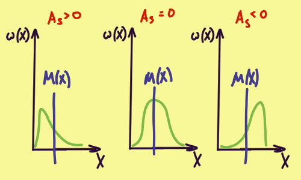</img>

## Коэффициент эксцесса 

__Обозначение:__ $\gamma_2$

__Определение:__ характеризует остроту пика на графике распрелеоения. Коэффициент -3 введен, чтобы эксцесс для нормального распределния был 0. Значение больше 0 - острый пик, меньше 0 - гладкий пик

__Формула:__ $\gamma_2 = \frac{M(X-M(X)^4)}{(\sqrt{D(X)})^4} - 3$ 

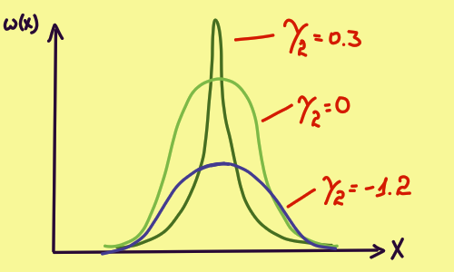</img>

## Случайные события

__Обозначение:__ $\varkappa$ (в вики не такое, но у меня нет нужного шрифта)

__Определение:__ Множество всех подмножест $\Omega$. Говоря по простому, все возможные наборы элементарных событий

__Следствие:__ Случйное событие - элемент подмножества $\varkappa$, который в свою очередь является подмножеством $\Omega$... Ну ты понял...

__Не понял:__ в определении используется "сигма-алгебра", но я тупой и не понимаю что это :(

## Вероятностная мера

__Обозначение:__ P 

__Определение:__ Вероятностная мера случайного события или по-человечески вероятность

__Свойтсва:__
- вероятность всех элементарных событий единица
$$ P(\Omega) = 1$$

__Не понял:__ в определении используется "счетно-аддиивная мера", которая следует из ["сигма-алгебры"](#случайные-события), но я тупой и не понимаю что это :(

## Ряд распределения

В качестве примера для дальнейших вычислений возьмем ряд:

| X |  P        |
|:--|:----------|
| 3 | 0.2       |
| 4 | $\alpha$  |
| 5 | 0.4       |

где:
- X - величина
- p - вероятность того, что случится X
- $\alpha$ - неизвестная вероятность

## Ищем неизвестную вероятность 

Сумма всех вероятностей это 100%. Ибо должно произойти хоть что-то:
$$\sum p = 1$$

Для нашего случая:
$$0.2 + \alpha + 0.4 = 1;$$

А значит $\alpha$ равно:
$$\alpha = 1 - 0.2 - 0.4 = 1 - 0.6;$$
$$\alpha = 0.4;$$

## Математическое ожидание

Математическое ожидание - нечто вроде среднего значения, которое мы получим бесконечно проводя наш эксперимет

