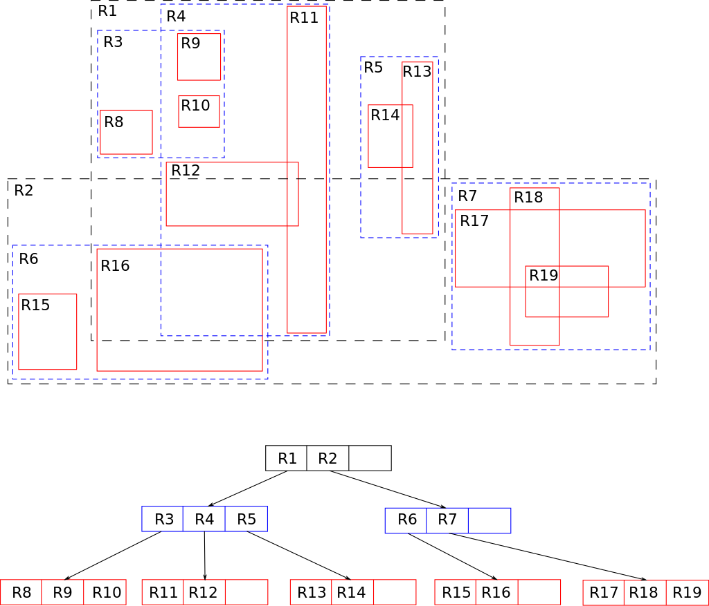

# Алгоритмы и ООП паттерны

# Алгоритмы

## Big O

Big O нотация - показывает асимптоматику(характер функции $n -> const$) числа операций от числа элементов в общем виде:

| Название                     | Big O нотация | Пример                            |
| :--------------------------- | :------------ | :-------------------------------- |
| Константа                    | $O(1)$        | Взять 20-ый элемент массива       |
| Сложность порядка n          | $O(n)$        | Пройтись в цикле по всему массиву |
| Сложность порядка n квадрат  | $O(n^2)$      | Цикл в цикле                      |
| Сложность порядка логарифм n | $O(log{n})$   | Binary search                     |

## Binary Search

Binary Search - берём элемент из середины массива и сравниваем с ключом. Ключ меньше => повторяем с левой частью массива. Ключ больше => повторяем с правой частью массива:

-   Есть отсортированный массив чисел
-   Есть ключ, позицию котороно ищем в массиве

# Деревья

Деревья - одна из о наиболее распространенных структур данных в информатике, эмулирующая древовидную структуру в виде набора связанных узлов

## Бинарное дерево

Бинарное дерево - дерево в котором каждый узел имеет не более 2-ух потомков

Сортированное бинарное дерево:

-   каждый узел также является сортированным бинарным деревом
-   все значения узлов слева не больше, а значения справа не меньше, чем значение корня

## Красно-черное дерево

Красно-черное дерево:

-   сортированное бинарное дерево
-   имеет дополнительным бит информации(красный/черный узел)
-   дерево - самобалансирущееся. То есть число операций: $O(log{n})$

Правила для самобалансировки:

-   Корень(не поддеревья) - всегда черный
-   Конечные узлы - черные
-   Дочерние узлы от красного узла - черные
-   Глубина(если мы считаем только черные узлы) - везде одинакова

## B-деревья

B-дерево

НЕ бинарное, а обычное дерево. Является всегда жестко сбалансированными. В узлах храняться ссылки на следующие узлы, а между ними значения. Значения слева и справа от ссылки задают range, в пределах которого должен находиться потомок указанный в ссылке. Значений должно быть меньше заданного  Mathjax (уровень дерева). Если за k обозначить число значений в некотором узле, то у него либо 0 либо k+1(по числу ссылок) потомков

В общем, B-дерево долго добавляет элемент, зато в нем быстрые переходы от одного узла к другому. Например B-дерево используется в файловой системе

## R-дерево

R-дерево

Похоже на B-дерево, но для объектов в пространстве. Стркутура, разбивает пространство на множество пересекающихся прямоугольников, в которых находятся объекты. Сбалансированное дерево

