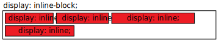
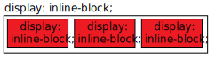

# Блочная модель

Основное понятие в CSS. То как элементы типа block и inline располагаются

## Устройство блока

- margin - внешний отступ
- border - граница. Точнее рамка вокруг
- padding - внутренний отступ
- content - содержание


## Задание размеров блока

Существует два способа задавать размеры элемента

Через height и width задают размеры для контента. Отступы в эти размеры не входят:

````css
box-sizing: content-box;
````

Через height и width задаются размеры ВСЕГО блока. Отступы меняют размер самого содержимого, но не всего элемента:

````css
box-sizing: border-box;
````

Задать одну блочную модель для всех элементов:

````css
html { box-sizing: border-box; }
*, *::before, *::after { box-sizing: inherit; }
````

## Внешний тип
[outType]: #внешний-тип

Задает внешнее поведение

|display: inline|display: block|display: inline-block|
|:--|:--|:--|
|Останется в __той же__ строке|Начнется с __новой__ строки|Останется в __той же__ строке
|width и height __не__ применяются|width и height применяются|width и height применяются
|__Горизонтальные__ отступы будут отодвигать другие __inline__ элементы|Отступы будут отодвигать от него элементы|Отступы будут отодвигать от него элементы
|__Вертикальные__ отступы будут применяться но __НЕ БУДУТ__ отодвигать __inline__ элементы| - | -
|-|Будет заполнять всю ширину родителя|Размеры будут больше содержимого только если явно задать
|||

## Внутренний тип

Задает внутреннее поведение блока

К нему относят только flex, grid. Но лучше чекни [Layout CSS][Layout]

# Layout. Расположение элементов
[Layout]: #layout-расположение-элементов

## Высота элемента: z-index 

Управляет "высотой" элементов. Высокие значения - сверху

````css
z-index: 10;
````

Работает только:
- для элементов на одом уровне иерархии
- для позиционированных элементов(position которых НЕ static)
- для flex и grid элементов
- для элементо чей opacity < 1, например 0.999

## Normal Flow

Normal flow. Использует стандартные свойства у tag'ов для отоброжения. Поведение по умолчанию.

Такое поведение описано [здесь][outType]

## Display

Display. Можно поменять у tag'ов свойство, чтобы они стали inline/block/block-inline

````css
display: inline;
display: block;
display: block-inline;
````

## Position

Все значения аттрибута position, кроме static, убирают элемент из Normal Flow. Такой элемент становится "позиционированным". По умолчанию позиционированный элемент - <html>

Все потомки позционированного элемента переносятся на "новый слой" и определяют свое положение относительно него элемента

````css
position: static;       /* поведение по умолчанию (просто Normal Flow) */
position: relative;     /* положение определяется относительно положения по умолчанию */
position: absolute;     /* удаляет элемент из нормального потока, элемент игнорирует остальные и залезает левый-верхний угол "позиционированного" родителя */
position: fixed;        /* фиксирует элемент относительно viewport'а. Короче при прокрутке страницы элемент остается на месте */
position: sticky;       /* элемент ведет себя как static. После достижения определенной линии viewport ведет себя как fixed */
````

Управление позицией "позиционированного" элемента:

````css
top: 10px;
left: 10%;
right: 20em;
bottom: calc(100% - 10px);
````

## Flex

Выставляет элементы либо в ряд либо горизонтально либо вертикально

Flex делаится на две составляющие:
- flex-wrapper
- flex-block


Дальше я буду назыать элемент flex-block, если он потомок flex-wrapper
Дальше я буду назыать элемент flex-wrapper, если у него в CSS определен display как flex

### Свойства flex-wrapper

Устанавливаем flex-wrapper:

````css
// указываем что это элемент-обертка типа flex. Расставляет block как flex-block
display: flex;
// указываем что это элемент-обертка типа flex. Расставляет inline как flex-block
display: inline-flex; - указываем что это элемент-обертка типа flex. Расставляет inline как flex-block
````

flex-direction: row | column | row-reverse | column-reverse; - распологать flex-block в строку/ряд/строку-задом-наперед/столбец-задом-наперед
flex-wrap: wrap | no-wrap; - если flex-blok не помещается, то переносит/не-переносит на следующую строку

align-items: stretch | center | flex-start | flex-end; - указывае где элемент находится на поперечной(перпендекулярна оси направления) оси. Значение stretch - растягивает элементы, все остальные выравнивают
justify-content: flex-start | center | flex-end | space-around | 
align-content: flex-start | center | flex-end | stretch | space-between | space-around; - если строк поперечной(перпендекулярна оси направления) оси в контейнере больше двух, а в контейнере еще есть место, то это позволяет управлять расположением этих строк

space-between; - располагает элементы вдоль главной(ось направления) оси. Свойство space-around - распределяет все элементы равномерно с небольшим количеством свободного места на концах. Свойство space-between - как space-around, но не остваляет место на концах
row-gap: ; - отступы между строками
column-gap: ; - оступы между столбцами

Свойства flex-block:
flex-grow: ; - распределит flex-block согласно указанным весам
flex-shrink: ; - если во flex-wrapper не хватает места, то flex-block будут уменьшаться согласно указанным весам
flex-basis: ; - сначало элемент примет значение , а потом оставшееся место будет разделено
flex: ; - сокращенный вариант для свойств выше. Значения обозначают flex-grow, flex-shrink и flex-basis. Так же можно не указывать второе свойство

align-self: ...; - работает точно так же как align-items, но только один flex-block
order: ; - элемент снаибольшим значением идет в конец главной(ось направления) оси. Значение может быть отрицательным

## Grid

Выстраивает элементы в двумерную сетку

По рядам и столбцам.

Свойства grid-wraper:
display: grid; - указываем что это элемент-обертка. И он является grid. Элемент-обертка ведет себя как block
display: inline-grid; - указываем что это элемент-обертка. И он является grid. Элемент-обертка ведет себя как inline

grid-template-columns: 40px auto 40%; - создаст три колонки
grid-template-columns: [start line1] 150px [line2] 40%; - создает две колонки. Дальше в CSS к ним можно будет обращаться по именам заданным в [...]. У первой колонки двойное имя
grid-template-columns: repeat(3, 250px); - три одинаковых колонки
grid-template-columns: 1fr 2fr 1fr 200px; - колонки с весами(fr). Специального для grid введенное размерность. Веса расщитываютс после фиксированных размеров
grid-template- rows: ...; - все что выше написано о gr...-columns относится к текущему свойству. Но текущее свойство создает строки

gap: 10px; - делает отступ в 10px между строками и между столбцами
gap: 10px 20px; - делает отступ в 10px между строками и 20px между столбцами
column-gap: 10px; - делает отступ в 10px между столбцами
row-gap: 50px; - делает отступ в 50px между строками

grid-auto-columns: 50px 150px; - для невлезжих в сетку элементов, будут создаваться колонки с указанными ширинами с повтором значений ширины
grid-auto-rows: ...; - тоже что grid-auto-columns, но для строк
grid-auto-flow: row | column; - для невлезжих элементов будет создавать строки/колонки
grid-auto-flow: dense row | column; - невлезшими элементами будет сначало заполнять пустые ячейки, а потом создавать строки/колонки

justify-items: start | center | end | stretch; - выравние элементов по горизонтальной оси
align-items: start | center | end | stretch; - выравние элементов по вертикальной оси

grid-template-areas: 
"header header header" 
"content content 👾" 
"content content ." 
"footer footer footer"; - после задания числа и размеров строк и столбцов, можно разбить сетку на области. Значение этого свойтва - это имена областей. Необходимо указать область для каждой ячейки. Точка обозначает пустую область в которой ничего нет
grid-area: areaName; - укзав это совйоство в grid-block, элемент займет всю область проименованную в grid-template-areas 

Свойства grid-block:
justify-self: start | center | end | stretch; - выравние этого элемента по горизонтальной оси
align-self: start | center | end | stretch; - выравние этого элемента по вертикальной оси

grid-column-start / grid-column-end / grid-row-start / grid-row-end - эти свойства определяют положение grid-block. То как их указывать описано ниже:
grid-...-...: line1; - определяет положение по имени строки/столбца
grid-...-...: 2; - определяет положение по порядковому строки/столбца
grid-...-end: line1; - растягивает до имени строки/столбца
grid-...-end: span 2; - растягивает на две ячейки

grid-area: 1 / col4-start / last-line / 6; - шорткат для 4 свойств выше. Работает в следующем порядке: grid-row-start / grid-column-start / grid-row-end / grid-column-end

## Table

Свойство рзметки для нетабличных элементов
Очевидно создаем таблицу и в ней располагаем контент ао строкам и столбцам. УСТАРЕЛО, не использовать

## Floats

Может заставить "прилепить" содержимое блочного элемента к одной стороне другого элемента
float: left | right | none | inherit; - элемент выравнивается по указанной стороне. Остальные последующие элементы, пытаются занять местот так, будто нашего float элемента нет, но видят что он есть и начинают его "обтекать"
clear: left | right | both; - элемент на котором это свойсвто, перестанет пытаться обтекать и просто будет в конце

clearfix hack - если float работает не так как ты думал, чекни

## Multi-column layout

Расположить содержимое столбцами как в газетах. Так же с ним работают свойства фрагментации
Для этого надо просто указать блоку 1-о из свойств:
column-count: ; - разделит блок на равные колонки и будет пихать контент в них
column-width: ; - разделит на как можно большее число столбцов как минимум указанной ширины
column-gap: ; - растояние между столбцами
column-rule: 4px dotted rgb(79, 185, 227); - создает линию, типа border, между столбцами
column-span: none | all; - элемент прерывает делениие на столбцы, занимая все стобцы. После текст снова распределяется по столбцам
