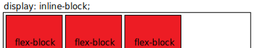

# Layout. Расположение элементов
[Layout]: #layout-расположение-элементов

Layout - понятие в CSS под которое попадают определенные техники расположения элементов на странице

# Высота элемента: z-index 

Управляет "высотой" элементов. Высокие значения - сверху

````css
z-index: 10;
````

Работает только:
- для элементов на одом уровне иерархии
- для позиционированных элементов(position которых НЕ static)
- для flex и grid элементов
- для элементо чей opacity < 1, например 0.999

# Normal Flow

## Noraml Flow

Normal flow. Использует стандартные свойства у tag'ов для отоброжения. Поведение по умолчанию.

Такое поведение описано [здесь][outType]

## Display

Display. Можно поменять у tag'ов свойство, чтобы они стали inline/block/block-inline

````css
display: inline;
display: block;
display: block-inline;
````

# Position

Все значения аттрибута position, кроме static, убирают элемент из Normal Flow. Такой элемент становится "позиционированным". По умолчанию позиционированный элемент - <html>

Все потомки позционированного элемента переносятся на "новый слой" и определяют свое положение относительно него элемента

````css
position: static;       /* поведение по умолчанию (просто Normal Flow) */
position: relative;     /* положение определяется относительно положения по умолчанию */
position: absolute;     /* удаляет элемент из нормального потока, элемент игнорирует остальные и залезает левый-верхний угол "позиционированного" родителя */
position: fixed;        /* фиксирует элемент относительно viewport'а. Короче при прокрутке страницы элемент остается на месте */
position: sticky;       /* элемент ведет себя как static. После достижения определенной линии viewport ведет себя как fixed */
````

Управление позицией "позиционированного" элемента:

````css
top: 10px;
left: 10%;
right: 20em;
bottom: calc(100% - 10px);
````

# Flex

Выставляет элементы либо в ряд либо горизонтально либо вертикально

Flex делаится на две составляющие:
- flex-wrapper
- flex-block


Дальше я буду назыать элемент __flex-wrapper__, если у него в CSS определен display как flex
Дальше я буду назыать элемент __flex-block__, если он потомок __flex-wrapper__  

## Свойства flex-wrapper

Устанавливаем flex-wrapper:

````css
/* указываем что это элемент-обертка типа flex. Расставляет block как flex-block */
display: flex;
/* указываем что это элемент-обертка типа flex. Расставляет inline как flex-block */
display: inline-flex;
````

У flex-wrapper есть main-axis и cross-axis. Относительно этих осей описывается поведение свойств ниже

#TODO:


Управление расположением рядов элементов:

````css
/* распологать flex-block в строку/ряд/строку-задом-наперед/столбец-задом-наперед */
flex-direction: row | column | row-reverse | column-reverse;
/* если flex-blok не помещается, то переносит/не-переносит на следующую строку */
flex-wrap: wrap | no-wrap;
````

Управление выравниванием элементов:

````css
/* указывае где элемент находится на cross-axis
flex-start | center | flex-end - прижимает к указанному месту
Значение stretch - растягивает элементы на всю длинну flex-wrapper */
align-items: stretch | center | flex-start | flex-end;

/* указывает как располагать элементы вдоль main-axis
flex-start | center | flex-end - прижимает к указанному месту
space-between - равномерное распределение
space-around - равномерное распрделение с дополнительными отступами по краям*/
justify-content: flex-start | center | flex-end | space-around | space-between;

/* как располагать несколько строк вдоль cross-axis
то бишь работает как justify-content, но для cross-axis
flex-start | center | flex-end - прижимает к указанному месту
space-between - равномерное распределение
space-around - равномерное распрделение с дополнительными отступами по краям */
align-content: flex-start | center | flex-end | space-between | space-around;
````

Настройка отступов между flex-block:

````css
/* отступы между строками */
row-gap: [<length>](./03-Values.md#length);

/* оступы между столбцами */
column-gap: [<length>](./03-Values.md#length);
````

## Свойства flex-block:

Сойства ниже указывются для каждого элемента индивидуально

Распределение размеров flex-block:

````css
/* свободное место распределяется между flex-block согласно указанным весам */
flex-grow: <integer>;
/* если во flex-wrapper не хватает места, то flex-block будут уменьшаться согласно указанным весам */
flex-shrink: <integer>;
/* сначало элементы примут значение flex-basis, а потом оставшееся место будет разделено между ними*/
flex-basis: <length>;
/* сокращенный вариант для свойств выше
значения обозначают flex-grow, flex-shrink и flex-basis
есть вариант без указания второго свойства */
flex: <flex-grow> <flex-shrink> <flex-basis>;
````

Выравнивание элемента:

````css
/* работает точно так же как align-items у flex-wrapper, но только для одного flex-block */
align-self: stretch | center | flex-start | flex-end;
````

Порядок элементов:

````css
Элемент снаибольшим значением идет в конец main-axis. Значение может быть отрицательным
order: <integer>;
````

# Grid

Выстраивает элементы в двумерную сетку

Grid делаится на две составляющие:
- grid-wrapper
- grid-block

## Свойства grid-wraper

Устанавливаем grid-wrapper:

````css
/* указываем что это grid-wrapper. Элемент ведет себя как block */
display: grid;
/* указываем что это grid-wrapper. Элемент ведет себя как inline */
display: inline-grid;
````

Создаем столбцы и строки. Вместо __...__ подставляй column/row:

````css
/* в данном примере 3 штуки с указанными размерами */
grid-template-...: 40px auto 40%;
/* создвет две колонки и дает им имена(в квадратных кавычках). Потом по этим именам можно обращаться в CSS */
grid-template-...: [start line1] 150px [line2] 40%;
/* в данном примере 3 штуки по 250px */
grid-template-...: repeat(3, 250px);
/* fr - специальная величина для grid. Является весо колонки 
Сначало устанавливаются фиксированные размеры, потом распределяется место по весам */
grid-template-columns: 1fr 2fr 1fr 200px; - колонки с весами(fr). Специального для grid введенное размерность. Веса расщитываютс после фиксированных размеров
````

Настройка отступов между grid-block:

````css
/* делает отступ в 10px между столбцами */
column-gap: 10px;
/* делает отступ в 50px между строками */
row-gap: 50px;
/* делает отступ в 10px между строками и 20px между столбцами */
gap: 10px 20px;
/* делает отступ в 10px между строками и между столбцами */
gap: 10px;
````

Дополнительные автоматически создаваемые столбцы/строки для невлезжих элементов. Вместо __...__ подставляй column/row:

````cs
/* для невлезжих в сетку элементов, будут создаваться колонки с указанными ширинами с повтором значений ширины */
grid-auto-...: 50px 150px;
/* для невлезжих элементов будет создавать строки/колонки */
grid-auto-flow: row | column;
/* невлезшими элементами будет сначало заполнять пустые ячейки, а потом создавать строки/колонки */
grid-auto-flow: dense row | column;
````

Выравнивание элементов:

````css
/* выравние элементов по горизонтальной оси */
justify-items: start | center | end | stretch;
/* - выравние элементов по вертикальной оси */
align-items: start | center | end | stretch; 
````

## Свойства grid-block:

Выравнивание ячеек

````css
/* выравние элемента по горизонтальной оси */ 
justify-self: start | center | end | stretch;
/* выравние этого элемента по вертикальной оси */ 
align-self: start | center | end | stretch;
````


grid-column-start / grid-column-end / grid-row-start / grid-row-end свойства определяют положение grid-block. То как их указывать описано ниже

````css
/* определяет положение по имени строки/столбца */
grid-...-...: line1;
/* определяет положение по порядковому строки/столбца */
grid-...-...: 2;
/* растягивает до имени строки/столбца */
grid-...-end: line1;
/* растягивает на две ячейки */
grid-...-end: span 2;
````
шорткат для 4 свойств выше

````css
/* Работает в следующем порядке: grid-row-start / grid-column-start / grid-row-end / grid-column-end */
grid-area: 1 / col4-start / last-line / 6; 
````

## Разбитие grid на области  

Для grid-wrapper, после задания числа и размеров строк и столбцов, можно разбить сетку на области. Области могут быть только квадратными. Значение этого свойтва - имена областей. Необходимо указать имя область для каждой ячейки. Точка обозначает пустую область в которой ничего нет. Также смотри grid-area(ниже)

````css
grid-template-areas: 
"header header header" 
"content content 👾" 
"content content ." 
"footer footer footer";
````

Для grid-block, если определен grid-template-areas, то можно указать элементу, чтобы он занимал весь именнованный блок

````css
grid-area: content;
````

# Table

Свойство рзметки для нетабличных элементов
Очевидно создаем таблицу и в ней располагаем контент со строкам и столбцам. УСТАРЕЛО, не использовать

# Floats

Может "прилепить" содержимое блочного элемента к стороне другого элемента

````css
/* элемент выравнивается по указанной стороне. Последующие элементы, пытаются занять место так, будто нашего float элемента нет, но видят что он есть и начинают его "обтекать" */
float: left | right | none | inherit; 
/* элемент на котором это свойсвто, перестанет пытаться обтекать и просто будет в NormalFlow */
clear: left | right | both; 
````

Загугли: __clearfix hack__, если float работает не так как ты думал

# Multi-column layout

Расположить содержимое столбцами как в газетах. Так же с ним работают свойства фрагментации(для подготоки страницы к печати)
Для этого надо просто указать блоку 1-о из свойств:

````css
/* разделит блок на равные колонки и будет пихать контент в них */
column-count: <number>;
/* разделит на как можно большее число столбцов как минимум указанной ширины */
column-width: <length>;
/* растояние между столбцами */
column-gap: <length>;
/* создает линию, типа border, между столбцами */
column-rule: 4px dotted rgb(79, 185, 227);
/* элемент прерывает делениие на столбцы, занимая все стобцы. После снова распределяется по столбцам */
column-span: none | all;
````

