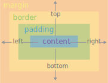
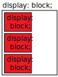
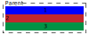
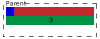
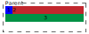
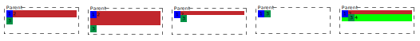

# CSS

## Наследование свойств(стилей)

Наследование становится важно, когда несколько селекторов указывают на один элемент:

1. Cascad(каскад) - берется последний определенный в CSS документе
1. Specific(специфичность) - чем более узкий селектор тем свойства(стиль) приоритетнее. [Более подробно](#расчет-специфичности)
1. Inherit(наследование) - некоторые свойства передются от родителя к потомку. В основном это касается текстовых свойства. Так же можно задать [наследование значений]()

## Расчет специфичности

(упрощенная версия) Расчитывается четырехзначное число по праилам ниже. Чем больше число тем выше приоритет стиля:

-   Тысячи : поставьте единицу в эту колонку, если объявление стиля находится внутри атрибута style(встроенные стили). Такие способ не имеют селекторов, поэтому их специфичность всегда просто 1000
-   Сотни : поставьте единицу в эту колонку за каждый селектор ID, содержащийся в общем селекторе
-   Десятки: поставьте единицу в эту колонку за каждый селектор класса, селектор атрибута или псевдокласс, содержащийся в общем селекторе
-   Единицы: поставьте общее число единиц в эту колонку за каждый селектор элемента или псевдоэлемент, содержащийся в общем селекторе

!important. Прописав это в свойстве, сделает его самым специфичным. Не рекомендуется использовать

```css
p {
	border: none !important;
}
```

## Наследование

Для начала нужно понять, что стили делятся на следущие группы:

-   Initial value - базовый стиль. Один для всего веба. На MDN у HTML тегов описан в свойствах initial value
-   Browser styles - браузерные стили. Индивидуальны для каждого браузера. Но по большей части схожи
-   CSS - стили в CSS документе
-   Style - аттрибут в html тегах

Эти значения можно прописывать любому свойсту стиля:

-   inherit - взять значение свойства у ближайшего родительского элемента
-   initial - устанавливает значение из базового стиля
-   unset - для наследуемых свойств применяется inherit, для не наследуемых initial. Возвращает свойству его естественное значение
-   revert - работает как unset, но берет значения из стилей браузера. Не все браузеры поддерживают. Возвращает свойству его естественное значение

```css
font-size: inherit;
font-size: initial;
font-size: unset;
font-size: revert;
```

Так-то unset и revert бесполезны. Но с аттрибутом all все приобретает смысл:

-   all: unset - сбрасывает все свойства до естественных
-   all: initial value - сбрасывает все свойства до стандартных

```css
p {
	all: unset;
}

p {
	all: initial value;
}
```

# Блочная модель

Блочная модель - основное понятие в CSS. То как элементы типа block и inline располагаются

## Устройство блока

Устройство блока:



-   margin - внешний отступ
-   border - граница. Точнее рамка вокруг
-   padding - внутренний отступ
-   content - содержание

Так же существует две блочные модели:

-   [Блочная модель по content](#задание-блочной-модели-1)
-   [Блочная модель по border](#задание-блочной-модели-2)
-   [Одна блочная модель для всех элементов](#задание-блочной-модели)

## Margin collapsing

Это когда margin'ы у top и bottom схлопываются в один. Размер получившегося margin'а равен наибольшему из top и bottom

Схлопывание происходит:

-   у соседних элементо "братьев и сестер"
-   между родителем и потомком если отсутствуют: padding, border
-   у пустых блоков без: padding, border, inline-content

Схлопывание НЕ происходит:

-   у float элементов
-   у position: absolute элементов

## Normal Flow

Нормальный поток - стандартное поведение завязанное на свойстве Display:

| display: inline                                                                           | display: block                                                                                                  | display: inline-block                                    |
| :---------------------------------------------------------------------------------------- | :-------------------------------------------------------------------------------------------------------------- | :------------------------------------------------------- |
| Останется в **той же** строке                                                             | Начнется с **новой** строки                                                                                     | Останется в **той же** строке                            |
| width и height **не** применяются                                                         | width и height применяются                                                                                      | width и height применяются                               |
| **Горизонтальные** отступы будут отодвигать другие **inline** элементы                    | Отступы будут отодвигать от него элементы                                                                       | Отступы будут отодвигать от него элементы                |
| **Вертикальные** отступы будут применяться но **НЕ БУДУТ** отодвигать **inline** элементы | -                                                                                                               | -                                                        |
| -                                                                                         | Будет заполнять всю ширину родителя                                                                             | Размеры будут больше содержимого только если явно задать |
|                                           |  |    |

# Способы разметки страниц

Есть несколько способов распологать элементы относительно друг друга

## Float(устарело)

CSS свойство float, может "прилепить" содержимое блочного элемента к стороне другого элемента:

```html
<div>
	<div style="float: left;">Block1</div>
	<div style="float: right;">Block2</div>
	<div style="float: none;">Block3</div>
</div>
```

CSS свойство clear:

```html
<div>
	<div style="clear: left;">Block1</div>
	<div style="clear: right;">Block2</div>
	<div style="clear: both;">Block3</div>
</div>
```

Примеры:

-   [Как работает свойство float](#работа-свойства-float)
-   [Как применять свойство clear](#clearfix)

## Table(устарело)

Древний способ верстки, когда создавали таблицу, и раскладывали content по строкам и столбцам

## Multi-column

Multi-column - позволяет расположить содержимое столбцами, как в газетах. Так же с ним работают свойства фрагментации

Разделить блок на 5 равных колонок и пихать контент в них:

```css
column-count: 5; - разделит блок на равные колонки и будет пихать контент в них
```

Разделить блок на 5 равных строк и пихать контент в них:

```css
column-width: 5; - разделит блок на равные колонки и будет пихать контент в них
```

Задать расстояние между строками/столбцами:

```css
column-gap: 10px;
```

Создает линию, типа border, между строками/столбцами:

```css
column-rule: 4px dotted rgb(79, 185, 227);
```

Элемент прерывает делениие на строки/столбцы занимая все пространство. После него опять распределяется по строкам/столбцам

```css
column-span: all;
```

## Flex

Flex - позициониравние потомков в ряд/столбец:

-   flex-wrapper - элемент у которого display: flex/inline-flex
-   flex-block - потомки элемента flex-wrapper

Также у Flex есть такое понятие как оси:

-   main-axis - для строк направлена: слева -> направо; для столбцов: сверху -> вниз;
-   cross-axis - для строк направлена: сверху -> вниз; для столбцов: слева -> направо;

Свойства flex-wrapper:

-   [Создаем flex-wrapper](#flex-wrapper)
-   [Распологать flex-block в строку/ряд/строку(задом наперед)/столбец(задом наперед)](#flex-wrapper---flex-direction)
-   [Перенос на следующую строку/столбец при переполнении](#flex-wrapper---flex-wrap)
-   [Выравнивание вдоль main-axis](#flex-wrapper---justify-content)
-   [Выравнивание вдоль cross-axis](#flex-wrapper---align-items)
-   [Выравнивание нескольких строк/столбцов вдоль cross-axis](#flex-wrapper---align-content)
-   [Отступы между строками/столбцами](#flex-wrapper---column-gap-row-gap)

Свойства flex-block:

-   [Занимаемое flex-block пространство(grow)](#flex-block---flex-grow)
-   [Занимаемое flex-block пространство(shrink)](#flex-block---flex-shrink)
-   [Занимаемое flex-block пространство(basis)](#flex-block---flex-basis)
-   [Занимаемое flex-block пространство](#flex-block---flex)
-   [Выравнивание flex-block](#flex-block---align-self)
-   [Порядок элементов](#flex-block---order)

## Grid

Выстраивает элементы в двумерную сетку:

-   grid-wrapper - элемент у которого display: grid/inline-grid
-   grid-block - потомки элемента grid-wrapper

Свойства grid-wrapper:

-   [Создаем grid-wrapper](#grid-wrapper)
-   [Указываем размер строк(grid-template-rows)](#grid-wrapper---grid-template-rows)
-   [Указываем размер столбов(grid-template-columns)](#grid-wrapper---grid-template-columns)
-   [Создаем разметку таблицы(grid-template-areas)](#grid-wrapper---grid-template-areas)
-   [Авто-добавление строк/столбцов(auto-)](#grid-wrapper---auto)
-   [Отступы между строками/столбцами таблицы(gap)](#grid-wrapper---gap)
-   [Выравние элементов по вертикальной оси(align-items)](#grid-wrapper---align-items)
-   [Выравние элементов по горизонтальной оси(justify-items)](#grid-wrapper---justify-items)

Свойства grid-block:

-   [Выравние текущего элемента по горизонтальной оси(justify-self)](#justify-self)
-   [Выравние текущего элемента по вертикальной оси(align-self)](#align-self)
-   [Расоложение элемента в строке(grid-row-...)](#grid-block---grid-row)
-   [Расоложение элемента в столбце(grid-column-...)](#grid-block---grid-column)
-   [Расоложение элемента в области(grid-area)](#grid-block---grid-area)

## Position

Все значения аттрибута position(кроме static), выбивают элемент из Normal Flow. Такой элемент становится "позиционированным":

-   "позиционированный" элемент - становится точкой отсчета, для элементов внутри себя
-   по умолчанию "позиционированный" элемент - html

Все потомки позционированного элемента переносятся на "новый слой" и определяют свое положение относительно него элемента

```css
position: static; /* поведение по умолчанию (просто Normal Flow) */
position: relative; /* положение определяется относительно положения по умолчанию */
position: absolute; /* удаляет элемент из нормального потока, элемент игнорирует остальные и залезает левый-верхний угол "позиционированного" родителя */
position: fixed; /* фиксирует элемент относительно viewport'а. Короче при прокрутке страницы элемент остается на месте */
position: sticky; /* после достижения определенной линии viewport - ведет себя как fixed. Приклеивается до тех пор, пока не дойдет до конца родителя */
```

Управление позицией "позиционированного" элемента:

```css
top: 10px;
left: 10%;
right: 20em;
bottom: calc(100% - 10px);
```

# Типы значений

## Precentage - Процент

Значение в процентах:

```css
margin: 25%;
```

## Length - Длниа

Длина может измеряться в Абсолютных значениях:

-   px - пиксель
-   mm, cm - миллиметр/сантисметр
-   in, pt - дюйм/семдесять-вторая дюйма
-   ch - ширина символа 0
-   ex - высота символа x

Длина может измеряться в Относительных значениях:

-   em - значение относительно родительского font-size. Для margin и padding - это значение font-size текущего элемента
-   rem - значение относительно аттрибута font-size у html
-   vh, vw - 1% от высоты/ширины экрана
-   vmin, vmax - наименьшее/наибольшее из vh и vw

## Color - Цвет

Цвет можно указывать одним из следующих способов:

-   [Цвет по ключевым словам](#color---keyword)
-   [Цвет по HEX коду](#color---hex)
-   [Цвет по RGBa коду(старый синтаксис)](#color---rgbaold)
-   [Цвет по RGBa коду(новый синтаксис)](#color---rgbanew)
-   [Цвет по HSL коду(старый синтаксис)у](#color---hslold)
-   [Цвет по HSL коду(новый синтаксис)](#color---hslnew)
-   [Скопировать цвет предка](#color---currentcolor)

## Angle - Угол

Задание угла:

-   1.2turn - оборот. То бишь 360 градусов
-   50grad - Град - одна сотая прямого угла. Один круг этот 400grad
-   45deg - классческие градусы
-   3.1416rad - классические радианы

```css
rotate: 1.2turn;
rotate: 50grad;
rotate: 45deg;
rotate: 3.1416rad;
```

# Свойства

# Основные свойства

## margin

Внешний отступ:

-   Задание margin и padding в %, работает так: берется предок, у него смотрится inline-размер(внутренний) и от него берется процент
-   margin: 1px 2px 3px 4px; - сокращенная запись отступов. Указывает отступы по часовой: сверху/справа/снизу/слева
-   margin: 10px 20px; - сокращенная запись отступов, 10px - отступы сверху и снизу, 20px - отступы слева и справа

```css
margin-top: 10px;
margin-bottom: 2%;
margin-left: 10px;
margin-right: 10px;
margin: 1px 2px 3px 4px;
margin: 10px 20px;
```

## padding

Внутренний отступ:

-   Задание margin и padding в %, работает так: берется предок, у него смотрится inline-размер(внутренний) и от него берется процент
-   padding: 1px 2px 3px 4px; - сокращенная запись отступов. Указывает отступы по часовой: сверху/справа/снизу/слева
-   padding: 10px 20px; - сокращенная запись отступов, 10px - отступы сверху и снизу, 20px - отступы слева и справа

```css
padding-top: 10px;
padding-bottom: 2%;
padding-left: 10px;
padding-right: 10px;
padding: 1px 2px 3px 4px;
padding: 10px 20px;
```

## border

Рамка между padding и margin:

-   [Радиус скругления углов(по окружности)](#border---radius)
-   [Радиус скругления углов(по элипсу)](#border---radius2)
-   [Ширина рамки](#border---width)
-   [Цвет рамки](#border---color)
-   [Стиль рамки](#border---style)
-   [Задаем сразу ширину/цвет/стиль](#border---border)

## background

Настройка заднего фона:

-   [Цвет фона](#background---background-color)
-   [Изображение на фон](#background---background-imagepath)
-   [Несколько изображений на фон](#background---множество-картинок)
-   [Позиция изображения на фоне](#background---background-position)
-   [Размер изображения на фоне](#background---background-size)
-   [Зацикливание изображения на фоне](#background---background-repeat)
-   [Правила прокрутки изображения на фоне](#background---background-attacment)

Градиент на заднем фоне:

-   [Линейный градиент](#background---background-imagelinear-gradient)
-   [Радиальный градиент](#background---background-imageradial-gradient)
-   [Конический градиент](#background---background-imageconic-gradient)
-   [Насколько градиентов одновременно](#background---background-imageкомбинированный-градиент)

## overflow

Определяет видимость контента за пределами блока:

-   visible - стандартное значение видимости
-   auto - если content вылез за пределы контейнера, то появляется полоса прокрутки
-   hidden - если content вылез за блок, то его не видно
-   scroll - горизонтальная и вертикальная полосы прокрутки
-   overflow-x - прокрутка по горизонтали
-   overflow-y - прокрутка по вертикали
-   scrol hidden - значения по вертикали и по горизонтали отдельно

```css
overflow: visible;
overflow: auto;
overflow: hidden;
overflow: scroll;
overflow: overflow-y;
overflow: overflow-x;
overflow: scroll hiden;
```

# Свойства текста

Почти все аттрибуты текста передаются от родителя потомкам

Работаем с текстом:

-   [Цвет текста](#text---color)
-   [Выравнивание текста](#text---text-align)
-   [Устанавливаем вывод текста: заглавные/строчные](#text---text-transform)
-   [Тень для текста](#text---text-shadow)

Размеры шрифта:

-   [Размер шрифта у текста](#text---font-size)
-   [Высота линии, в которой текст](#text---line-height)
-   [Расстояние между буквами/словами](#text---letter-spacing-word-spacing)
-   [Задаем "жирность" и курсив](#text---font-style-font-weight)

Настраиваем линию подчеркивания/перечеркивания/надчеркивания:

-   [Задаем линию подчеркивания/перечеркивания/надчеркивания](#text---text-decoration-line)
-   [Задаем линии стиль](#text---text-decoration-style)
-   [Задаем линии цвет](#text---text-decoration-color)
-   [Сокращенная запись, для всех параметров линии](#text---text-decoration)

Создание и настройка шрифта:

-   [Задание шрифтов тексту](#text---font-family)
-   [Создание custom шрифта](#text---custom-font)

# Пример

## Задание блочной модели #1

Через height и width задают размеры для контента. Отступы в эти размеры не входят. Для этого нужно указать:

```css
box-sizing: content-box;
```

## Задание блочной модели #2

Через height и width задаются размеры ВСЕГО блока. Отступы меняют размер самого содержимого, но не всего элемента. Для этого нужно указать:

```css
box-sizing: border-box;
```

## Задание блочной модели

Задать одну блочную модель для всех элементов:

```css
html {
	box-sizing: border-box;
}
*,
*::before,
*::after {
	box-sizing: inherit;
}
```

## Работа свойства float

Работа свойства float, пошагово:

-   1 Есть три блока с display: block;
-   2 Блок 1 - задали свойство float: left;
    -   Блок 1 - принимает размер по content
-   3 Блок 1 - смещается влево до тех пор пока:
    -   не встретит границу parent
    -   не встретит другой блок со свойством float
-   4 Блок 2 - перекрыт float блоком, и потому он сдвигает content

<div>
    
    
    
    
    <div style="clear: both;"></div>
</div>

Примеры:



## ClearFix

Существует такая проблема, чтобы блоки после float больше не залазили под float. Для этого нужно сделать очистку:

-   Block3 - будет отображаться ниже Block1 и Block2, а не под ними

```html
<div>
	<div style="float: left;">Block1</div>
	<div style="float: left;">Block2</div>
	<div style="clear: both;">Block3</div>
</div>
```

Поскольку html должен быть чистым, то мы не всегда можем себе позволить лишний блок для clear. Тогда используется:

```html
<style>
	.clearfix:after {
		content: '';
		display: block;
		clear: both;
	}
</style>

<div class="clearfix">
	<div style="float: left;">Block1</div>
	<div style="float: left;">Block2</div>
</div>
<div>Block3</div>
```

## Flex-wrapper

Указываем что используем flex:

-   display: flex; - flex-wrapper ведет себя как display
-   display: inline-flex; - flex-wrapper ведет себя как inline

```css
display: flex;
display: inline-flex;
```

## Flex-wrapper - flex-direction

flex-direction - указывает как распологать flex-block внутри flex-wrapper:

-   row - располагает flex-block в строку
-   column - располагает flex-block в ряд
-   row-reverse - располагает flex-block в строку(задом наперед)
-   column-reverse - располагает flex-block в столбец(задом наперед)

```css
flex-direction: row;
flex-direction: column;
flex-direction: row-reverse;
flex-direction: column-reverse;
```

## Flex-wrapper - flex-wrap

flex-wrap - указывает переносить не помещающиеся flex-block на следующую строку или нет:

-   wrap - переносит на следующую строку
-   no-wrap - НЕ переносит на следующую строку

```css
flex-wrap: wrap;
flex-wrap: no-wrap;
```

## Flex-wrapper - justify-content

justify-content - выравнивание flex-block, вдоль main-axis:

-   flex-start - начало cross-axis
-   flex-end - конец cross-axis
-   center - центрирует по cross-axis
-   space-between - равномерно распределяет flex-block внутри flex-wrapper
-   space-around - делает отступ у первого и последнего элемента, равномерно распределяет flex-block внутри flex-wrapper
-   space-evenly - делает БОЛЬОШОЙ отступ у первого и последнего элемента, равномерно распределяет flex-block внутри flex-wrapper

```css
justify-content: flex-start;
justify-content: flex-end;
justify-content: center;
justify-content: space-between;
justify-content: space-around;
justify-content: space-evenly;
```

## Flex-wrapper - align-items

align-items - выравнивание flex-block, вдоль cross-axis:

-   stretch - растягивает flex-block
-   center - центрирует по cross-axis
-   flex-start - начало cross-axis
-   flex-end - конец cross-axis

```css
align-items: stretch;
align-items: center;
align-items: flex-start;
align-items: flex-end;
```

## Flex-wrapper - align-content

align-content - работает как justify-content, но только для cross-axis. Не имеет отличий от align-items пока flex-wrap:wrap и всего 1 строка:

-   center - центрирует по cross-axis
-   flex-start - начало cross-axis
-   flex-end - конец cross-axis
-   space-between - равномерно распределяет flex-block внутри flex-wrapper
-   space-around - делает отступ у первого и последнего элемента, равномерно распределяет flex-block внутри flex-wrapper
-   space-evenly - делает БОЛЬОШОЙ отступ у первого и последнего элемента, равномерно распределяет flex-block внутри flex-wrapper

```css
align-items: center;
align-items: flex-start;
align-items: flex-end;
...
```

## Flex-wrapper - column-gap, row-gap

row-gap/column-gap - создает отступы между строками/столбцами flex-block:

```css
row-gap: 1em;
column-gap: 20px;
```

## Flex-block - flex-grow

flex-grow - насколько сильно растягивается flex-block внутри flex-wrapper:

-   flex-grow: 1; - указывается в долях(весах)

```css
flex-grow: 1;
```

## Flex-block - flex-shrink

flex-shrink - насколько сильно ужимается flex-block внутри flex-wrapper:

-   flex-shrink: 1; - указывается в долях(весах)

```css
flex-shrink: 1;
```

## Flex-block - flex-basis

flex-basis - сначало flex-block принимает указанное значение, а потом расстягивается/ужимается внутри flex-wrapper:

```css
flex-basis: 200px;
```

## Flex-block - flex

flex-basis - сначало flex-block принимает указанное значение, а потом расстягивается/ужимается внутри flex-wrapper:

-   2 - [flex-grow](#flex-block---flex-grow)
-   1 - [flex-shrink](#flex-block---flex-shrink)
-   200px - [flex-basis](#flex-block---flex-basis)

```css
flex: 2 1 200px;
```

## Flex-block - align-self

align-self - выравнивает ТЕКУЩИЙ flex-block, вдоль cross-axis:

-   stretch - растягивает flex-block
-   center - центрирует по cross-axis
-   flex-start - начало cross-axis
-   flex-end - конец cross-axis

```css
align-self: stretch;
align-self: center;
align-self: flex-start;
align-self: flex-end;
```

## Flex-block - order

order - меняет порядок элементов. Чем больше значение, тем дальше по main-axis расположен элемент:

```css
order: -5;
order: 1;
```

## Grid-wrapper

Указываем что используем grid:

-   display: grid; - grid-wrapper ведет себя как display
-   display: inline-grid; - grid-wrapper ведет себя как inline

```css
display: grid;
display: inline-grid;
```

## Grid-wrapper - grid-template-columns

grid-template-columns - Устанавливает размеры столбцов:

-   repeat(3, 250px) - три одинаковых колонки
-   40px auto 40% - создаст три колонки
-   [start line1] 150px [line2] 40%; - создает две колонки. В CSS к ним можно обращаться, для первой колонки start и line1; для второй колонки: line2;
-   1fr 2fr 1fr 200px - пример с fr, потому что это размерность доступна только для grid. Веса расчитываются после фиксированных размеров

```css
grid-template-columns: repeat(3, 250px); - три одинаковых колонки
grid-template-columns: 40px auto 40%; - создаст три колонки
grid-template-columns: [start line1] 150px [line2] 40%;
grid-template-columns: 1fr 2fr 1fr 200px;
```

## Grid-wrapper - grid-template-rows

grid-template-rows - Устанавливает размеры строк:

-   repeat(3, 250px) - три одинаковых колонки
-   40px auto 40% - создаст три колонки
-   [start line1] 150px [line2] 40%; - создает две колонки. В CSS к ним можно обращаться, для первой колонки start и line1; для второй колонки: line2;
-   1fr 2fr 1fr 200px - пример с fr, потому что это размерность доступна только для grid. Веса расчитываются после фиксированных размеров

```css
grid-template-rows: repeat(3, 250px); - три одинаковых колонки
grid-template-rows: 40px auto 40%; - создаст три колонки
grid-template-rows: [start line1] 150px [line2] 40%;
grid-template-rows: 1fr 2fr 1fr 200px;
```

## Grid-wrapper - grid-template-areas

grid-template-areas - позволяет расписать верстку таблицы, с указанием число строк и столбцов. Так же разбивает таблицу на области, к которым можно обращаться после:

-   header/content/👾/footer - области с именами
-   . - пустая область, в ней нет ячеек
-   используется в связке с [grid-area](#grid-block---grid-area)

```css
grid-template-areas:
	'header  header  header'
	'content content 👾'
	'content content .'
	'footer  footer  footer';
```

## Grid-wrapper - auto

Набор свойств отвечающих за создание строк и столбцов для элементов, которые не влезли в заранее созданную сетку:

-   grid-auto-columns - для невлезжих в сетку элементов, будут создаваться колонки с указанными ширинам
-   grid-auto-rows - для невлезжих в сетку элементов, будут создаваться строки с указанными ширинам

```css
grid-auto-columns: 50px 150px; - для невлезжих в сетку элементов, будут создаваться колонки с указанными ширинами с повтором значений ширины
grid-auto-rows: 50px 150px; - тоже что grid-auto-columns, но для строк
```

Указываем что создавать для невлезжих элементов - строки/столбцы:

-   row - для невлезжих элементов будет создавать строки
-   column - для невлезжих элементов будет создавать столбцы
-   dense - сначала заполнять пустые ячейки сетки, а после создавать строки/колонки

```css
grid-auto-flow: row | column; - для невлезжих элементов будет создавать строки/колонки
grid-auto-flow: dense row | column; - невлезшими элементами будет сначало заполнять пустые ячейки, а потом создавать строки/колонки
```

## Grid-wrapper - gap

Отступы между строками/столбцами:

```css
gap: 10px;
```

Отступы между строками/столбцами:

-   10px - отступ между строками
-   20px - отступ между столбцами

```css
gap: 10px 20px;
```

Отступы между строками/столбцами:

-   10px - отступ между строками
-   20px - отступ между столбцами

```
row-gap: 10px;
column-gap: 20px;
```

## Grid-wrapper - justify-items

Выравние элементов по горизонтальной оси:

-   stretch - растягивает grid-block
-   center - центрирует
-   start - начало
-   end - конец

```css
justify-items: start;
justify-items: center;
justify-items: end;
justify-items: stretch;
```

## Grid-wrapper - align-items

Выравние элементов по вертикальной оси:

-   stretch - растягивает grid-block
-   center - центрирует
-   start - начало
-   end - конец

```css
align-items: start;
align-items: center;
align-items: end;
align-items: stretch;
```

## Grid-block - justify-self

Выравние текущего элемента по горизонтальной оси:

-   stretch - растягивает grid-block
-   center - центрирует
-   start - начало
-   end - конец

```css
justify-self: start;
justify-self: center;
justify-self: end;
justify-self: stretch;
```

## Grid-block - align-self

Выравние текущего элемента по вертикальной оси:

-   stretch - растягивает grid-block
-   center - центрирует
-   start - начало
-   end - конец

```css
align-self: start;
align-self: center;
align-self: end;
align-self: stretch;
```

## Grid-block - grid-column

Свойство определяющие какие и сколько ячеек займет grid-block в столбце:

-   grid-column-start - столбец с которого начинаем растягивать grid-block
-   grid-column-end - столбец до которого расстягиваем grid-block

```css
grid-column-start: ...;
grid-column-end: ...;
```

Принимаемые значения:

-   line1 - имя данное столбцу при указании шаблона [столбца](#grid-wrapper---grid-template-columns)
-   2 - порядковый номер столбца от/до которого растягиваем
-   span 2 - количество столбцов на которое растягиваем

```css
grid-column-start: line1;
grid-column-end: 2;

grid-column-start: 2;
grid-column-end: span 2;
```

## Grid-block - grid-row

Свойство определяющие какие и сколько ячеек займет grid-block в строке:

-   grid-row-start - столбец с которого начинаем растягивать grid-block
-   grid-row-end - столбец до которого расстягиваем grid-block

```css
grid-row-start: ...;
grid-row-end: ...;
```

Принимаемые значения:

-   line1 - имя данное строке при указании шаблона [строки](#grid-wrapper---grid-template-rows)
-   2 - порядковый номер строки от/до которого растягиваем
-   span 2 - количество строк на которое растягиваем

```css
grid-row-start: line1;
grid-row-end: 2;

grid-row-start: 2;
grid-row-end: span 2;
```

## Grid-block - grid-area

grid-area - указывает прямоугольную область, которую занимает grid-block:

-   шорткат для [grid-column-](#grid-block---grid-column) [grid-row-](#grid-block---grid-row)
-   1 - grid-row-start
-   col4-start - grid-column-start
-   last-line - grid-row-end
-   6 - grid-column-end

```css
grid-area: 1 / col4-start / last-line / 6;
```

grid-area - указываем проименованную область, которую элемент должен занять:

-   используется в связке с [grid-template-areas](#grid-wrapper---grid-template-areas)
-   areaName - имя области

```css
grid-area: areaName;
```

## Color - keyword

Указание через ключевые цвета:

```css
color: red;
color: transparent;
```

## Color - HEX

HEX(без alpha - 3 или 6 символов):

````css
color: #c00;
color: #c0c0c0;
```

HEX(с alpha - 4 или 8 символов):

```css
color: #a82f;
color: #c0c0c0ff;
````

## Color - RGBa(old)

Указание цвета(без alpha) в старом синтаксисе:

```css
color: rgb(200, 120, 256);
```

Указание цвета(с alpha) в старом синтаксисе:

```css
color: rgba(200, 120, 200, 0.5);
```

## Color - RGBa(new)

Указание цвета(без alpha) в новом синтаксисе:

```css
color: rgb(200 120 256);
```

Указание цвета(с alpha) в новом синтаксисе:

```css
color: rgb(34 12 64 / 0.6);
```

## Color - HSL(old)

HSL - это:

-   Hue - оттенок. Все цвета радуг от 0 до 359, где 180 это голубой
-   Saturation - насыщенность. 0% - черно-белое, 100% - цветное,
-   Lightness - светлота или яркость. 100% - к белому, 0% - к черному

Указание цвета(без alpha) в старом синтаксисе:

```css
color: hsl(30, 100%, 50%);
```

Указание цвета(с alpha) в старом синтаксисе:

```css
color: hsla(30, 100%, 50%, 0.6);
```

## Color - HSL(new)

HSL - это:

-   Hue - оттенок. Все цвета радуг от 0 до 359, где 180 это голубой
-   Saturation - насыщенность. 0% - черно-белое, 100% - цветное,
-   Lightness - светлота или яркость. 100% - к белому, 0% - к черному

Указание цвета(без alpha) в новом синтаксисе:

```css
color: hsl(30 100% 50%);
```

Указание цвета(с alpha) в новом синтаксисе:

```css
color: hsl(30 100% 50% / 0.6);
```

## Color - CurrentColor

Кодовое слово, которое наследует цвет у свойства родителя. Можно использовать в любом свойстве принимающем цвет:

```css
backgrpund-color: currentcolor;
```

## Border - radius

Указываем радиус скругления угла по окружности:

-   border-top-left-radius: 10px; - скругление верхнего-левого угла по окружности
-   border-radius: 10px; - скругление всех углов по окружности

```css
border-top-left-radius: 10px;
border-top-right-radius: 10%;
border-bottom-left-radius: 20px;
border-bottom-right-radius: 10px;

border-radius: 10px;
```

## Border - radius#2

Указываем радиус скругления угла по элипсу. Первое число - горизонтальный радиус, второе число - вертикальный радиус:

-   border-bottom-left-radius: 10px, 20px; - скругление нижнего-левого угла по элипсу (10px, 20px)
-   border-radius: 10px / 5px; - скругление всех углов по элипсу (10px, 5px)
-   border-radius: 10px 25% / 5px 100em; - скругление углов по элипсу
    -   верхний-левый и нижний-правый (10px, 5px)
    -   верхний-правый и нижний-левый (25%, 100em)
-   border-radius: 10px 25% 50px 100px / 5px 100em 50px 100px ; - скругление углов по элипсу
    -   верхний-левый (10px, 5px)
    -   верхний-правый (25%, 100em)
    -   нижний-правый (50px, 50px)
    -   нижний-левый (100px, 100px)

```css
border-bottom-left-radius: 10px, 20px;

border-radius: 10px;
border-radius: 10px / 5px;
border-radius: 10px 25% / 5px 100em;
border-radius: 10px 25% 50px 100px / 5px 100em 50px 100px;
```

## Border - width

Задаем толщину линии:

```css
border-top-width: 10px;
border-right-width: 10px;
border-bottom-width: 10px;
border-left-width: 10px;

border-width: 10px;
```

## Border - color

Цвет рамки:

```css
border-top-color: #c0c0c0;
border-right-color: rgba(200, 120, 200, 0.5);
border-bottom-color: hsl(30, 100%, 50%);
border-left-color: currentcolor;

border-color: red;
```

## Border - style

Стиль рамки:

-   none - нет рамки
-   dotted - рамка точками
-   dashed - рамка короткими линиями
-   solid - рамка сплошная
-   groove - "типа" 3D
-   inset - верхняя-левая часть темнее нижней-правой

```css
border-top-style: none;
border-right-style: dotted;
border-bottom-style: dashed;
border-left-style: solid;

border-style: groove;
```

## Border - border

Сокращенный вариант для указания всех параметров сразу:

-   10px - [ширина рамки](#border---width)
-   dotted - [стиль рамки](#border---style)
-   red - [цвет рамки](#border---color)

```css
border-top: 10px dotted red;
border-right: 10px dotted red;
border-bottom: 10px dotted red;
border-left: 10px dotted red;

border: 10px dotted red;
```

## Background - background-image(linear-gradient)

Линейный градиент:

-   45deg - угол под которым рисуем градиент
-   red 10%, - указываем цвет и сколько он занимает в процентов от "полоски градиента"
-   red 0% 10%, blue 50% 60% - от 0% до 10% все red, потом размытие из red в blue, от 50% до 60% все blue, и т.д.
-   blue 20px, - 20px реального пространства, а не "полоски градиента"

```css
background-image: linear-gradient(45deg, red 10%, blue 60%, yellow 80%);
background-image: linear-gradient(
	45deg,
	red 0% 10%,
	blue 50% 60%,
	yellow 80% 100%
);
background-image: linear-gradient(45deg, red 0%, blue 20px, yellow 80%);
```

Есть еще вариант с повторяющимся градиентом:

```css
background-image: repeating-linear-gradient(
	45deg,
	red 0%,
	blue 20px,
	yellow 80%
);
```

## Background - background-image(radial-gradient)

Радиальный градиент:

-   red 10%, - указываем цвет и сколько он занимает в процентов от "полоски градиента"
-   red 10px 20%, yellow 30%, #1e90ff 50% - от 10px до 20% все red, потом размытие из red в yellow, от 30% до 100% все yellow
-   at 100% 20px - устанавливаем центр градиента в точку x: 100%, y: 20px
-   ellipse - градиент становиться не круглым, а элипсом, который пропорционален сторонам элемента
-   closest-side - радиус градиента равен растоянию от центра, до ближайщей стороны

```css
background-image: radial-gradient(red 10px 20%, yellow 30%);
background-image: radial-gradient(
	at 100% 20px,
	red 10px,
	yellow 30%,
	#1e90ff 50%
);
background-image: radial-gradient(
	ellipse at 100% 20px,
	red 10px,
	yellow 30%,
	#1e90ff 50%
);
background-image: radial-gradient(
	closest-side at 100% 20px,
	red 10px,
	yellow 30%,
	#1e90ff 50%
);
```

Есть еще вариант с повторяющимся градиентом:

```css
background-image: repeating-radial-gradient(red 10px 20%, yellow 30%);
```

## Background - background-image(conic-gradient)

Конический градиент:

-   red 10%, - указываем цвет и сколько он занимает в процентов от "полоски градиента"
-   at 0% 20px - устанавливаем центр градиента в точку x: 0%, y: 20px
-   from 45deg - угол в 45 градусов

```css
background: conic-gradient(red, blue);
background: conic-gradient(at 0% 20px, red 10%, yellow 30%, #1e90ff 50%);
background: conic-gradient(from 45deg, red, orange 50%, yellow 85%, green);
```

## Background - background-image(комбинированный градиент)

Комбинированный градиент:

```css
 {
	background: linear-gradient(
			217deg,
			rgba(255, 0, 0, 0.8),
			rgba(255, 0, 0, 0) 70.71%
		), linear-gradient(
			127deg,
			rgba(0, 255, 0, 0.8),
			rgba(0, 255, 0, 0) 70.71%
		), linear-gradient(336deg, rgba(0, 0, 255, 0.8), rgba(0, 0, 255, 0) 70.71%);
}
```

## Background - background-image(path)

Указываем путь до изображение на заднем фоне:

```css
background-image: url(./source/image.png);
```

## Background - background-color

Устанавливаем фоновый цвет. Распостраняется на контент и отступы от него:

```css
background-color: red;
```

## Background - background-position

Расположение [изображения](#background---background-imagepath):

-   background-position: top 20px right 10px; - отступ сверху 20px, отступ саправа 10px
    -   можно использовать: top/right/bottom/left

```css
background-position: 20px 10%;
background-position: top 20px right 10px;
```

## Background - background-size

Размер картинки на заднем фоне:

-   100px 10%; - конкретный размер изображения
-   cover - заполнить элемент изображением
-   contain - уменьшит изображение так, чтобы поместить в элемент

```css
background-size: 100px 10%;

background-size: cover;
background-size: contain;
```

## Background - background-repeat

Повторение изображения заднего фона:

-   no-repeat - не повторять изображение
-   repeat-x - повторять изображение по оси x
-   repeat-y - повторять изображение по оси y
-   repeat - повторять изображение

```css
background-repeat: no-repeat;
background-repeat: repeat-x;
background-repeat: repeat-y;
background-repeat: repeat;
```

## Background - background-attacment

Поведение заднего фона в зависимости от scroll:

-   fixed - прокуручивает так, словно элемент это "окно" смотрящее на background
-   scroll - прокучивает как обычную картинку

```css
background-attacment: sroll;
background-attacment: fixed;
```

## Background - множество картинок

Есть возможность задать сразу множество изображений:

-   image будет в позиции (10px 20px)
-   image2 будет в позиции (200px 0px)

```css
background-image: url(./image), url(./image2);
background-position: 10px 20px, 200px 0px;
```

Если количество свойств и изображений неравное, то свойства зацикливаются. Например:

-   image будет в позиции (10px 20px)
-   image2 будет в позиции (200px 0px)
-   image3 будет в позиции (10px 20px)

```css
background-image: url(./image), url(./image2), url(./image3);
background-position: 10px 20px, 200px 0px;
```

## Text - color

Цвет текста:

```css
color: red;
```

## Text - text-shadow

Тень текста:

-   можно описать несколько теней. Делается это через запятую
-   red - цвет
-   10px - отступ тени по горизонтали
-   20px - отступ тени по вертикали
-   2px - радиус размытие. Необязательно

```css
text-shadow: red 10px 20px;
text-shadow: blue -10px 0px 2px, red 10px 20px;
```

## Text - text-align

Выравнивание текста по горизонтали:

-   left - выравнивание по левой стороне
-   center - выравнивание по центру
-   right - выравнивание по правой стороне
-   justify - растянуть текст по всей ширине

```css
text-align: left;
text-align: center;
text-align: right;
text-align: justify;
```

## Text - text-transform

Настройка строчных и заглавных букв:

-   none - ничего не дклать
-   uppercase - весь текст заглавными
-   lowercase - весь текст строчными
-   capitalize - слова начинается с заглавной
-   full-width - делает моношрифт

```css
text-transform: none;
text-transform: uppercase;
text-transform: lowercase;
text-transform: capitalize;
text-transform: full-width;
```

Настройка декоративной линии:

## Text - text-decoration-line

Создаем декоративную линию:

-   none - отсутствие линии
-   underline - линия под текстом(подчеркивание)
-   overline - линия над текстом
-   line-through - линия по середине текста(перечекивание)

```css
text-decoration-line: none;
text-decoration-line: underline;
text-decoration-line: overline;
text-decoration-line: line-through;
```

## Text - text-decoration-style

Стиль декоративной линии:

-   solid - сплошная
-   double - двойная
-   dotted - точечками
-   dashed - прерывистая
-   wavy - волна

```css
text-decoration-style: solid;
text-decoration-style: double;
text-decoration-style: dotted;
text-decoration-style: dashed;
text-decoration-style: wavy;
```

## Text - text-decoration-color

Цвет декоративной линии:

```css
text-decoration-color: red;
```

## Text - text-decoration

Сокращенная запись для создания декоративной линии:

-   red - [цвет](#text---text-decoration-color)
-   solid - [стиль линии](#text---text-decoration-style)
-   underline - [где находится линия](#text---text-decoration-line)

```css
text-decoration: red solid underline;
```

## Text - font-size

Размер шрифта:

-   20px - размеры шрифта можно указывать в [абсолютных единицах](#length---длниа)
-   10% - размеры шрифта можно указывать в [процентах](#precentage---процент)

```css
font-size: 20px;
font-size: 10%;
```

## Text - line-height

Высота линии, в которой пишем текст. Влияет на расстояние между строками, не меняет сами буквы:

-   20px - высоту линии можно указывать в [абсолютных единицах](#length---длниа)
-   10% - высоту линии можно указывать в [процентах](#precentage---процент)

```css
line-height: 20px;
line-heighte: 10%;
```

## Text - letter-spacing, word-spacing

Расстояние между буквами в тексте:

-   20px - расстояние можно указывать в [абсолютных единицах](#length---длниа)

```css
letter-spacing: 20px;
```

Расстояние между словами в тексте:

-   20px - расстояние можно указывать в [абсолютных единицах](#length---длниа)

```css
word-spcing: 20px;
```

## Text - font-style, font-weight

Задает курсив:

-   normal - обычный текст
-   italic - курсивный(наклонный) текст
-   oblique - курсивный(наклонный) текст

```css
font-style: normal;
font-style: italic;
font-style: oblique;
```

Задает "жирность" шрифта:

-   100 - можно задать число от 100 до 900, но кратное 100. Чем больше, тем "жирнее"
-   light - тонкий текст
-   normal - нормальный текст
-   bold - "жирный" текст
-   extrabold - очень "жирный" текст

```css
font-weight: 100;
font-weight: light;
font-weight: normal;
font-weight: bold;
font-weight: extrabold;
```

## Text - font-family

В идеале надо укзывать три семейства-шрифтов:

1. [Кастомный (Custom)](#text---custom-font) - какой-то свой, который добавлен(или не добавлен) через @font-face
2. Системный (Safe Font) - какой-нибудь распостраненный системный шрифт максимально близкий к Кастомному
3. Семейство (Family Font) - шрифт из списка ниже. Этот шрифт 99.9% сработает, потому что это набор в него входят наборы пердустановленных шрифтов

Список Family Font:

-   serif - шрифт с засечкам (считается удобным для длинных текстов)
-   sans-serif - шрифт без засечек
-   monospace - шрифт с символами одной ширины
-   cursive - курсивный шрифт
-   fantasy - декоративный шрифт
-   system-ui - стандартный шрифт с устройства пользователя

Задание списка приоритета для шрифтов:

-   приоритет для шрифтов задается так: чем раньше шрифт в списке, тем он приоритетнее
-   если символ отсутствует в 1 шрифте, то он возьмется из второго и т.д.

```css
font-family: Georgia, serif;
```

## Text - Custom font

Задание custom шрифта:

```css
@font-face {
	/* Даем название кастомному шрифту */
	font-famly: 'nameOfFont';
	/* Чекаем, вдруг шрифт уже установлен на устройстве пользователя. Тогда используем его */
	src: local('Helvetica Neue Bold');
	/* Последовательно смотрим, может ли браузер использовать этот формат шрифта? Если да, то он его скачивает и использует */
	src: url('fonts/helveticaFont.ttf') format('truetype');
	src: url('fonts/helveticaFont.woff2') format('woff2');
	src: url('fonts/helveticaFont.woff') format('woff');
	src: url('fonts/helveticaFont.svg') format('svg');

	/* Значения font-weight и font-style при которых кастомный шрифт применяется*/
	font-weight: normal;
	font-style: normal;
}
```
