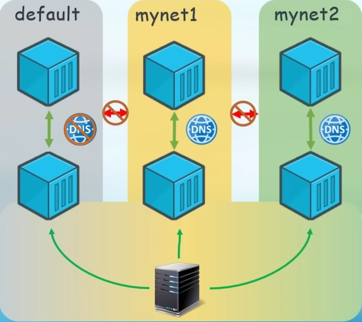
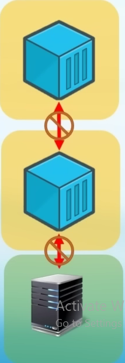

# Docker

Docker по сути своей, облегченная VM(virtual machine). Поскольку они все-таки различны, их разделяют на:

-   hypervision - термин, которым называют иерархию VM
    -   использует hardware эмуляцию, либо стремиться к ней
    -   к ним относится VirtualBox
-   baremetal hypervision - более оптимальный вариант VM
    -   избегает hardware эммуляции
    -   либо напрямую пишет в I/O поток, либо использует инструменты os на которой установлен
    -   к ним относится Docker

# Термины для VM

Термины для VM:

-   host os - компьютер на которой разврачивается VM
-   ghost machine - так называется VM
-   hosted hypervisor - когда виртуалка просто интерфейс соединяющий команды из ghost machine и host
-   hosted hypervisor - так называют VM, которые соединяют host и ghost через интерфейс. Без hardware эммуляций

# Термины для Docker

Слои абстракции в Docker:

-   Docker Registry - удаленная платформа для хранения Image
    -   dockerhub - оффициалььный Docker Registry, где хранится болльшинство Image для Docker
    -   Docker Repository - это набор образов имеющие одинаковые имена, но отличающиеся тегами
        -   например, есть образ python, но есть варианты этого образа: python-3. 7, python-slim...
        -   всё эти образы собираются в реестр
-   Image - образ из которого разварачивается контейнер
    -   по сути, это сами программы, которые потом запускаются в container
-   Container - программная платформа для разработки, доставки и запуска контейнерных приложений
    -   по сути, это обертка, в которой запускаются программы из Image
    -   через интерфейсы контейнеров программы общаяются
-   Dockerfile - файл в котором мы прописываем какие библиотеки(и тому подобное) необходимо добавить
    -   по сути, у нас есть container с node, а в dockerfile мы прописываем package.json который надо установить
-   Docker Volumes - механизм для постоянного хранения данных, потребляемых или производимых приложениями
    -   по сути, это база данных, которая не должна затираться при перезапуске контейнера
-   Software - последний слой Docker. Сама исполняемая программа

Взаимосвязь слоев абстракции:

-   Docker Client - это консоль, в которой мы пишем команды для Docker
-   Docker Daemon - это сервер, который получает команды из Docker Client, и из того определяет как должны действовать слои абстракции внутри системы

</img>

# Docker команды

## Docker - ps

ps - смотрим запущенные сейчас Container:

```bash
docker ps
```

ps - смотрим все Container, включае те, что отработали:

```bash
docker ps -a
```

## Docker - rm

rm - удалить Container:

-   c6ea745ce40e - ID удаляемого Container
-   c6 - начало ID удаляемого Container
-   c6 b7 ae - начало ID нескольких Container, которые удаляем
-   adoring_poinca - имя удаляемого Container

```bash
docker rm c6ea745ce40e
docker rm c6
docker rm c6 b7 ae
docker rm adoring_poinca
```

## Docker - rmi

rmi - удалить Image:

-   c6ea745ce40e - ID удаляемого Image
-   c6 - начало ID удаляемого Image
-   c6 b7 ae - начало ID нескольких Image, которые удаляем

```bash
docker rmi c6ea745ce40e
docker rmi c6
docker rmi c6 b7 ae
```

## Docker - images

images - смотрим установленные сейчас Images:

```bash
docker images
```

## Docker - pull

pull - скачиваем Image на пк:

-   image_name - имя скачиваемого пакета(можно нати например на dockerhub)
-   image_name:tag - имя скачиваемого пакета и нужный tag

```bash
docker pull image_name
docker pull image_name:tag
```

## Docker - run

run - создаем Container из Image и запускаем:

-   image_name - имя запускаемого пакета(можно нати например на dockerhub)
-   image_name:tag - имя запускаемого пакета и нужный tag
-   стандартные Image ничего не делают, поэтому их Container сразу закрывается

```bash
docker run image_name
docker run image_name:tag
```

Флаги:

-   -d - флаг позволяющий пользоваться консолью даже если в Container идет какая-то работа
-   --rm - флаг удаляющий Container по окончанию его работы
-   --name - флаг указывающий имя для Container
-   echo "Hello, World!" - команда переданная в Container

```bash
docker run -d image_name
docker run --rm image_name
docker run --name container_name image_name
docker run image_name echo "Hello, World!"
```

## Docker - start

start - запускаем Container, который был уже создан:

-   aec51ddb9253 - ID нужного Container
-   aec - начало ID нужного Container
-   adoring_poinca - имя запускаемого Container

```bash
docker start aec51ddb9253
docker start aec
docker start adoring_poinca
```

## Docker - pause

pause - ставим работу Container на паузу:

-   4034112326f - ID нужного Container
-   403 - начало ID нужного Container
-   adoring_poinca - имя Container, который ставим на паузу
-   в списках Container остановленный Container будет помечен как paused

```bash
docker pause 4034112326f
docker pause 403
docker pause adoring_poinca
```

## Docker - unpause

unpause - снимаем Container с паузы:

-   4034112326f - ID нужного Container
-   403 - начало ID нужного Container
-   adoring_poinca - имя Container, который снимаем с паузы
-   в списках Container остановленный Container помечен как paused

```bash
docker unpause 4034112326f
docker unpause 403
docker unpause adoring_poinca
```

## Docker - stop

stop - останавливаем Container:

-   4034112326f - ID нужного Container
-   403 - начало ID нужного Container
-   adoring_poinca - имя Container, который снимаем с паузы
-   stop в отличии от kill дает Container время чтобы остановиться. Мы так же можем обрабатывать это состояние внутри самого Container

```bash
docker stop 4034112326f
docker stop 403
docker stop adoring_poinca
```

## Docker - kill

kill - прекращение работы Container:

-   4034112326f - ID нужного Container
-   403 - начало ID нужного Container
-   adoring_poinca - имя Container, который снимаем с паузы
-   kill в отличии от stop моментально выключает Container

```bash
docker kill 4034112326f
docker kill 403
docker kill adoring_poinca
```

## Docker - stats

stats - сколько ресурсов занимает Container:

-   4034112326f - ID нужного Container
-   403 - начало ID нужного Container
-   adoring_poinca - имя Container, который снимаем с паузы

```bash
docker stats 4034112326f
docker stats 403
docker stats adoring_poinca
```

## Docker - logs

logs - смотрим логи Container:

-   4034112326f - ID нужного Container
-   403 - начало ID нужного Container
-   adoring_poinca - имя Container, который снимаем с паузы

```bash
docker logs 4034112326f
docker logs 403
docker logs adoring_poinca
```

Флаги:

-   -f - видеть постоянно обновляющиеся логи(life режим)

```bash
docker logs -f adoring_poinca
```

## Docker - exec

exec - выполнить команду внутри Container

Зайти внутрь Container:

-   -it - не понимаю что делают ключи, но без них ничего не работает
-   MyNginx - имя Container
-   /bin/bash - куда заходим

```bash
docker exec -it MyNginx /bin/bash
```

Выйти из Container:

-   CTRL + D - комбинация клавишь
-   exit - команда выхода

```bash
CTRL + D
# или
exit
```

## Docker - пробросить Port

Чтобы пробросить Prot, например для Nginx, достаточно написать:

-   -p - флаг проброса Port
-   8080 - Port у Container с которого будем пробрасывать
-   80 - Port у nginx, внутри Container, который будем слушать

```bash
docker run -p 8080:80 nginx
docker run -p 8080:80 -p 9200:120 nginx
```

## Docker - Environment Variable

Environment Variable - переменне окружения. Будет установленно как [системная переменная Linux](../../Linux/05-Base.md#environment-variable). Их можно передать таким синтаксисом:

-   -e - флаг, указывающий что дальше будет переменная окружения
-   PASSWD=12345678 - передаем переменную PASSWD и задаем ей значение 12345678

```bash
docker run -e PASSWD=12345678 mysql
```

# Volume

При прекращение работы Container, данные удаляются. Чтобы этого не происходило, существует механика - Volume:

-   Mount(монтирование) - ч/з Docker указываем папку на жестком, из которой будут браться данные

## Volume - ls

ls - позволяет посмотреть список volume на host:

```bash
docker volume ls
```

## Volume - rm

rm - позволяет удалить volume на host:

-   volume_name - имя Volume который хотим удалить

```bash
docker volume rm volume_name
```

## Volume - Host Volumes

Host Volumes - при запуске указываем папку из которой Mount данные:

-   -v - флаг указания Volumes
-   /opt/mysql_data - папка на host
-   /var/lib/mysql - папка в Container
-   :ro - расшифровывается ReadOnly, указывает что Container может только читать

```bash
docekr run -v /opt/mysql_data:/var/lib/mysql mysql
docekr run -v /opt/mysql_data:/var/lib/mysql:ro mysql
```

## Volume - Named Volumes

Named Volumes - при запуске указываем папку из которой Mount данные:

-   -v - флаг указания Volumes
-   /var/lib/docker/mysql_data/\_data - папка создается на host
-   /var/lib/mysql - папка в Container
-   :ro - расшифровывается ReadOnly, указывает что Container может только читать

```bash
docekr run -v mysql_data:/var/lib/mysql mysql
docekr run -v mysql_data:/var/lib/mysql:ro mysql
```

## Volume - Anonymous Volumes

Anonymous Volumes - при запуске указываем папку из которой Mount данные:

-   -v - флаг указания Volumes
-   /var/lib/docker/volumes/HASH/\_data - папка на host
    -   HASH - какой-то сгенерированный HASH
-   /var/lib/mysql - папка в Container
-   :ro - расшифровывается ReadOnly, указывает что Container может только читать

```bash
docekr run -v /var/lib/mysql mysql
docekr run -v /var/lib/mysql:ro mysql
```

# Container

Команды для работы с Container:

-   [Посмотреть информацию по Container](#container---inspect)
-   [Запустить Container в указанной сети](#network---запустить-container)

# Network

Network(сеть) - настройка сетей, позволяет управлять тем, как общаются Container между собой и host. Сети могут быть нескольких типов, но в 95% случаев используется Bridge и Host:

-   [Brigde - множество изолированных подсетей](#network---bridge)
-   [Host - одна изолированная сеть](#network---host)
-   [None - каждый container изолирован](#network---none)

Команды для работы с Network:

-   [Посмотреть список сетей](#network---ls)
-   [Посмотреть информацию о сети](#network---inspect)
-   [Посмотреть IP-адрес и Mac-адрес для Container](#container---inspect)
-   [Задаем сети IP-адреса(subnet/gateway)](#network---задать-ip)
-   [Запустить Container в указанной сети](#network---запустить-container)
-   [Удалить сеть](#network---удалить-сеть)

Манипулирование подключением Container(обычно используется для создания Proxy):

-   [Подключить Container к сети](#network---connect)
-   [Отключить Container от сети](#network---disconnect)

# DockerFile

# Примеры

## Container - inspect

inspect - получить информацию по Container, влючает mac-адрес, ip-адрес и т.д:

-   4034112326f - ID нужного Container
-   403 - начало ID нужного Container
-   adoring_poinca - имя Container, который снимаем с паузы

```bash
docker inspect 4034112326f
docker inspect 403
docker inspect adoring_poinca
```

## Network - Connect

Connect - подключает Container к подсети:

-   network_name - имя подсети
-   container_name - имя Container

```bash
docker network connect network_name container_name
```

## Network - Disconnect

Disconnect - отключить Container от подсети:

-   netwrork_id - id подсети. Можно глянуть через inspect
-   container_name - имя Continer

```bash
docker network diconnect netwrork_id container_name
```

## Network - Запустить Container

Запустить Container:

-   network_name - имя подсети, в которой хотим запустить Container

```bash
docker run --net network_name image_name
```

## Network - Удалить сеть

```bash
docker network rm network_name
```

## Network - Задать IP

Задать IP:

-   --subnet 192.168.10.0/24 -
    -   /24 - маска подсети или по привычному 255.255.255.0
-   --gateway 192.168.10.1 - куда
-   --driver bridge - сеть типа bridge
-   network_name - имя сети

```bash
docker network create --driver bridge --subnet 192.168.10.0/24 --gateway 192.168.10.1 network_name
```

## Network - inspect

inspect - можно посмотреть тип, ip и т.д:

-   network_name - имя сети информацию по которой смотрим

```bash
docker network inspect network_name
```

## Network - ls

ls - посмотреть какие сети есть в Docker:

```bash
docker network ls
```

## Network - Bridge

Bridge - сеть, из подсетей:

-   default, mynet1, mynet2 - подсети
    -   default - стандартная подсеть, внутри которой Container получают случайные IP
        -   нет DNS(нельзя давать Container имена)
        -   Container могут общатья между собой
        -   Container могут общатья с host
        -   при запуске Container без указания подсети, попадает в default
    -   mynet1, mynet2 - пользовательская подсеть
        -   есть DNS(можно задавать имена Container, чтобы пересылать данные)
        -   Container могут общатья между собой
        -   Container могут общатья с host



Создаем подсеть типа Bridge:

-   network_name - имя которое даем подсети

```bash
docker network create --drive bridge network_name
```

Запустить Container внутри подсети:

-   network_name - имя подсети в которой запускаем Container

```bash
docker run --net network_name nginx
```

## Network - Host

Host - сеть, которая использует IP адреса самого host:

-   Container могут общатья между собой
-   Container могут общатья с host
-   Может быть только одна сеть типа host


Создаем подсеть типа Host:

-   network_name - имя которое даем подсети

```bash
docker network create --drive host
```

## Network - None

None - изолированно запусаются Container:

-   Container НЕ могут общатья между собой
-   Container НЕ могут общатья с host
-   Может быть только одна сеть типа None



## Network - macvlan

macvlan - упращает маршрутизацию для Switch:

-   каждый Container получает свой IP и копирует mac-адрес host
-   каждый Container получает свой mac-адрес

## Network - ipvlan

ipvlan:

-   каждый Container получает свой IP
-   каждый Container копирует mac-адрес из host
