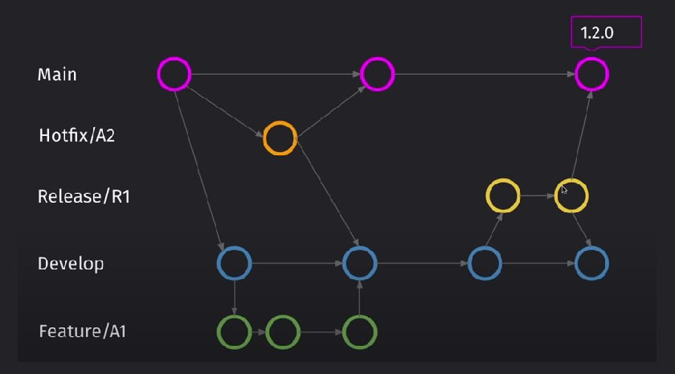

# Методологии

То как вести проект в GIT

# GIT Flow

Базовая база, но в интернете пишут, что не подходит для небольших комманд

## Устройство

Устройство:

| Имя ветки | Как создается                                                                          | Для чего                                                                       | Что делаем по готовности            |
| :-------- | :------------------------------------------------------------------------------------- | :----------------------------------------------------------------------------- | :---------------------------------- |
| Develop   | Один раз branch'тся от Main. Ничего не надо push-ить, только merg-ить из веток Feature | Ветка в которой ведется разработка                                             | От Develop branch'тся ветка Release |
| Feature   | Branch'тся от Develop                                                                  | Ветки в которых ведется разработка новых фич. Для каждой своя ветка            | По завершению merg-им с develop     |
| Release   | Branch'тся от Develop                                                                  | Ветки в которых фиксируем нужный функционал. Исправлем баги и готовим к редизу | В конце merg-им в Main и в Develop  |
| Main      | Ничего не надо push-ить, только merg-ить из веток Feature и HotFix                     | Версия приложения готовая к публиации                                          |                                     |
| HotFix    | Branch'тся от Main                                                                     | Ветки для исправление багов в уже зарелизенной версии приложения               | В конце merge'тся в Main и Develop  |

