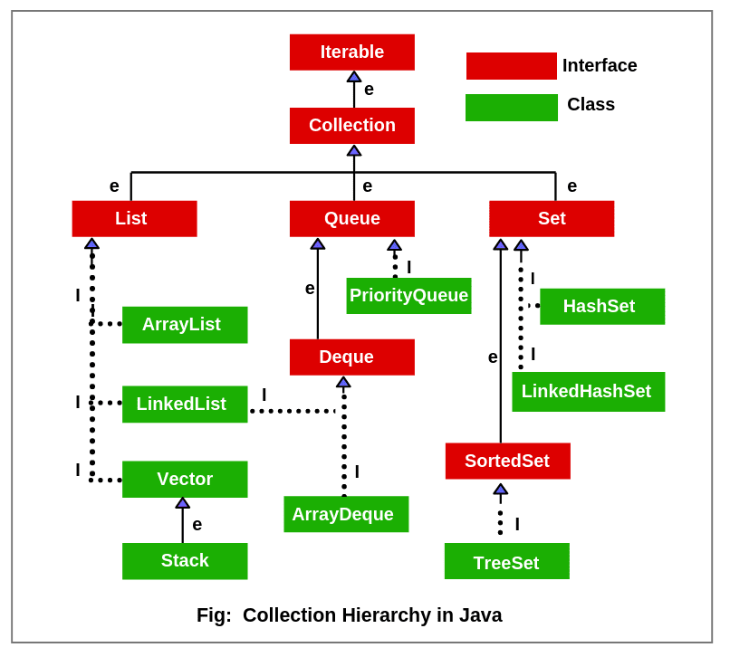

# Java

Java - это база, это знать надо

## Java - общий понятия

Структура Java инструментария такова:

-   JDK(JavaDevelopmentKit) - контейнер для JRE и DevTools
    -   JRE - контейнер для JVM, JavaClassLibrary и DevTools
        -   JVM(Java Virtual Machine) - виртуальная машина куда компилируется код
        -   JavaClassLibrary - базовые библиотеки
    -   DevTools - вские jar, javadoc и т.д.

SDK - набор инструментов для разработки. Туда входят:

-   В SDK входят:
    -   API
    -   Libriries
    -   Documentation
    -   Debugging
    -   Tutorials
    -   ...
-   Например:
    -   может быть специальная SDK - для авторизации. Это не только библиотека, а уже полностью сформированный инструмент

# Структуры

## Объявление переменных

Объявление переменных:

<!-- -   [var - глобальная переменная](#объявление-переменных---var)
-   [let - локальная переменная](#объявление-переменных---let)
-   [const - константа](#объявление-переменных---const) -->

## Условия

Условия бывают:

-   [Условие типа: if ... else if ... else](#условия---ifelse)
-   [Условие типа: switch](#условия---switch)
-   [Тернарный оператор](#условия---тернарный-оператор)

## Циклы

Циклы while:

-   [Классический while](#цикл---while)
-   [Классический do...while](#цикл---dowhile)

Циклы for:

-   [Классический for](#цикл---for)
-   [Классический forEach](#цикл---foreach)

Break, continue и label:

-   [Break](#цикл---break)
-   [Continue](#цикл---continue)
-   [Label](#цикл---label)

## Ошибки

Ошибки отлавливаются через try...catch...finally:

```java
try {
    // код
} catch (Exception e) {
    // поймали ошибку
} finally {
    // выполнится вне зависимости от наличия ошибки
}
```

# Синтаксический сахар

Обработка undefined:

-   [Если false, то новое значение](#syntaxsugar---double-pipe)
-   [Если undefined, то новое значение](#syntaxsugar---double-qestion)

# Мультиполточность

# Типы данных

## Примитивные типы

Примитивные типы - НЕ ссылочные типы:

-   [Целые числа - byte, short, int, long](#примитивные-типы---byte-short-int-long)
-   [Числа с плавающей точкой - float, double](#примитивные-типы---float-double)
-   [Логический - boolean](#примитивные-типы---boolean)
-   [Символьный - char](#примитивные-типы---char)

## String

Array - строка. Создать строку:

-   [Создать строку](#string---создать-строку)

## Array

Array - массив, длина не изменяется. Создать массив:

-   [Создать массив с указанным типом](#array---создать)
-   [Создать массив с конкретными значениями](#array---создать-со-значениями)
-   [Создать двумерный массив](#array---создать-двумерный-массив)

# Collections

Ооооо, колекции в Java это пипец:



Список объектов:

-   [ArrayList](#collections---arraylist)
-   [SynchronizedList](#collections---synchronizedlist)
-   [LinkedList](#collections---linkedlist)
-   [Vector](#collections---vector)

Список интерфейсов:

-   [Iterator](#collections---iterator)
-   [Iterable - тип элемента возвращенный Iterator](#collections---iterable)
-   [Collection](#collections---collection)
-   [List](#collections---list)
-   [Queue](#collections---queue)
-   [Set](#collections---set)
-   [Deque](#collections---deque)
-   [SortedSet](#collections---sortedset)

Работа с потоками:

-   [Synchronized Lock](#collections---synchronized-lock)

## Collections - Iterable

Iterable - базовый интерфейс коллекций. Реализует одно поле - Iterator:

-   list.Iterator() - вернет объект [класса Iterator](#collections---iterator)

```java
ArrayList<String> list = new ArrayList<String>;
Iterator iterList = list.Iterator();
```

## Collections - Iterator

Iterator - интерфейс, с помощью которого можно иттерироваться по другому объекту:

-   связан с [интерфейсом Iterable](#collections---iterable)

Реализует 3 метода:

-   next - возвращает следующий элемент Iterator
-   hasNext - возвращает true, если есть еще элементы в Iterator
-   remove - удаляет следующий элемент Iterator

## Collections - Collection

Collection - базовый интерфейс коллекций. Реализует такие методы как:

-   contains/containsAll - проверить содержание элемнта/элементов-коллекции
-   add/addAll - Добавить элемент/элементы-коллекции
-   remove/removeAll/removeIf - Удалить экземпляр элемента/элементы-коллекции/по-условию
-   clear - очистить всю коллекцию

Полезные штучки:

-   iterator/stream/toArray - возвращает Iterator/stream/Array по элементам коллекции
-   isEmpty - Является ли, коллекция пустой
-   size - Получить размер коллекции

Базовые методы, для коллекций:

-   equals/hashCode - шелуха всякая

## Collections - List

List - интерфейс позволяющий хранить упорядоченную последовательность элементов(дубликаты и null). Элементы индексированны:

Методы полученные от [интерфейса Collection](#collection):

-   contains/containsAll - проверить содержание элемнта/элементов-коллекции
-   add/addAll - Добавить элемент
-   add/addAll - Добавить элемент, в место указанное по индексу
-   remove - Удалить элемента/элементы-коллекции/по-условию по index
-   remove/removeAll - Удалить экземпляр элемента/элементы-коллекции/по-условию

-   get - получить элемент по index
-   set - располагает элемент по index
-   subList - возвращает под-коллекцию, по начальному и конечному индексу

-   indexOf/lastIndexOf - получить index по элементу от начала/конца или -1

-   clear - очистить всю коллекцию

Полезные штучки:

-   iterator/listIterator/toArray - возвращает Iterator/stream/Array по элементам коллекции
-   listIteratorstream - возвращает Iterator, начиная с index
-   isEmpty - Является ли, коллекция пустой
-   size - Получить размер коллекции

-   replaceAll - заменяет каждый элемент списка, результатом применения оператора к каждому элементу
-   sort - сортирует список по порядку, который определяет Comparator

Базовые методы, для коллекций:

-   equals/hashCode - шелуха всякая

## Collections - Queue

Queue - интерфейс реализующий очередь по правилу FIFO(first-in first-out):

Методы полученные от [интерфейса Collection](#collection):

-   [add - Добавить элемент](#collection---add)
-   [remove - Удалить элемент](#collection---remove)
-   [isEmpty - Является ли, коллекция пустой](#collection---isEmpty)
-   [size - Получить размер коллекции](#collection---size)

Реализует методы, которые аналогичны стандартным, но ошибки не выбрасывает

1. poll вместо remove
2. offer вместо add (для ограниченный очередей ошибка)
3. peek вместо element

## Collections - Deque

Deque(DoubleEndQue) - двунаправленная очередь. В такой очереди элементы могут использоваться с обоих концов. Здесь работает как FIFO так и LIFO

Методы:

1. addFirst / offerFirst
2. addLast / offerLast
3. removeFirst / pollFirst
4. removeLast / pollLast
5. getFirst / peeckFirst
6. getLast / peeckLast

## Collections - Set

Set - интерфейс реализующий коллекцию уникальных элементов(множество):

Методы полученные от [интерфейса Collection](#collection):

-   [add - Добавить элемент](#collection---add)
-   [remove - Удалить элемент](#collection---remove)
-   [isEmpty - Является ли, коллекция пустой](#collection---isEmpty)
-   [size - Получить размер коллекции](#collection---size)

## Collections - ArrayList

ArrayList - массив изменяющий свою длинну:

-   Плюсы:
    -   Быстро ищет элементы
-   Минусы:
    -   Долго добавляет элементы
    -   Нет синхронизации

Принцип работы:

-   initialCapacity - резервирует память на указанное число элементов элементов. В примере: (2);
-   size - при превышении initialCapacity, создает новый массив, размер которого = размер \* 1.5 + 1

```java
ArrayList<String> strings = new ArrayList<String>();
ArrayList<String> strings = new ArrayList<String>(2);
```

Методы полученные от [интерфейса Collection](#collection):

-   [add - Добавить элемент](#collection---add)
-   [remove - Удалить элемент](#collection---remove)
-   [isEmpty - Является ли, коллекция пустой](#collection---isEmpty)
-   [size - Получить размер коллекции](#collection---size)

## Collections - SynchronizedList

SynchronizedList - массив изменяющий свою длинну, синхронизированны методы add и remove:

-   Плюсы:
    -   Быстро ищет элементы
    -   Синхронизированны методы add и remove
-   Минусы:
    -   Долго добавляет элементы
    -   Нет синхронизации у Iterator

```java
ArrayList<String> strings = new ArrayList<String>();
ArrayList<String> strings = new ArrayList<String>(2);
```

Методы полученные от [интерфейса Collection](#collection):

-   [add - Добавить элемент](#collection---add)
-   [remove - Удалить элемент](#collection---remove)
-   [isEmpty - Является ли, коллекция пустой](#collection---isEmpty)
-   [size - Получить размер коллекции](#collection---size)

## Collections - LinkedList

LinkedList - цепочка из данных:

-   Плюсы:
    -   Долго ищет элементы
-   Минусы:
    -   Быстро добавляет элементы(особенно если они находятся вначале или в конце коллекции)

Принцип работы - цепочка из данных, где каждый элемент хранит определенные данные и ссылки на предыдущий и следующий элементы:

-   Head - первый элемент LinkedList, и для него предыдущий элемент null
-   Tail - последний элемент LinkedList, и для него последующий элемент null

```java

```

Методы полученные от [интерфейса Collection](#collection):

-   [add - Добавить элемент](#collection---add)
-   [remove - Удалить элемент](#collection---remove)
-   [isEmpty - Является ли, коллекция пустой](#collection---isEmpty)
-   [size - Получить размер коллекции](#collection---size)

## Collections - Vector

Vector(УСТАРЕЛ) - массив изменяющий свою длинну:

-   По сути тоже что и ArrayList
-   имплементирует интерфейс List
-   Класс устарел и не рекомендуется к использованию
-   Является [synchronized](#collections---synchronized)

## Collections - synchronized lock

synchronized - ставит Lock для других потоков, чтобы переменные не конфликтовали. Например при иттерировании по коллекции это обязательно:

-   (synchList) - переменная для которой поставили Lock

```java
synchronized (synchList) {
    Iterator<Integer> iterator = synchList.iterator();
    while (iterator.hasNext()) {
        System.out.println( iterator.next() );
    }
}
```

# Функциональные фичи

## Functional Interface

Functional Interface - функциональный интерфейс, это Interface с одним мтодом

-   @FunctionalInterface - аннотация, не позволяющая задать более одного метода

```java
@FunctionalInterface
interface MyInterface { String reverse(String n); }

public class main {
    public static void main() {
        MyInterface res = (s) -> s.reverse()
    }
}
```

## Встроенные FunctionalInterface

Список встроенных FunctionalInterface:

-   [Predicate](#functionalinterface---predicate)
-   [UnaryOpertor](#functionalinterface---unaryopertor)
-   [BinaryOperator](#functionalinterface---binaryoperator)
-   [Function](#functionalinterface---function)
-   [Consumer](#functionalinterface---consumer)
-   [Suplier](#functionalinterface---suplier)
-   [Predicate](#functionalinterface---predicate)

## Lambda

Lambda - анонимная функция без класса:

-   появилась в Java8
-   этот синтаксис - обертка над Funciton Interface

```java
// без аргументов
() -> System.out.println("Hello")


(int var1, int var2, int var3) -> var+var2+var3

(int var1, int var2, int var3) -> {
    return var1 + var2 + var3
}
// можем не указывать тип, если исполььзуем Functional Interface
SomeInterface res = s -> s.length
```

## Method Refrence

Method Reference - получаем ссылку на метод:

-   в примере каждый элемент list выведем через System.Out.pringtln в консоль

```java
list.forEach(System.out::println);
```

## Stream

Stream - позволяет проходить по объекту, как в функциональных языках:

-   появились в JAVA 8

Самые главные методы:

-   [map](#stream---map)
-   [filter](#)
-   [reduce](#)
-   [forEach](#)

## Stream - filter

Возвращает только значения прошедшие проверку:

```java
ArrayList<String> arrayList = new ArrayList<>();
arrayList.add("aTraction");
arrayList.add("bInary");
arrayList.add("aOpsadlka");

arrayList.stream().filter(
        el -> el.charAt(0)=='a' && el.length()==9
);
```

## Stream - forEach

пробегаемся по Stream и что-то делаем, но ничего не возвращает. Например можно что-либо вывести:

```java
Arrays.stream(array).forEachOrdered(el -> System.out.println(el * 2));
```

## Stream - map

применяет переданную функцию последовательно к каждому элементу

Подробный вариант использования map:

```java
ArrayList<String> arrayList1 = new ArrayList<>();
arrayList1.add("privet");
// ...
arrayList1.add("ok");

Stream<String> fooStream = arrayList1.stream();
Stream<Integer> fooStream2 = fooStream.map( el -> el.length() );
ArrayList<Integer> arrayList2 = (ArrayList<Integer>) fooStream2.collect(Collectors.toList());
```

Сокращенный вариант:

```java
ArrayList<String> arrayList1 = new ArrayList<>();
arrayList1.add("privet");
// ...
arrayList1.add("ok");

ArrayList<Integer> arrayList2 = (ArrayList<Integer>) arrayList1.stream().map(
        el -> el.length()
).collect(Collectors.toList());
```

Хотя к массивам по другому применяется:

```java
int[] array = {1,2,4,6,78};
int[] array2 = Arrays.stream(array).map(
        el -> el * 2
).toArray();
```

## Stream - reduce

возвращает из набора элементов один, путем кумулятивного(накопительно) применения функции к последовательнсоти. По факту возвращает Optional, это связано с тем что может reduce может вернуть null:

```java
int result = 0;
Optional<Integer> reduce = list.stream().reduce((accumulator, el) -> accumulator*el);
if(reduce.isPresent()) {
    result = reduce.get();
} else {
    // значение Stream.reduce null... Короче говно случилось
}
```

# Важные вещи

Важные вещи:

-   [Вывод в косоль](#важные-вещи---consolelog)
<!-- -   [Комментарии](#важные-вещи---комментарии) -->

# Примеры

## FunctionalInterface - Predicate

Predicate<T> - проверка соблюдения условия:

```java
Prdicate<Integer> isPositive = x -> x > 0;
```

## FunctionalInterface - UnaryOpertor

UnaryOpertor<T> - выполняет над объектом операцию:

```java
UnaryOpertor<Integer> square = x -> x*x;
```

## FunctionalInterface - BinaryOperator

BinaryOperator<T> - выполняет над 2-мя объектами операцию:

```java
BinaryOperator<Integer> multiply = (x, y) -> x*y;
```

## FunctionalInterface - Function

Function<T, S> - функция перехода от T к S:

```java
Function<Integer, String> convert = x -> String.valueof(x);
```

## FunctionalInterface - Consumer

Consumer<T> - выполняет операцию над объектом, ничего не возвращает:

```java
Consumer<Integer> printer = x -> System.out.print(x);
```

## FunctionalInterface - Suplier

Suplier<T> - ничего е принимает, но возвращает объект типа T:

```java
Suplier<User> user = () -> new User(
    new Scanner(System.in).nextLine()
);
```

## Array - Создать со значениями

Создает массив из указаных значений:

```java
String[] sStrings = { "string A", "string B" };
```

## Array - создать двумерный массив

Создаем двумерный Array:

```java
int[][] sNumbers = {
     { 1, 2, 3, 4, 5},
     { 4, 5 },
     { 7, 8, 9}
};
System.out.println( sNumber[0][2] );
```

## Array - Создать

Создает массив из целых числе, длиной 5(заполнен нулями):

```java
int[] fNumbers = new int[5];
```

## String - создать строку

Строка создается так:

```java
String sVar = "значение";
// или инициализируем как объект
String sVar = new String("значение");
```

## Условия - if/else

Стандартное условие:

```java
if (5 > 10) {
    // блок кода
} else if (5 < 0) {
    // блок кода
} else {
    // блок кода
}
```

## Условия - тернарный оператор

Условие в одну строку:

-   age > 18 - логическое выражение
-   "Совершеннолетний" - переменная var будет "Совершеннолетний", если age > 18 вернет true
-   "Несовершеннолетний" - переменная var будет "Несовершеннолетний", если age > 18 вернет false

```java
var = age > 18 ? "Совершеннолетний" : "Несовершеннолетний";
```

## Условия - switch

Множественное ветвление:

```java
switch (age) {
    case 0:
        System.out.println("Ты родился");
        break;
    case 7:
        System.out.println("Ты пошел в школу");
        break;
    case 18:
        System.out.println("Ты совершеннолетний!");
        break;
    default: // этот блок необязателен
        System.out.println("Обычный год");
}
```

## Цикл - while

Цикл while:

```java
int value = 0;
while (value > 5) {
    System.out.println(value);
    value = value + 1;
}
```

## Цикл - do...while

Цикл do...while:

-   отличается от while тем, что обязатель но выполнит { ... } хотя бы раз
-   выполняет { ... }, пока выполняется условие condition

```java
do {
    System.out.println("Введите число 5: ");
    num = scanner.nextInt();
} while (num != 5);
```

## Цикл - for

Классика, как в C:

```java
for (int i = 0; i < 5; i = i + 1) {
    // блок кода
}
```

Цикл с несколькими инициализациями:

-   Переменные должны быть одного типа. Иначе никак

```java
for(int i=0, j=10; i<max; i++) { ... }
```

Цикл с несколькими инициализациями и шагами:

```java
for(int i=0, j=10; i<max; i++, j--) { ... }
```

Цикл без инициализации:

```java
for(; i<obj.length; i++) { ... }
```

Цикл только с условием:

```java
for(; i<obj.length;) { ... }
```

Бесконечный цикл:

```java
for(;;;) { ... }
```

## Цикл - forEach

Проходимся по элементам массива:

```java
int[] arr = {1, 2, 3, 4, 5, 6, 7};

for (int num : arr) {
    // блок кода
}
```

## Цикл - break

break - прерывет цикл и начинает выполнять код идущий после него:

-   в примере мы доходим до 5, срабатывает break и цикл прекращает свою работу

```java
for (int i = 0; i < 10; i++) {
	if (i == 5) {
		break;
	}
}
```

## Цикл - continue

continue - прыгает к следующей иттерации цикла:

-   в примере выведет цифры от 1 до 10 пропустив 5

```java
for (int i = 0; i < 10; i++) {
	if (i == 5) {
		continue;
	}
	System.out.println(i);
}
```

## Цикл - label

label - метка, на которую мы перемещаемся при использовании brek или continue:

-   в примере проходимся по двумерному массиву, для каждого элемента и если какой-то элемент равен 1, переходим к след строке

```java
labelName: for(int i = 0; i < 10; i++) {
    for (int let j = 0; j < data[i].length; j++) {
        if (data[i][j] == 1) {
			continue labelName;
		}
		data[i][j] = -1;
    }
}
```

## SyntaxSugar - Double pipe

Возвращает значение слева, если это false, то тогда значение справа:

```java
function example(a) {
	a = a || 'Value';
	console.log(a);
}

example(10);
// => 10

example(undefined);
// => 'Value'
example(0);
// => 'Value'
example(false);
// => 'Value'
example('');
// => 'Value'
```

## SyntaxSugar - Double qestion

Возвращает значение слева, если это undefined, то тогда значение справа:

```java
function example(a) {
	a = a ?? 'Value';
	console.log(a);
}

example(10);
// => 10
example(0);
// => 0
example(false);
// => false
example('');
// => ''

example(undefined);
// => 'Value'
```

## Важные вещи - console.log

Вывод в консоль:

```java
System.out.println("Ты родился")
```

## Важные вещи - Комментарии

Комментарии:

```java
// Это коментарий однострочный

/*
   Это коментарий
   многострочный
*/
```

## Примитивные типы - boolean

Стандартный логический тип:

-   значение по умолчанию: false

```java
boolean bVar = false;
boolean bVar2 = true;
```

## Примитивные типы - float, double

Примитивные числовые(дробные) типы:

-   float
    -   Необходим постфикс f, иначе создает double
    -   Занимает: 4 байт
    -   Класс обертка: Float
-   double
    -   Занимает: 8 байта
    -   Класс обертка: Double

```java
float fVar = 45.23f;
double dVar = 45.23;
```

## Примитивные типы - byte, short, int, long

Примитивные числовые(целые) типы:

-   byte
    -   Значение: от -128 до 127
    -   Занимает: 1 байт
    -   Класс обертка: Byte
-   short
    -   Занчение: от -32768 до 32767
    -   Занимает: 2 байта
    -   Класс обертка: Short
-   int
    -   Занчение: от -2147483648 до 2147483647
    -   Занимает: 4 байта
    -   Класс обертка: Integer
-   long
    -   Занчение: от "-много" до "+много"
    -   Занимает: 8 байт
    -   Класс обертка: Long

```java
byte bVar = 10;
short sVar = 10;
int iVar = 10;
long lVar = 10;
```

## Примитивные типы - char

char - примитивный тип хранящий символ:

-   инициализируется в одинарных кавычках
-   Класс обретка: Char

```java
char cVar = 'a';
```

## Collection - add

add - метод [интерфейса Collection](#collection), который добавляет элемент в коллекцию(в конец):

```java
ArrayList<Cat> cats = new ArrayList<Cat>();
cats.add(new Cat("Бегемот"));
```

## Collection - remove

remove - метод [интерфейса Collection](#collection), который удаляет элемент из коллекции(по индексу):

```java
ArrayList<Cat> cats = new ArrayList<Cat>();
cats.add(new Cat("Бегемот"));

cats.remove(0);
```

## Collection - isEmpty

isEmpty - метод [интерфейса Collection](#collection), который проверяет пуста ли коллекция:

```java
ArrayList<Cat> cats = new ArrayList<Cat>();
cats.isEmpty();
// => true
```

## Collection - size

size - метод [интерфейса Collection](#collection), возвращает колличество эллементов коллекции:

```java
ArrayList<Cat> cats = new ArrayList<Cat>();
cats.size();
// => 0
```

## Collections - synchronized

synchronized - если есть такая приписка у коллекции, значает, что при использовании многопоточности, есть возможность заблочить доступ всем потокам кроме одного

# AAAAAAAAAAAA

## throws

возможность в Java прокинуть исключения наверх. То есть, вместо обработки этого исключения внутри функции, его будет обрабатывать метод который вызвал данный. Пример использования(Exception как предок всех исключений способен использоваться как аналог ВСЕХ пойманых исключений):

```java
void method() throws java.lang.Exception {
    throw new ArithmeticException();
}
```

## WildCard

возможность использовать generic в качестве аргумента функции или метода

WildCard наследников класса:

```java
// функция принимает list объектов класса Mammals и его наследников(Cat и Dog)
private static void test3(List<? extends Mammals> mammals) {}
```

WildCard объектов конкретного класса:

```java
// функция принимает list объектов класса Dog
private static void test(List<Dog> dogs) {}
```

WildCard объектов любого класса:

```java
// функция принимает list объектов любого класса
private static void test2(List<?> objects) {}
```

WildCard предков класса:

```java
// функция принимает list объектов являющимися предками класса Mammals(Animals и Object)
private static void test4(List<? super Mammals> animals) {}
```

## Methods

Контракт метода - спецификация метода и тип возвращаемого значения

```java
public void moveTo(int x, int y) throws IOException
```

Метод, который возвращает значение:

```java
// примитивный тип:
double oldAge() {
    return 15d;
}

// любой класс:
ClassIncapsulation example() {
    return new ClassIncapsulation();
}

// пример void: Метод, который ничего не возвращает
void displayInfo() {
    System.out.println( "Метод вызван" );
}
```

Методы в JAVA классе:
пишется модификатор. Тип возвращаемого значения(void - ничего не возвращает). Имя метода. Аргументы метода. Тело метода

```java
public static void methodName(String agr1) { /*тело*/ }
```

Сигнатура метода:

-   имя и параметры метода

```java
moveTo(int x, int y)
```

# JavaDoc

через комментарий позволяет создать документацию к Class, Interface, методу или полю

```java
/**
 * Method - Описание метода
 * @param x - первый параметр
 * @param y - второй параметр
 * @return int - возвращаемое значение
 **/
int kek() { return 0; };
```

JavaDoc для Class или Interface:

```java
/**
 * @author Cucmber
 * @version 0.0.1a
 * @see JavaDocLink - кликабельный текст-ссылка на что-то в проекте
 */
class DocumentationClass {}

/**
 * @deprecated если интерфейс или класс устарел
 */
@Deprecated interface DprecatedInterface {}
```

JavaDoc для метода(конструктора):

```java
/**
 * @param x описание первого аттрибута
 * @param y описание второго аттрибута
 * @throws PrinterException какое-то пояснение к ошибке. Вместо @trows можно использовать @exception, это одно и то же
 * @see JavaDocLink - кликабельный текст-ссылка на что-то в проекте
 * @return описание того что возвращаем
 */
int documentationMethod(int x, int y) throws PrinterException {
    return 0;
}

/**
 * @deprecated если метод устаред
 */
@Deprecated void deprecatedMethod(){}
```

JavaDoc для поля:

```java
/**
 * Текстовое описание поля
 * @see JavaDocLink - кликабельный текст-ссылка на что-то в проекте
 */
public String path;
```

JavaDoc использование link:
можно сделать ссылку на какой-то объект в проекте или какой-то модуль. Особено актуально для полей see и deprecate. Например:

```java
* @see package.Class#method(Type, Type,...)
```

или

```java
* @deprecated если интерфейс или класс устарел {@link Class#field}
```

Как прописывать ссылки до интересующих мест:

-   #field
-   #Constructor()
-   #method()
-   Class
-   Class#field
-   Class#Constructor()
-   Class#method()
-   package
-   package.Class
-   package.Class#field
-   package.Class#Constructor()
-   package.Class#method()

# Exception

исключения. Классы унаследованные от java.lang.Exception. Вызываются когда происходит некоторая ошибка. Делаятся на два вида:

1. Compile Exception - ошибки отлавливаемые при компиляции
2. Runtime Exception - ошибки которые невозможно отловить при компиляции, только при работе приложения

## Java, вывести цепочку ошибок

в коде используем try...catch и когда поймаем определенную ошибку или решим вызвать исключение, передаем в класс сообщение и пойманный Exception. Например:
try{
// ...
} catch (NumberFormatException e) {
throw new ClassExtendException("Message for Exception", e)
}

## Java, свои Exception

```java
создаем Class. Наследуем Class от Exception. Overloading методы Exception. Вызываем когда надо выбросить ошибку. Пример вызова:
throw new ClassExtendException("Message for Exception", e)
```

# hashCode

в Java не переопределенный hashCode использует ссылку в качестве основы для расчета. Поэтому у абсолютно одинаковых объектов hascode будет разным. Так что hashcode надо переопределять, ЭТО БАЗА

# Immutable

объект, который не позволяет себя менять. А все попытки провести изменения создают новый объект

# method reference

оказывается... На методы... Можно ссылаться... Прямо как в функциональных языках используя :: Например:

```java
class Hey {
    public double square(double num) {
        return Math.pow(num, 2);
    }
}

Hey hey = new Hey();
Function<Double, Double> square = hey::square;
double ans = square.apply(23d);
```

Аналогично:

```java
Function<Double, Double> square = (Double num) -> num * num;
double ans = square.apply(23d);
```

# Multithreading (Многопоточность)

чтобы код работал паралельно нужно создавать и запускать потоки. Поток может быть в нескольких состояниях, их можно получить методом getState(): NEW(создан но не запущен), RUNNABLE(запущен методом start и работет), TERMINATED(закончил свою работу)

Создать поток чз наследование:

```java
class ExThread extends Thread {
    @Override
    public void run() {
        System.out.println("privet");
        super.run();
    }
}

public class Main {
    public static void main(String[] args) {

        Thread th = new Thread(new ExThread());
        th.run();
    }
}
```

Создать поток чз интерфейс:

```java
class ExThread implements Runnable {
    @Override
    public void run() {
        System.out.println("privet");
    }
}

public class Main {
    public static void main(String[] args) {

        Thread th = new Thread(new ExThread());
        th.run();
    }
}
```

Создать поток чз Lambda функцию:

```java
Thread th = new Thread( () -> {
    System.out.println("privet");
});
th.run();
Создать поток чз абстрактный класс:
Thread th = new Thread(new Runnable() {
    @Override
    public void run() {
        System.out.println("privet");
    }
});
th.run();
```

## Stateless

объект, о котором мы точно знаем что он не будет изменен. Обычно в нем просто нет полей для изменения (связано с потоками)

## Thread - join

ждем окончания выполнения потока, и только после этого продолжаем идти по текущему потоку. Есть вариант с временем в миллисекундах, то есть если пройдет указанное время или вызванный поток закончит работу, то мы продолжим работу текущего потока

```java
class ExThread implements Runnable {
    @Override
    public void run() {
        System.out.println("privet");
    }
}

public class Main {
    public static void main(String[] args) throws InterruptedException {

        Thread th = new Thread(new ExThread());
        th.run();
        th.join();

        System.out.println("Thread th закончил работу");
    }
}
```

## Thread - sleep

просто заставляет поток остановиться(уснуть) на указанное число милисекунд:

```java

```

# Строение проекта

## Из чего состоит package

каждый файл package это Class. В файле обязательно должен быть одноименный public class

## Наименование package в JAVA

вначале казывают комерческий(com) или некомерческий(org) проект. А дальше уже по логической цели использования пакета.(но все это писано вилами по воде). Например вот так:
org.learn.android.messenger

## Строение проекта

```bash
.../Project
.../src
.../main
.../java- папка с packages
.../resources- image, const и т.д.
.../test- тесты
.../все остальное- gradle, git...
.../Externial Libries- библиотеки
```
