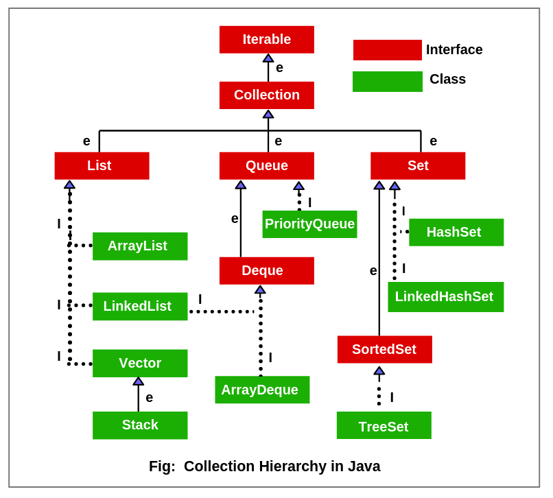

# Collections

Collections - коллекции хранящие данные в определенной последовательности:



Collection типа массив:

-   [ArrayList - массив изменяющий свою длинну](#collections---arraylist)
-   [LinkedList - цепочка из данных](#collections---linkedlist)
-   [SynchronizedList - массив изменяющий свою длинну(синхронизированны методы add и remove)](#collections---synchronizedlist)
-   [Vector - массив изменяющий свою длинну(УСТАРЕЛ)](#collections---vector)

Collection типа очередь:

-   [Stack - очередь типа LIFO](#collections---stack)
-   [PriorityQueue - отсортированная очередь](#collection---priorityqueue)
-   [ArrayDeque - реализация двунаправленнйо очереди](#collections---arraydeque)

Collection типа множество:

-   [HashSet - множество](#collections---hashset)
-   [LinkedHashSet - множество хранящее порядок добавления элементов](#collections---linkedhashset)
-   [TreeSet - отсортированное множество](#collections---treeset)

Map - не Collection, но к ним относится:

-   [HashMap - классический Map](#collections---hashmap)
-   [LinkedHashMap - упорядоченный HashMap](#collections---linkedhashmap)
-   [TreeMap - сортированное дерево](#collections---treemap)

Список интерфейсов:

-   [Iterable - тип элемента возвращенный Iterator](#collections---iterable)
-   [Iterator - объект по которому можно иттерироваться](#collections---iterator)
-   [Collection](#collections---collection)
-   [List](#collections---list)
-   [Queue](#collections---queue)
-   [Set](#collections---set)
-   [Deque](#collections---deque)
-   [SortedSet](#collections---sortedset)

Работа с потоками:

-   [Synchronized Lock](#collections---synchronized-lock)

# Быстрое создание коллекций

Быстрое создание коллекций через литералы появилось только в Java9:

```java
Map test = Map.ofEntries(
    Map.entry(6, "oks"),
    Map.entry(77, "ok"),
    Map.entry(9, "ok")
);
```

# Примеры

## Collections - HashSet

HashSet - просто множество

-   В основе HashSet лежит HashMap, у которого отсутствуют value
    -   необходимо переопределять hashCode и equals у элементов множества

Специфичные для Set вещи:

-   retainAll - сохраняет только те элементы, которые есть в переданной Collection
-   clone - создает неглубокую копию Set

Методы полученные от [интерфейса Collection](#collections---collection):

-   contains/containsAll - проверить содержание элемнта/элементов-коллекции
-   add/addAll - Добавить элемент/элементы-коллекции
-   remove/removeAll/removeIf - Удалить экземпляр элемента/элементы-коллекции/по-условию
-   clear - очистить всю коллекцию
-   iterator/stream/toArray - возвращает Iterator/stream/Array по элементам коллекции
-   isEmpty - Является ли, коллекция пустой
-   size - Получить размер коллекции
-   stream - создает Stream из коллекции
-   equals/hashCode/toString - шелуха всякая

## Collections - LinkedHashSet

LinkedHashSet - множество запоминающее порядок добавления элементов

-   в плане методов никаких отличий от HashSet
-   В основе LinkedHashSet лежит HashMap, у которого отсутствуют value
    -   необходимо переопределять hashCode и equals у элементов множества

Специфичные для Set вещи:

-   retainAll - сохраняет только те элементы, которые есть в переданной Collection
-   clone - создает неглубокую копию Set

Методы полученные от [интерфейса Collection](#collections---collection):

-   contains/containsAll - проверить содержание элемнта/элементов-коллекции
-   add/addAll - Добавить элемент/элементы-коллекции
-   remove/removeAll/removeIf - Удалить экземпляр элемента/элементы-коллекции/по-условию
-   clear - очистить всю коллекцию
-   iterator/stream/toArray - возвращает Iterator/stream/Array по элементам коллекции
-   isEmpty - Является ли, коллекция пустой
-   size - Получить размер коллекции
-   stream - создает Stream из коллекции
-   equals/hashCode/toString - шелуха всякая

## Collections - TreeSet

TreeSet - множество не повторяющихся элементов. По структуре - сортированное дерево в котором

-   В основе структуры лежит сортированное дерево
-   Долго добавляет
-   Быстро ищет
-   Сортирует элементы
-   При инициализации нужно передать компаратор
    -   пример: new TreeMap<>(Comparator.comparingInt(o -> o.age));

Базовые манипуляции:

-   put - кладет в TreeSet объект
-   size - колличество элементов
-   isEmpty - проверяет, является ли TreeSet пустым
-   remove - удаляет переданный объект

Полезные штучки:

-   iterator/descendingIterator - возвращает Iterator в прямом/обратном порядке
-   contains - проверить есть ли в TreeSet такой объект
-   clear - очистить весь TreeSet

чтото:

-   addAll - Добавить элементы коллекции в TreeSet
-   subSet - вернет TreeSet со значениями между первым элемента и вторым переданными объектами
    -   вариант#1, получает: fromElement, toElement. Возвращает от fromElement ключительно, до toElement не включительно
    -   вариант#2, получает: fromElement, fromInclude, toElement, toInculde. Возвращает от fromElement, до toElement, fromInclude и toInculde получая true делают возврат включительно
-   headSet/tailSet
    -   получает
        -   вариант#1, объект на вход
        -   вариант#2, объект на вход и boolean параметр
    -   возвращает объект(TreeSet)
    -   результат содержит значения строго-меньше/строго-больше входного объекта
    -   boolean параметр определяет включительно или строго берем значения
    -   поведение без boolean, такое словно boolean равен false
-   comparator - вернет функцию компаратор
-   first/last - первое/последние значение
-   lower/higher - первое значение которое меньше/больше переданного
-   floor/ceiling - первое значение которое меньше-или-равно/больше-или-равно переданному
-   pollFirst/pollLast - извлекает и удаляет первое/последнее значение в TreeSet
-   clone - клонирует TreeSet, создает не глубокую копию

## Collections - TreeMap

TreeMap - классический Map который содержит ассоциацию ключ - значение, но при этом сортирует элементы по переданному компаратору:

-   В основе структуры лежит красно-черное дерево
-   Долго добавляет
-   Долго ищет
-   Сортирует элементы
-   При инициализации нужно передать компаратор
    -   пример: new TreeMap<>(Comparator.comparingInt(o -> o.age));

Наименьшие/наибольшие значения:

-   floorEntry/floorKey - получает ключ на вход, ищет ключ "равный" или ближащий "меньше". Если нашел, вернет-пару-ключ-значение/вернет-ключ. Если не нашел вернет null
-   lowerEntry/lowerKey - получает ключ на вход, ищет ближащий ключ "меньше" указанного. Если нашел, вернет-пару-ключ-значение/вернет-ключ. Если не нашел вернет null
-   pollFirstEntry/pollLastEntry - получает первый/последний элемент, содеержащий ключ значение и удаляет его
-   firstEntry/firstKey - вернет пару-ключ-значение/ключ. Будет выбран наименьший ключ в TreeMap
-   lastEntry/lastKey - вернет пару-ключ-значение/ключ. Будет выбран ниабольший ключ в TreeMap

Ищем ближайшие наибольшие/наименьшие значения:

-   ceilingEntry/ceilingKey - получает ключ на вход, ищет ключ "равный" или ближащий "больше". Если нашел, вернет-пару-ключ-значение/вернет-ключ. Если не нашел вернет null
-   higherEntry/higherKey - получает ключ на вход, ищет ближащий ключ "больше" указанного. Если нашел, вернет-пару-ключ-значение/вернет-ключ. Если не нашел вернет null

Получаем значения в диапозоне:

-   subMap - возвращает subMap, со значением в диапозоне от переданного ключа, до переданного ключа:
    -   вариант#1, получает: keyFrom, keyTo. Возвращает от keyFrom ключительно, до keyTo не включительно
    -   вариант#2, получает: keyFrom, fromInclude, keyTo, toInculde. Возвращает от keyFrom, до keyTo, fromInclude и toInculde получая true делают возврат включительно
-   headMap/tailMap - получает ключ на вход, возвращает объект(SortedMap), содержащий значения строго-меньше/строго-больше переданного ключа
    -   есть еще перегруженный вариант этих методов. Там еще один boolean параметр, который определяет включительно или строго берем значения

Получить отсортированный набор элементов:

-   navigableKeySet - вернет объект(SortedSet), который содержит отсортированные ключи в порядке возрастания
-   descendingKeySet - вернет объект(SortedSet), который содержит отсортированные ключи в порядке убывания
-   descendingMap - вернет объект(SortedMap), который содержит ключи и значения, отсортированные в порядке убывания ключей

Особые бесполезные манипуляции:

-   comporator - функция вернет функцию компратор переданную в TreeMap

Базовые манипуляции:

-   put - кладет в HashMap пару ключ и значение
-   putAll - кладет все значения из переданного HashMap в этот HashMap
-   get - вернет значение, по переданному в get ключу
-   getOrDefault - смотрит, если ключ есть, то возвращает значение, если ключа нет, то значение по умолчанию
    -   Пример: getOrDefault("key", "defaultValue")
-   replace - заменяет значение по указанному ключу на переданное значение
-   remove - удаляет объект по указанному ключу
-   isEmpty - проверяет, является ли hashMap пустым
-   size - колличество элементов

Улучшенная версия базоывых манипуляций:

-   putIfAbsent - если ключа нет, то возвращает null и кладет по указанному ключу, значение. Если ключ есть, возвращает значение
-   replace - в качестве аргументов получает ключ, старое-значение и новое-значение, если есть такой ключ со старым-значением, тогда заменяет на новое-значение
-   replaceAll - принимает функцию, которая проходит по всем ключам и значениям, заменяя значения на результат работы функции
-   remove - в качестве аргументов получает ключ и значение, если есть такой ключ со значением, тогда удаляет

Подмена значений:

-   computeIfPresent - прописываем ключ и функцию одного аргумента. Теперь когда попытаемся получить значение по ключу котрого ЕСТЬ, вернет результат функции(передаст аргумент - ключ)
    -   Пример: hashmap.computeIfPresent("key", (a) -> "Это ключ: " + a)
-   computeIfAbsent - прописываем ключ и функцию одного аргумента. Теперь когда попытаемся получить значение по ключу котрого НЕТ, вернет результат функции(передаст аргумент - ключ)
    -   Пример: hashmap.computeIfAbsent("key", (a) -> "Это ключ: " + a)
-   compute - прописываем ключ и функцию двух аргументов. Теперь когда попытаемся получить значение по этому ключу, вернет результат функции(передаст аргументы - ключ и значение)
    -   Пример: hashmap.compute("key", (a, b) -> "Это ключ: " + a + ", Это значение: " + b)
-   merge - если ключ отсутствует, то добавляет ключ и переданное значение. Если ключ присутствует, то заменяет значение на результат функции от старого и переданного хначения
    -   Пример: prices.merge("Shirt", 100, (oldValue, newValue) -> oldValue + newValue)

Получить List элементов:

-   keySet - вренет Set из ключей
-   values - вернет Collection из значений
-   entrySet - вренет Set из объектов Entry
    -   Entry - хранит ключ и значение, в методах getKey, getValue, setValue

Полезные штучки:

-   containsKey/containsValue - проверить есть ли в HashMap такой ключ/значение
-   clear - очистить весь HashMap
-   clone - клонирует HashMap, создает не глубокую копию

Специфичные для ArrayList вещи:

-   forEach - пройтись по всем элементам HashMap
    -   принимает функцию двух аргументов
        -   первый аргумент - ключ
        -   второй аргумент - значение
-   retainAll - сохраняет только те элементы, которые есть в переданной Collection

## Collections - LinkedHashMap

LinkedHashMap - упорядоченный классический Map который содержит ассоциацию ключ - значение:

-   Элементы передаваемые в LinkedHashMap должны иметь функцию hashcode
-   Элементы передаваемые в LinkedHashMap должны быть неизменяемыми(stateless)
    -   иначе если они поменятются, их потом будет не найти
-   быстро получает данные
-   LinkedHashMap гарантирует сохранения порядка
-   по сути чутка модифицированная версия HashMap

Особые манипуляции:

-   removeEldestEntry - предполанается, что унаследовавшись от LinkedHashMap, ты переопределишь метод так, чтобы он возвращал true когда нужно удалять последний элемент. Нпример при превышении размеров LinkedHashMap

Базовые манипуляции:

-   put - кладет в HashMap пару ключ и значение
-   putAll - кладет все значения из переданного HashMap в этот HashMap
-   get - вернет значение, по переданному в get ключу
-   getOrDefault - смотрит, если ключ есть, то возвращает значение, если ключа нет, то значение по умолчанию
    -   Пример: getOrDefault("key", "defaultValue")
-   replace - заменяет значение по указанному ключу на переданное значение
-   remove - удаляет объект по указанному ключу
-   isEmpty - проверяет, является ли hashMap пустым
-   size - колличество элементов

Улучшенная версия базоывых манипуляций:

-   putIfAbsent - если ключа нет, то возвращает null и кладет по указанному ключу, значение. Если ключ есть, возвращает значение
-   replace - в качестве аргументов получает ключ, старое-значение и новое-значение, если есть такой ключ со старым-значением, тогда заменяет на новое-значение
-   replaceAll - принимает функцию, которая проходит по всем ключам и значениям, заменяя значения на результат работы функции
-   remove - в качестве аргументов получает ключ и значение, если есть такой ключ со значением, тогда удаляет

Подмена значений:

-   computeIfPresent - прописываем ключ и функцию одного аргумента. Теперь когда попытаемся получить значение по ключу котрого ЕСТЬ, вернет результат функции(передаст аргумент - ключ)
    -   Пример: hashmap.computeIfPresent("key", (a) -> "Это ключ: " + a)
-   computeIfAbsent - прописываем ключ и функцию одного аргумента. Теперь когда попытаемся получить значение по ключу котрого НЕТ, вернет результат функции(передаст аргумент - ключ)
    -   Пример: hashmap.computeIfAbsent("key", (a) -> "Это ключ: " + a)
-   compute - прописываем ключ и функцию двух аргументов. Теперь когда попытаемся получить значение по этому ключу, вернет результат функции(передаст аргументы - ключ и значение)
    -   Пример: hashmap.compute("key", (a, b) -> "Это ключ: " + a + ", Это значение: " + b)
-   merge - если ключ отсутствует, то добавляет ключ и переданное значение. Если ключ присутствует, то заменяет значение на результат функции от старого и переданного хначения
    -   Пример: prices.merge("Shirt", 100, (oldValue, newValue) -> oldValue + newValue)

Получить List элементов:

-   keySet - вренет Set из ключей
-   values - вернет Collection из значений
-   entrySet - вренет Set из объектов Entry
    -   Entry - хранит ключ и значение, в методах getKey, getValue, setValue

Полезные штучки:

-   containsKey/containsValue - проверить есть ли в HashMap такой ключ/значение
-   clear - очистить весь HashMap
-   clone - клонирует HashMap, создает не глубокую копию

Специфичные для ArrayList вещи:

-   forEach - пройтись по всем элементам HashMap
    -   принимает функцию двух аргументов
        -   первый аргумент - ключ
        -   второй аргумент - значение
-   retainAll - сохраняет только те элементы, которые есть в переданной Collection

## Collections - HashMap

HashMap - классический Map который содержит ассоциацию ключ - значение:

-   Элементы передаваемые в HashMap должны иметь функцию hashcode
-   Элементы передаваемые в HashMap должны быть неизменяемыми(stateless)
    -   иначе если они поменятются, их потом будет не найти
-   быстро получает данные

Устройство HashMap:

-   HashMap - массив с ссылками на Bucket
-   Bucket - хранит в себе ссылки на массив с объектами
-   массив с объеками - массив в котором лежат Node, хранящие ключ и значение

Принцип работы:

-   HashMap получает ключ и значение
-   от ключа
    -   берется hashCode
    -   от hashCode берется остаток от деления на количество Bucket
    -   по полученному числу берется подходящий Bucket
-   проходимся по Bucket и сравниваем hashCode ключа и хранящихся ключей
-   если нашел одинаковые, то заменяет/считывает, иначе добавляет-в-конец/возвращает-null

Базовые манипуляции:

-   put - кладет в HashMap пару ключ и значение
-   putAll - кладет все значения из переданного HashMap в этот HashMap
-   get - вернет значение, по переданному в get ключу
-   getOrDefault - смотрит, если ключ есть, то возвращает значение, если ключа нет, то значение по умолчанию
    -   Пример: getOrDefault("key", "defaultValue")
-   replace - заменяет значение по указанному ключу на переданное значение
-   remove - удаляет объект по указанному ключу
-   isEmpty - проверяет, является ли hashMap пустым
-   size - колличество элементов

Улучшенная версия базоывых манипуляций:

-   putIfAbsent - если ключа нет, то возвращает null и кладет по указанному ключу, значение. Если ключ есть, возвращает значение
-   replace - в качестве аргументов получает ключ, старое-значение и новое-значение, если есть такой ключ со старым-значением, тогда заменяет на новое-значение
-   replaceAll - принимает функцию, которая проходит по всем ключам и значениям, заменяя значения на результат работы функции
-   remove - в качестве аргументов получает ключ и значение, если есть такой ключ со значением, тогда удаляет

Подмена значений:

-   computeIfPresent - прописываем ключ и функцию одного аргумента. Теперь когда попытаемся получить значение по ключу котрого ЕСТЬ, вернет результат функции(передаст аргумент - ключ)
    -   Пример: hashmap.computeIfPresent("key", (a) -> "Это ключ: " + a)
-   computeIfAbsent - прописываем ключ и функцию одного аргумента. Теперь когда попытаемся получить значение по ключу котрого НЕТ, вернет результат функции(передаст аргумент - ключ)
    -   Пример: hashmap.computeIfAbsent("key", (a) -> "Это ключ: " + a)
-   compute - прописываем ключ и функцию двух аргументов. Теперь когда попытаемся получить значение по этому ключу, вернет результат функции(передаст аргументы - ключ и значение)
    -   Пример: hashmap.compute("key", (a, b) -> "Это ключ: " + a + ", Это значение: " + b)
-   merge - если ключ отсутствует, то добавляет ключ и переданное значение. Если ключ присутствует, то заменяет значение на результат функции от старого и переданного хначения
    -   Пример: prices.merge("Shirt", 100, (oldValue, newValue) -> oldValue + newValue)

Получить List элементов:

-   keySet - вренет Set из ключей
-   values - вернет Collection из значений
-   entrySet - вренет Set из объектов Entry
    -   Entry - хранит ключ и значение, в методах getKey, getValue, setValue

Полезные штучки:

-   containsKey/containsValue - проверить есть ли в HashMap такой ключ/значение
-   clear - очистить весь HashMap
-   clone - клонирует HashMap, создает не глубокую копию

Специфичные для ArrayList вещи:

-   forEach - пройтись по всем элементам HashMap
    -   принимает функцию двух аргументов
        -   первый аргумент - ключ
        -   второй аргумент - значение
-   retainAll - сохраняет только те элементы, которые есть в переданной Collection

## Collections - Stack

Stack - очередь по принципу LIFO:

-   Является аналогом наследником Vector, а потому имеет кучу synchronized методов

Методы определенные в Stack:

-   push - вставляет элемент вверх очеерди
-   peek - возвращает элемент с верха очереди
-   pop - возвращает элемент с верха очереди и удаляет его
-   search - ищет элемент в стеке. Если найден, возвращается его смещение от вершины стека, в противном случае возвращается 1.

В наличие такие методы, как:

-   add - является synchronized, добавить элемент, в место по указанному индексу
-   addAll - добавить элементы переданной коллекции, в место по указанному индексу
-   remove - является synchronized, удаляет элемент по index
-   get/set - является synchronized, получить/заменнить элемент по index
-   subList/removeRange - является synchronized, возвращает-List-из-элементов/удаляет от начального до конечного индекса
-   listIterator - является synchronized, возвращяет ListIterator, начиная с index
-   indexOf/lastIndexOf - является synchronized, получить index по элементу, начиная от указанного(с начала)/указанного(с конца) значения
-   elementAt - получить элемент по индексу
-   setElementAt/insertElementAt/removeElementAt - является synchronized, заменить/вставить/удалить по указанному индексу

Методы без использования индексации:

-   add/addAll - Добавить элемент/элементы-коллекции
-   contains - проверить содержание элемнта в коллекции
-   containsAll - является synchronized, проверяет содержание всех элементов-коллекции
-   remove - является synchronized, удалить экземпляр элемента
-   removeAll/removeIf - удалить экземпляр элементов-коллекции/по-условию
-   indexOf/lastIndexOf - получить index по элементу от начала/конца или -1
-   replaceAll - является synchronized, заменяет каждый элемент списка, результатом применения оператора к каждому элементу
-   sort - является synchronized, сортирует список по порядку, который определяет Comparator
-   firstElement/lastElement - является synchronized, получить первый/последний элемент
-   removeElement - является synchronized, удаляет первое вхождение в Vector
-   removeAllElements - является synchronized, удаляет все элементы в Vector

Полезные штучки:

-   iterator - является synchronized, возвращяет Iterator/ListIterator/Array по элементам коллекции
-   elements - возвращает Enumeration, это как Iterator, но устаревшее
-   isEmpty - является synchronized, является ли, коллекция пустой
-   size - получить размер коллекции
-   clear - очистить всю коллекцию
-   clone - является synchronized, клонирует ArrayList, создает не глубокую копию
-   copyInto - является synchronized, копирует все элементы в переданный массив
-   capacity - является synchronized, возвращает текущий capacity
-   setSize - является synchronized, увеличивает размер Vector, до указанного

Специфичные для ArrayList вещи:

-   forEach - является synchronized, пройтись по всем элементам коллекции
-   retainAll - сохраняет только те элементы, которые есть в переданной Collection
-   trimToSize - то, что мы зарезервировали для Vector, обрезается до реальных размеров
-   ensureCapacity - является synchronized, увеличивает емкость Vector, до размеров, чтобы помещалось как минимум указанное значение

Остальные методы наследует от [Collection](#collections---collection):

## Collections - Iterable

Iterable - базовый интерфейс коллекций. Реализует одно поле - Iterator:

-   list.Iterator() - вернет объект [класса Iterator](#collections---iterator)

```java
ArrayList<String> list = new ArrayList<String>;
Iterator iterList = list.Iterator();
```

## Collections - Iterator

Iterator - интерфейс, с помощью которого можно иттерироваться по другому объекту:

-   связан с [интерфейсом Iterable](#collections---iterable)

Реализует 3 метода:

-   next - возвращает следующий элемент Iterator
-   hasNext - возвращает true, если есть еще элементы в Iterator
-   remove - удаляет следующий элемент Iterator

## Collections - Collection

Collection - базовый интерфейс коллекций

-   больше про него сказать нечего

Реализует такие методы как:

-   contains/containsAll - проверить содержание элемнта/элементов-коллекции
-   add/addAll - Добавить элемент/элементы-коллекции
-   remove/removeAll/removeIf - Удалить экземпляр элемента/элементы-коллекции/по-условию
-   clear - очистить всю коллекцию

Полезные штучки:

-   iterator/stream/toArray - возвращает Iterator/stream/Array по элементам коллекции
-   isEmpty - Является ли, коллекция пустой
-   size - Получить размер коллекции

Базовые методы, для коллекций:

-   equals/hashCode - шелуха всякая

## Collections - List

List - интерфейс позволяющий хранить упорядоченную последовательность элементов(дубликаты и null)

-   элементы индексированны

В наличие такие методы, как:

-   add/addAll - Добавить элемент/элементы-коллекции, в место указанное по индексу
-   remove - Удалить элемент по index
-   get - получить элемент по index
-   set - располагает элемент по index
-   subList - возвращает под-коллекцию, по начальному и конечному индексу
-   listIteratorstream - возвращает Iterator, начиная с index

Методы без использования индексации:

-   add/addAll - Добавить элемент/элементы-коллекции
-   contains/containsAll - проверить содержание элемнта/элементов-коллекции
-   remove/removeAll/removeIf - Удалить экземпляр элемента/элементы-коллекции/по-условию
-   indexOf/lastIndexOf - получить index по элементу от начала/конца или -1
-   replaceAll - заменяет каждый элемент списка, результатом применения оператора к каждому элементу
-   sort - сортирует список по порядку, который определяет Comparator

Полезные штучки:

-   iterator/listIterator/stream/toArray - возвращает Iterator/Iterator/stream/Array по элементам коллекции
-   isEmpty - Является ли, коллекция пустой
-   size - Получить размер коллекции
-   clear - очистить всю коллекцию

Базовые методы, для коллекций:

-   equals/hashCode - шелуха всякая

## Collections - Queue

Queue - интерфейс реализующий очередь:

-   очередь реализуется по правилу FIFO(first-in first-out)

Методы выбрасывающие исключения:

-   add - Добавить first элемент(если нет места выкидывает ошибку)
-   element - Извлекает first элемент(не удаляет)
-   remove - Извлекает first элемент и удаляет

Методы вовзращающие специальные значения:

-   offer - Добавить first элемент(если нет места вернет false)
-   peek - Извлекает first элемент(не удаляет). Вернет Null для пустой очереди
-   poll - Извлекает first элемент(удаляет). Вернет Null для пустой очереди

Остальные методы наследует от [Collection](#collections---collection):

-   contains/containsAll - проверить содержание элемнта/элементов-коллекции
-   add/addAll - Добавить элемент/элементы-коллекции
-   remove/removeAll/removeIf - Удалить экземпляр элемента/элементы-коллекции/по-условию
-   clear - очистить всю коллекцию
-   iterator/stream/toArray - возвращает Iterator/stream/Array по элементам коллекции
-   isEmpty - Является ли, коллекция пустой
-   size - Получить размер коллекции
-   equals/hashCode - шелуха всякая

## Collections - PriorityQueue

PriorityQueue - очередь которая хранит в себе элементы в отсортированном виде по переданному компаратору

Методы вовзращающие специальные значения:

-   offer - Добавить last элемент(если нет места вернет false)
-   peek/element - Извлекает first/first элемент(не удаляет). Вернет Null для пустой очереди
-   poll - Извлекает first элемент(удаляет). Вернет Null для пустой очереди
-   comparator - получить метод компоратор

Остальные методы наследует от [Collection](#collections---collection):

-   contains/containsAll - проверить содержание элемнта/элементов-коллекции
-   add/addAll - Добавить элемент/элементы-коллекции
-   remove/removeAll/removeIf - Удалить экземпляр элемента/элементы-коллекции/по-условию
-   clear - очистить всю коллекцию
-   iterator/stream/toArray - возвращает Iterator/stream/Array по элементам коллекции
-   isEmpty - Является ли, коллекция пустой
-   size - Получить размер коллекции
-   equals/hashCode - шелуха всякая

## Collections - Deque

Deque(DoubleEndQue) - двунаправленная очередь. В такой очереди элементы могут использоваться с обоих концов:

-   очередь работает как FIFO и как LIFO

Методы выбрасывающие исключения:

-   addFirst/addLast/add - Добавить first/last/last элемент(если нет места выкидывает ошибку)
-   getFirst/getLast - Извлекает first/last элемент(не удаляет)
-   removeFirst/removeLast/remove - Извлекает first/last/first элемент и удаляет

Методы вовзращающие специальные значения:

-   offerFirst/offerLast/offer/push - Добавить first/last/last/first элемент(если нет места вернет false)
-   peekFirst/peekLast/peek/element - Извлекает first/last/first/first элемент(не удаляет). Вернет Null для пустой очереди
-   pollFirst/pollLast/poll/pop - Извлекает first/last/first/first элемент(удаляет). Вернет Null для пустой очереди

Остальные методы:

-   contains - проверить содержание элемнта
-   iterator/descendingIterator - возвращает Iterator/Iterator-с-конца по элементам коллекции
-   remove/removeFirstOccurrence/removeLastOccurrence - удаляет первое/первое/последнее вхождение элемента в очереди
-   size - Получить размер коллекции

Остальные методы наследует от [Collection](#collections---collection):

-   contains/containsAll - проверить содержание элемнта/элементов-коллекции
-   add/addAll - Добавить элемент/элементы-коллекции
-   remove/removeAll/removeIf - Удалить экземпляр элемента/элементы-коллекции/по-условию
-   clear - очистить всю коллекцию
-   iterator/stream/toArray - возвращает Iterator/stream/Array по элементам коллекции
-   isEmpty - Является ли, коллекция пустой
-   size - Получить размер коллекции
-   equals/hashCode - шелуха всякая

## Collections - Deque

ArrayDeque(DoubleEndQue) - двунаправленная очередь. В такой очереди элементы могут использоваться с обоих концов:

-   очередь работает как FIFO и как LIFO

Методы выбрасывающие исключения:

-   addFirst/addLast/add - Добавить first/last/last элемент(если нет места выкидывает ошибку)
-   getFirst/getLast - Извлекает first/last элемент(не удаляет)
-   removeFirst/removeLast/remove - Извлекает first/last/first элемент и удаляет

Методы вовзращающие специальные значения:

-   offerFirst/offerLast/offer/push - Добавить first/last/last/first элемент(если нет места вернет false)
-   peekFirst/peekLast/peek/element - Извлекает first/last/first/first элемент(не удаляет). Вернет Null для пустой очереди
-   pollFirst/pollLast/poll/pop - Извлекает first/last/first/first элемент(удаляет). Вернет Null для пустой очереди

Остальные методы:

-   contains - проверить содержание элемнта
-   iterator/descendingIterator - возвращает Iterator/Iterator-с-конца по элементам коллекции
-   remove/removeFirstOccurrence/removeLastOccurrence - удаляет первое/первое/последнее вхождение элемента в очереди
-   size - Получить размер коллекции

Остальные методы наследует от [Collection](#collections---collection):

-   contains/containsAll - проверить содержание элемнта/элементов-коллекции
-   add/addAll - Добавить элемент/элементы-коллекции
-   remove/removeAll/removeIf - Удалить экземпляр элемента/элементы-коллекции/по-условию
-   clear - очистить всю коллекцию
-   iterator/stream/toArray - возвращает Iterator/stream/Array по элементам коллекции
-   isEmpty - Является ли, коллекция пустой
-   size - Получить размер коллекции
-   equals/hashCode - шелуха всякая

## Collections - Set

Set - интерфейс реализующий коллекцию уникальных элементов:

-   если коротко, то это - множество

Специфичные для Set вещи:

-   retainAll - сохраняет только те элементы, которые есть в переданной Collection
-   copyOf - создает копию переданной коллекции
-   of - Из переданных элементов/коллекции создает Set

Методы полученные от [интерфейса Collection](#collections---collection):

-   contains/containsAll - проверить содержание элемнта/элементов-коллекции
-   add/addAll - Добавить элемент/элементы-коллекции
-   remove/removeAll/removeIf? - Удалить экземпляр элемента/элементы-коллекции/по-условию
-   clear - очистить всю коллекцию
-   iterator/stream?/toArray - возвращает Iterator/stream/Array по элементам коллекции
-   isEmpty - Является ли, коллекция пустой
-   size - Получить размер коллекции
-   equals/hashCode - шелуха всякая

## Collections - ArrayList

ArrayList - массив изменяющий свою длинну:

-   Плюсы:
    -   Быстро ищет элементы
-   Минусы:
    -   Долго добавляет элементы
    -   Нет синхронизации

Принцип работы:

-   initialCapacity - резервирует память на указанное число элементов элементов. В примере: (2);
-   size - при превышении initialCapacity, создает новый массив, размер которого = размер \* 1.5 + 1

```java
ArrayList<String> strings = new ArrayList<String>();
ArrayList<String> strings = new ArrayList<String>(2);
```

В наличие такие методы, как:

-   add/addAll - Добавить элемент/элементы-коллекции, в место указанное по индексу
-   remove - Удалить элемент по index
-   get - получить элемент по index
-   set - располагает элемент по index
-   subList - возвращает под-коллекцию, по начальному и конечному индексу
-   removeRange - удаляет элементы, по начальному и конечному индексу
-   listIterator - возвращает Iterator, начиная с index

Методы без использования индексации:

-   add/addAll - Добавить элемент/элементы-коллекции
-   contains/containsAll - проверить содержание элемнта/элементов-коллекции
-   remove/removeAll/removeIf - Удалить экземпляр элемента/элементы-коллекции/по-условию
-   indexOf/lastIndexOf - получить index по элементу от начала/конца или -1
-   replaceAll - заменяет каждый элемент списка, результатом применения оператора к каждому элементу
-   sort - сортирует список по порядку, который определяет Comparator

Полезные штучки:

-   iterator/listIterator/stream/toArray - возвращает Iterator/Iterator/stream/Array по элементам коллекции
-   isEmpty - Является ли, коллекция пустой
-   size - Получить размер коллекции
-   clear - очистить всю коллекцию
-   clone - клонирует ArrayList

Специфичные для ArrayList вещи:

-   forEach - пройтись по всем элементам коллекции
-   retainAll - сохраняет только те элементы, которые есть в переданной Collection
-   trimToSize - то, что мы зарезервировали для Array, обрезается до реальных размеров
-   ensureCapacity - увеличивает емкость Array, до размеров, чтобы помещалось как минимум указанное значение

## Collections - Vector

Vector - массив изменяющий свою длинну:

-   Является аналогом ArrayList, но с synchronized методами
-   Класс устарел и не рекомендуется к использованию

В наличие такие методы, как:

-   add - является synchronized, добавить элемент, в место по указанному индексу
-   addAll - добавить элементы переданной коллекции, в место по указанному индексу
-   remove - является synchronized, удаляет элемент по index
-   get/set - является synchronized, получить/заменнить элемент по index
-   subList/removeRange - является synchronized, возвращает-List-из-элементов/удаляет от начального до конечного индекса
-   listIterator - является synchronized, возвращяет ListIterator, начиная с index
-   indexOf/lastIndexOf - является synchronized, получить index по элементу, начиная от указанного(с начала)/указанного(с конца) значения
-   elementAt - получить элемент по индексу
-   setElementAt/insertElementAt/removeElementAt - является synchronized, заменить/вставить/удалить по указанному индексу

Методы без использования индексации:

-   add/addAll - Добавить элемент/элементы-коллекции
-   contains - проверить содержание элемнта в коллекции
-   containsAll - является synchronized, проверяет содержание всех элементов-коллекции
-   remove - является synchronized, удалить экземпляр элемента
-   removeAll/removeIf - удалить экземпляр элементов-коллекции/по-условию
-   indexOf/lastIndexOf - получить index по элементу от начала/конца или -1
-   replaceAll - является synchronized, заменяет каждый элемент списка, результатом применения оператора к каждому элементу
-   sort - является synchronized, сортирует список по порядку, который определяет Comparator
-   firstElement/lastElement - является synchronized, получить первый/последний элемент
-   removeElement - является synchronized, удаляет первое вхождение в Vector
-   removeAllElements - является synchronized, удаляет все элементы в Vector

Полезные штучки:

-   iterator - является synchronized, возвращяет Iterator/ListIterator/Array по элементам коллекции
-   elements - возвращает Enumeration, это как Iterator, но устаревшее
-   isEmpty - является synchronized, является ли, коллекция пустой
-   size - получить размер коллекции
-   clear - очистить всю коллекцию
-   clone - является synchronized, клонирует ArrayList, создает не глубокую копию
-   copyInto - является synchronized, копирует все элементы в переданный массив
-   capacity - является synchronized, возвращает текущий capacity
-   setSize - является synchronized, увеличивает размер Vector, до указанного

Специфичные для ArrayList вещи:

-   forEach - является synchronized, пройтись по всем элементам коллекции
-   retainAll - сохраняет только те элементы, которые есть в переданной Collection
-   trimToSize - то, что мы зарезервировали для Vector, обрезается до реальных размеров
-   ensureCapacity - является synchronized, увеличивает емкость Vector, до размеров, чтобы помещалось как минимум указанное значение

Остальные методы наследует от [Collection](#collections---collection):

-   equals/hashCode/toString - шелуха всякая

## Collections - SynchronizedList

SynchronizedList - массив изменяющий свою длинну, синхронизированны методы add и remove:

-   Плюсы:
    -   Быстро ищет элементы
    -   Синхронизированны методы add и remove
-   Минусы:
    -   Долго добавляет элементы
    -   Нет синхронизации у Iterator

```java
ArrayList<String> strings = new ArrayList<String>();
ArrayList<String> strings = new ArrayList<String>(2);
```

Методы полученные от [интерфейса Collection](#collections---collection):

-   [add - Добавить элемент](#collection---add)
-   [remove - Удалить элемент](#collection---remove)
-   [isEmpty - Является ли, коллекция пустой](#collection---isEmpty)
-   [size - Получить размер коллекции](#collection---size)

## Collections - LinkedList

LinkedList - цепочка из данных:

-   Плюсы:
    -   Долго ищет элементы
-   Минусы:
    -   Быстро добавляет элементы(особенно если они находятся вначале или в конце коллекции)

Принцип работы - цепочка из данных, где каждый элемент хранит определенные данные и ссылки на предыдущий и следующий элементы:

-   Head - первый элемент LinkedList, и для него предыдущий элемент null
-   Tail - последний элемент LinkedList, и для него последующий элемент null

Методы полученные от [интерфейса Collection](#collections---collection):

-   [add - Добавить элемент](#collection---add)
-   [remove - Удалить элемент](#collection---remove)
-   [isEmpty - Является ли, коллекция пустой](#collection---isEmpty)
-   [size - Получить размер коллекции](#collection---size)

Методы выбрасывающие исключения:

-   addFirst/addLast/add - Добавить first/last/last элемент(если нет места выкидывает ошибку)
-   getFirst/getLast - Извлекает first/last элемент(не удаляет)
-   removeFirst/removeLast/remove - Извлекает first/last/first элемент и удаляет

Методы вовзращающие специальные значения:

-   offerFirst/offerLast/offer/push - Добавить first/last/last/first элемент(если нет места вернет false)
-   peekFirst/peekLast/peek/element - Извлекает first/last/first/first элемент(не удаляет). Вернет Null для пустой очереди
-   pollFirst/pollLast/poll/pop - Извлекает first/last/first/first элемент(удаляет). Вернет Null для пустой очереди

В наличие такие методы, как:

-   addAll - Добавить элементы-коллекции, в место указанное по индексу
-   remove - Удалить элемент по index
-   get - получить элемент по index
-   set - располагает элемент по index
-   subList - возвращает под-коллекцию, по начальному и конечному индексу
-   removeRange - удаляет элементы, по начальному и конечному индексу
-   removeFirstOccurrence/removeLastOccurrence - удаляет первый/последний найденный элемент(идет из начала в конец)
-   listIterator - возвращает Iterator, начиная с index

Методы без использования индексации:

-   add/addAll - Добавить элемент/элементы-коллекции в конец
-   contains/containsAll - проверить содержание элемнта/элементов-коллекции
-   removeAll/removeIf - Удалить экземпляр элементы-коллекции/по-условию
-   indexOf/lastIndexOf - получить index по элементу от начала/конца или -1
-   replaceAll - заменяет каждый элемент списка, результатом применения оператора к каждому элементу
-   sort - сортирует список по порядку, который определяет Comparator

Полезные штучки:

-   iterator/listIterator/stream/toArray - возвращает Iterator/Iterator/stream/Array по элементам коллекции
-   isEmpty - Является ли, коллекция пустой
-   size - Получить размер коллекции
-   clear - очистить всю коллекцию
-   clone - клонирует ArrayList

Специфичные для ArrayList вещи:

-   forEach - пройтись по всем элементам коллекции
-   retainAll - сохраняет только те элементы, которые есть в переданной Collection

## Collections - synchronized lock

synchronized - ставит Lock для других потоков, чтобы переменные не конфликтовали. Например при иттерировании по коллекции это обязательно:

-   (synchList) - переменная для которой поставили Lock

```java
synchronized (synchList) {
    Iterator<Integer> iterator = synchList.iterator();
    while (iterator.hasNext()) {
        System.out.println( iterator.next() );
    }
}
```
