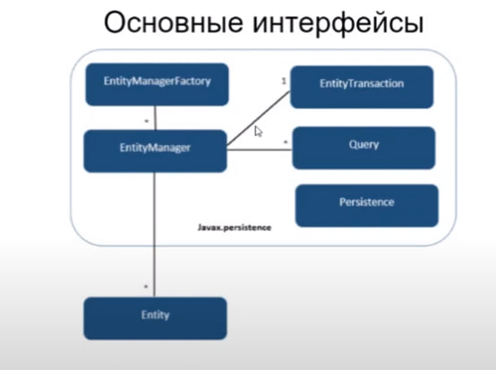

# Spring Boot

Spring Boot - фреймворк основанный на Spring, который реализует взаимодействие с БД через объекты в коде

-   эта концепция называется ORM(Object Relation Mapping)

# JPA

JPA(Java Persistence API) - стандарт в JAVA, в котором прописан набор интерфейсов. Если библиотека реализует эти интерфейсы, то библиотека считается JPA. JPA состоит из:

-   API - способ взаимодействия с библиотекой
-   Метаданные - в случае языка Java это аннотации, которые помечают какие поля в объекте как связанны с таблицами в БД
-   JPQL - язык запросов библиотеки, который заменяет SQL
    -   HQL - язык запросов в Hibernate

Hibernate - популрная имплементация JPA:

-   по сути сначала появился Hibernate, а после вдохновляясь им создали JPA

## Устройство JPA



Persistence - интерфейс в JPA отвечает за инициализацию библиотеки реализующей JPA

-   сканит файлы, на описание того, какие классы являются сущностяими
-   создает EntityManagerFactory

EntityManagerFactory - тяжеловесный интерфейс задача которого создавать EntityManager

-   sessionFactory - так в Hibernate называется EntityManagerFactory

EntityManager - интерфейс, через который можно открыть транзакцию и совершить запись

-   session - так в Hibernate называется EntityManager

Entity - прокси класс, в который оборачиваются сущности

## Models

Models - в JPA это классы, с которыми мы работаем как с таблицами

Требования к Model:

-   POJO - быть объектам Java без всяких сложных оберток
-   Пустой конструктор, который public или private
-   Поля должны быть не final и быть доступны только через getter/setter
-   Не может быть вложенным классом или Enum
-   Должен иметь хотя бы одно поле с аннотацией @Id

# Hibernate

Hibernate - популрная имплементация JPA:

-   по сути сначала появился Hibernate, а после вдохновляясь им создали JPA

## Models

Связываем Model с таблицей:

-   каждый экземпляр класса Student - предаставляет строку таблицы
-   @Entity - указывает что Hibernate надо связать объект с таблицей student
-   @Entity(name="student") - явно указывает что Hibernate надо связать объект с таблицей student

```java
@Entity
public class Student { ... }

@Entity(name="student")
public class Student { ... }
```

Указываем ID:

-   @Id - в Model обязательно должно быть хотябы одно поле помечено как @Id
-   @GeneratedValue - то как Id генерируется. Есть разные стратегии, по дефолту increment

```java
@Entity(name="student")
public class Student {
    @Id
    @GeneratedValue(strategy=GenrationType.AUTO)
    private Long id;

    private String name;
}
```

Им еще нужны setter и getter, но с Lombock можно просто прописать @Data:

```java
@Data
@Entity(name="student")
public class Student {
    @Id
    @GeneratedValue(strategy=GenrationType.AUTO)
    private Long id;

    private String name;
}
```

## Аннотации

Аннотации сущностей

@Entity - метка которая помечает что это объект который будет сохраняться/читаться в БД
@Table(name = "Book") - указываем таблицу с которой работает сущность

Аннотации над полями

@Column(name = "book_name")
@Id
@GeneratedValue - автоинкремент(можно указать стратегию инкрементирования)
@Transient - поле которое присутствует в модели, но сохранять мы его не хотим

Аннотация отношений

@OneToMany - не рукоменд(не явно)
@ManyToMany - не рукоменд(не явно)
@ManyToOne
@JoinColumn

## Repository

Repository - особые интерфейсы(классы), котрые Hebirnate считывает и связывает с таблицами в БД:

-   работа Hibernate идет через интерфейсы
-   для запуска Hibernate магии, необходимо имплементировать интерфейсу особый интерфейс CrudRepository

CrudRepository - особый интерфейс, являюийся базовым, предоствляющий возможности работаты с БД:

-   чтобы работать с БД нужно заинициализировать CrudRepository
-   интерфейсам, которые работают с БД нужно имплеменитировать CrudRepository, чтоюы Hibernate создал связь с таблицами в БД

Создание CrudRepository в Spring:

-   @EnableJpaRepository(basePackages="pro.sisit.unt9.data") - указываем Hibernate чтобы начал работать
-   SpringDataApplication - класс, являющийся точкой входа в приложение

```java
@EnableJpaRepository(basePackages="pro.sisit.unt9.data")
public class SpringDataApplication { ... }
```

Создание CrudRepository в Spring Data:

-   достаточно инициализировать SpringBoot, дальше он сам создаст CrudRepository:

```java
@SpringBootAllpication
public class SpringDataApplication { ... }
```

## Создание SQL-запросов через интерфейс

Создание SQL-запросов через интерфейс:

-   Hibernate - аннализирует названия методов в интерфейсах и на их основе создает SQL-запросы
-   по сути через имена методов, генерируется запрос, где по породяку подставляются аргументы описанной функции
-   сложные запросы так писать нельзя
-   [ссылочка на документацию](https://docs.spring.io/spring-data/jpa/docs/current/reference/html/#jpa.query-methods.query-creation)

Примеры SQL-запросов через имена методов в интерфейсе:

-   Distinct - уникальные строки, аналогично select distinct в начале SQL
-   And/Or - логические иператоры
    -   findByLastnameAndFirstname - найти совпдаения по полям lastname И firstname, которые должны быть равны n-му и (n+1)-му аргументам
-   OrderBy - сортируем
    -   findByAgeOrderByLastnameDesc - поле Age должно быть равно n-аргументу, после чего сортируем(orderby) lastname в убывающем(desc) порядке
-   findBy/Not/IgnoreCase - равно/не-равно/равно-игнорируя-регистр
    findByLastnameNot - поле lastname не равно n-му аргументу
    findByFirstnameIgnoreCase - поле firstname равное n-му аргументу не смотря на регистр символов
-   In/NotIn - значение присутствуе/отсутствует в переданной коллекции
    -   findByAgeIn(Collection<Age> ages) - значение поля age входит в переданную коллекцию
-   LessThan/LessThanEqual/GreaterThan/GreaterThanEqual - меньше/меньше-или-равно/больше/больше-или-равно
    -   findByAgeLessThanEqual - значение поля age меньше или равно n-ого аргумента
-   After/Before/Between - проверяет поле типа дата, на то после/до/между n-ого аргумента
    -   findByStartDateAfter - дата в поле startDate после даты в n-ом аргументе
-   IsNull/Null/IsNotNull/NotNull - проверяет что поле Null/Null/не-Null/не-Null
    -   findByAgeNotNull - поле age не null
-   Like/NotLike - проверяет на соответствие указанное поле, переданной строке типа SQL-like
    -   findByFirstnameNotLike - поле firstname соответствует строке переданной в n-ом аргументе

```java
public interface BookRepository extends CrudRepository<Book, Long> {
    List<Book> findByYear(Integer someYear);
    List<Book> findByLastnameAndFirstname(String someLastname, String someFirstname);
    List<Book> findDistinctByLastnameAndFirstname(String someLastname, String someFirstname);
    List<Book> findByStartDateBetween(Date firstDate, Date secondDate);
}
```

## Создание SQL-запросов через интерфейс с использованием jpql

Мы используем HSQL, для описание запроса. HSQL отличается от SQL следующим:

-   вместо имени таблицы, используется имя класса
-   вместо имени колонки таблицы, используется поле класса
-   ?1 - в некоторых местах, как в примере, можно использовать подстановку

```java
public interface BookRepository extends CrudRepository<Book, Long> {
    @Query("SELECT aob.book from AuthorOfBook aob join aob.author "
         + "where aoub.author.lastname = ?1"
    )
    List<Book> findByAuthor(Integer someAuthor);
}
```

## Вызываем SQL-запросы

Вызываем Вызываем SQL-запросы [созданные через интерфейс](#создание-sql-запросов-через-интерфейс):

-   BookRepository - интерфейс унаследованный от CrudRepository
-   bookRepository.save(book) - запись в БД
-   bookRepository.findAll() - метод описанный в интерфейсе, которые вызывает SQL-запрос

```java
@public void setUp() {}
public class SpringDataApplication {
    @Autowired
    private BookRepository bookRepository;

    @Before
    public void init() {
        Book book = new Book();
        book.setDescription("Description");
        book.setTittle("Tittle");
        book.setYear(1890);
        bookRepository.save(book);
    }

    @Test
    public void testSace() {
        bookRepository.findAll();
    }
}
```

## Соотношение таблиц БД

У полей моделей есть много параметров, которые можно настраивать:

-   размер колонки
-   инкрементация
-   значение по умолчанию
-   @Column(name="user_address_home")
    -   имя
-   и т.д.

Самой важной из них является отношение моделей:

-   @ManyToOne
    -   например
        -   например, покупатель может относиться к одной из групп(школьник, пенсионер, студент)
    -   класс в котором стоит эта аннотация становится "владельцем"
    -   класс с которым связан, не знает об этой связи
    -   хранит id'шники внутри поля на "зависимую" сущность
-   @OneToMany
    -   например
        -   например, у пользователя может быть много адресов, а у адресов не нужна информация о пользователях
    -   класс в котором стоит эта аннотация становится "владельцем"
    -   класс с которым связан, не знает об этой связи
    -   хранит КОЛЛЕКЦИЮ с id'шниками внутри поля на "зависимую" сущность
-   @ManyToMany
    -   например
        -   например, у исполнителя может быть несколько задач, а у задач может быть несколько исполнителей
    -   обе сущности знают друг о друге
    -   обе сущности аннотированны
    -   указание сущности владельца(оптимизирует число таблиц, логически смысла не имеет)
        -   @ManyToMany(mappedBy = "roles")
            -   "roles" - сщность которая является владельцем
-   @OneToOne
    -   например
        -   например, исполнителю можно назначить задачу, а у задачи должен быть только один исполнитель
    -   класс в котором стоит эта аннотация становится "владельцем"
    -   класс с которым связан, не знает об этой связи
    -   Hibernate будет следить, чтобы на сущность ссылалились из аннотированного класса только один экземпляр
-   @OneToOne(cascade = CascadeType.ALL, mappedBy="employee")
    -   например
        -   например, исполнителю можно назначить задачу, а задаче можно назначить одного исполнителя
    -   Hibernate будет следить, чтобы на сущность ссылалились из аннотированного класса только один экземпляр и НАОБОРОТ
-   @Embedded
    -   связь типа один к одному
    -   находим таблицу по аннотированному полю и "вставляет" поля из нее в аннотированную
    -   в бд таблица одна, а в классах появляется иерархия

Отношения выбираются по принципу: "кто о ком НЕ должен знать"

## FetchType

FetchType - указывает как грузить таблицы:

-   EAGER - загрузит все одним большим SQL
-   LAZY - загрузит родителя а потомков заменит PROXY, пока их не вызовут, грузить их не будет

```java
@OneToMany(fetch = FetchType.EAGER, mappedBy = "user")
public ...

@OneToMany(fetch = FetchType.LAZY, mappedBy = "user")
public ...
```

## Transactioanal

Transactioanal - транзакция, делает операции атомарными и неделимыми. Прямо как в мультипоточности. Если хоть одна операция в транзакции не сработала, то вся транзакция отменяется
