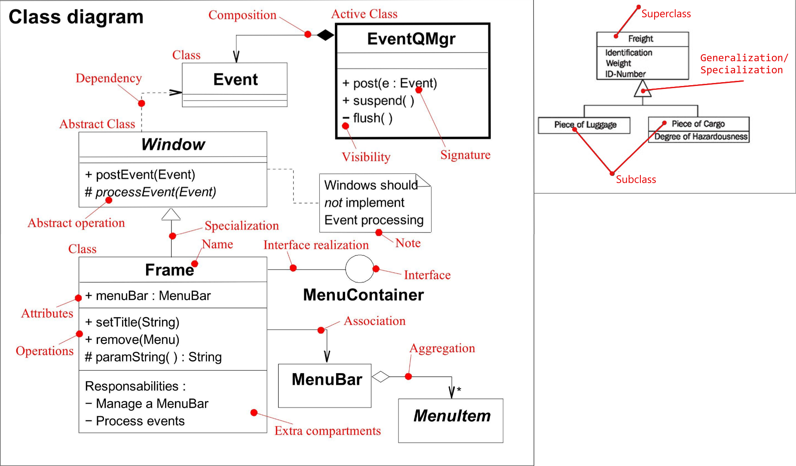

# UML

UML(unified modeling language) - стандартизированный язык диаграм. Делятся на:

-   Структурные диаграммы
    -   Диаграмма "Составной структуры"
    -   Диаграмма "Развертывания"
    -   [Диграмма "Пакетов"](#uml---диграмма-пакетов)
    -   Диаграмма "Профилей"
    -   [Диграмма "Классов"](#uml---диграмма-классов)
    -   [Диаграмма "Объектов"](#uml---диграмма-объектов)
    -   Диаграмма "Компонентов"
-   Диаграммы поведения - Диграмма "Деятельности" - Диаграмма "Прецедентов" - Диаграмма "Состояний" - Диаграмма "Взаимодействий" - Диаграмма "Последовательностей" - Диаграмма "Коммуникации" - Диаграмма "Обзора взаимодействия" - Диаграмма "Временная"
    Activity - динамическое представление

# Порядок разработки

Диграмма использование - большими баблами накидываем функционал, который должен быть в приложении

После, в каждом бабле с помощью диаграммы деятельности расписываем каждый бабл. То есть то как это будет достигнуто. Причем только ОДИН сценарий

# UML - для программирования

## UML - Диграмма "Классов"

Диграмма "Классов" - показывает взаимосвязь классов, их методы и параметры. Статическое представление:

-   Association(ассоциация)
    -   Показывает связь таблиц типа
        -   один к одному
        -   один ко многим
        -   многие ко многим
-   Aggregation(аггрегация)
    -   показывает кто является "владельцем"
    -   "подчиненный" в таких отношениях может существовать без "владельца"
-   Composition(композиция)
    -   показывает кто является "владельцем"
    -   "подчиненный" в таких отношениях не существует без "владельца"
-   Generalization/Specialization
    -   Generalization()
        -   процесс обратный Specialization
        -   в программирование Generalization назвается - наследование(Inheritance)
        -   объединение нескольких классов в один
    -   Specialization()
        -   процесс обратный Generalization
        -   создание подкласса из класса

## UML - Диграмма "Объектов"

Диграмма "Объектов" - показывает состояние класса в какой-то момент. Обычно используется для демонстрации возможных данных внутри системы

## UML - Диграмма "Пакетов"

Диграмма "Пакетов" - показывает пакеты проекта и их взаимодествие
