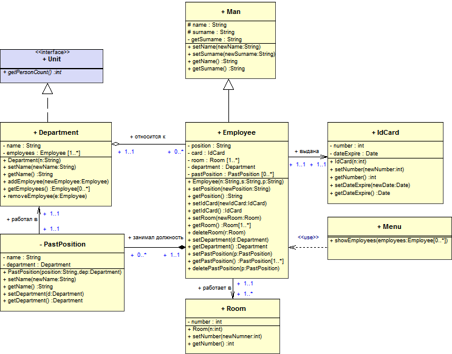
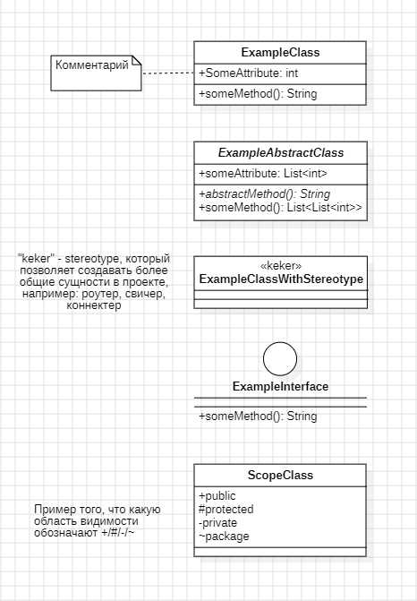
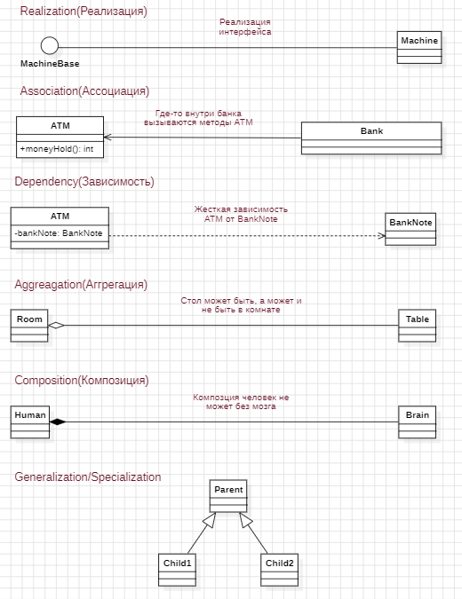
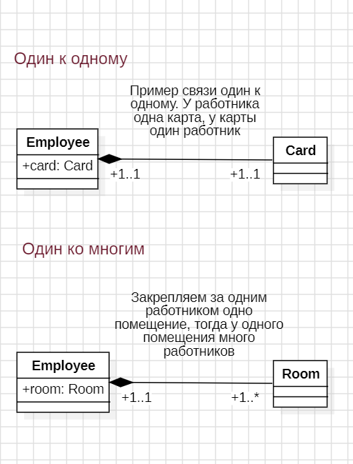

# Диаграмма классов

Показывает взаимосвзяь классов:

-   какой класс владеет каким классом
-   какой класс знает о каком классе
-   взаимосвязи типа:
    -   один ко многим
    -   многие к одному
-   показвает какие поля и методы есть у класса

## Пример диаграммы классов

Пример диаграммы классов:

## Элементы диаграммы классов

Диаграмма классов состоит из элементов:

-   Class
-   AbstractClass
-   Interface
-   Comment

Более подробно смотри на картинке:

## Отношения в диаграмме классов

Отношения в диаграмме классов:

-   Realization - наследование интерфейсов
-   Association - где-то внутри эта штука дрюка используется
-   Dependency - жесткая зависимость, при изменении в объекте, меняется поведение зависимого объекта
-   Aggregation - необязательное Depndecy Injection
-   Composition - строго обязательное Depndecy Injection
-   Generalization/Specialization - наследование

## Кратность в диаграмме классов

Кратность в диаграмме классов:

-   один ко многим
-   один к одному
-   и т.д. и т.п.

