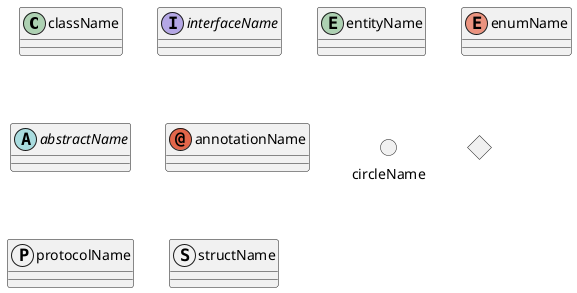

# PlantUML

Очень удобно для генерации UNL диаграм

# Обявление компонента диаграммы

Типы которые может принимать компонента диаграммы:

-   [Типы компонентов диаграм](#component---type-diagram)

Есть несколько способов обявления компонента диаграммы:

-   [Объявление компонента диаграммы: непривычный](#component---create-diagram-comnponent)
-   [Объявление компонента диаграммы: более привычный](#component---create-diagram-comnponent2)
-   [Текстовые названия для полей/методов/компонентов](#component---текстовые-названия-для-полейметодовкомпонентов)

Указание "видимости полей" типа public/private/protected/package-protected:

-   [Указание "видимости полей"](#component---указание-видимости)
-   [Изменить метод отображения "видимости полей" на классический(текстовый)](#component---сменить-тип-видимости)

# Связи между компонентами диаграммы

Связи между компонентами диаграммы:

-   [Стрелки](#realtion---стрелки)
-   [Метки на стрелках](#realtion---метки)

# Пример

## Realtion - Метки

Метки, могу быть:

-   в начале стрелки
-   в конце стрелки
-   в середние стрелки
    -   метка в середине, может быть с указанием направления

```plantunl
Class01 "метка в начале" *-- "метка в конце" Class02 : "метка в середине"

Class01 *-- Class02 : > "метка в середине с указанием направления"
Class01 *-- Class02 : < "метка в середине с указанием направления"
```

## Realtion - Стрелки

Стрелки, в PlantUML, состоят из:

-   линии
-   наконечника

Линия может быть:

-   -- - сплошная
-   .. - прерывистая

Наконечник стрелки может быть:

-   треугольник
    -   < - знак больше/меньше
    -   <| - треугольник
    -   } - обратный треугольник
-   ромб
    -   \* - сплошной ромб
    -   o - полый ромб
-   особые
    -   \# - квадрат
    -   x - крест
    -   \+ - кружок с крестом внутри

## Component - Type Diagram

Типы доступных компонентов диаграм:



## Component - Create Diagram Comnponent

Объявление компонента диаграммы:

```plantuml
class Bob
Bob : String fieldName
Bob : size()
Bob : - somePrivateMethod(String name) : String

```

## Component - Create Diagram Comnponent#2

Объявление компонента диаграммы:

```plantuml
class Bob {
    String fieldName
    void size()
    - somePrivateMethod(String name) : String
}
```

## Component - Указание видимости

Указание видимости, по умолчанию рендериться с цветными иконками:

-   цветные иконки легко запомнить, они работают по принципу светафора:
    -   зеленый - public
    -   оранжевый - protected
    -   красный - private

```plantuml
class Bob
Bob : + publicMethod()
Bob : # protectedMethod()
Bob : - privateMethod()
Bob : ~ packagePrivateMethod()
```

## Component - Текстовые названия для полей/методов/компонентов

Текстовые названия для полей/методов/компонентов:

```plantuml
class Bob {
    {field} Поле какое-то (а тут можно и описание добавить)
    {method} Какой-то метод
}

enum "Enum со сложным именем на русском" as EnumHardName

enum "Enum со сложным именем на русском" as EnumHardName2 { }
```

## Component - Сменить тип видимости

Включить текстовое отображение видимости вместо иконочного:

```plantuml
skinparam classAttributeIconSize 0
```
