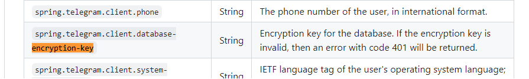

- Качаем TDLib
- Компилим по pipeline отсюдова: https://github.com/tdlib/td/tree/master/example/java
- Не забываем Java указать путь до либы -Djava.library.path=
- Доделываем инсталяцию отсюда: https://github.com/p-vorobyev/spring-boot-starter-telegram

- А где достать EncryptionKey???

